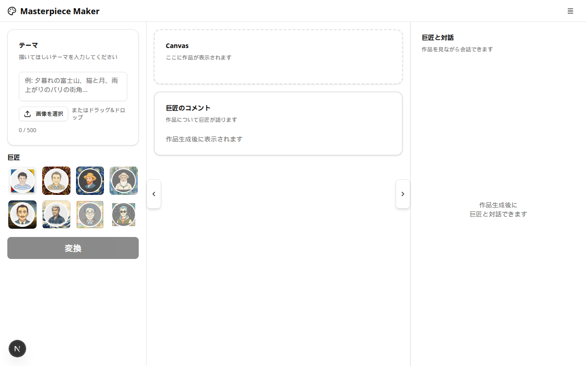
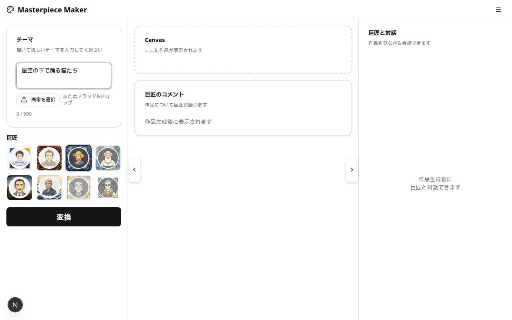
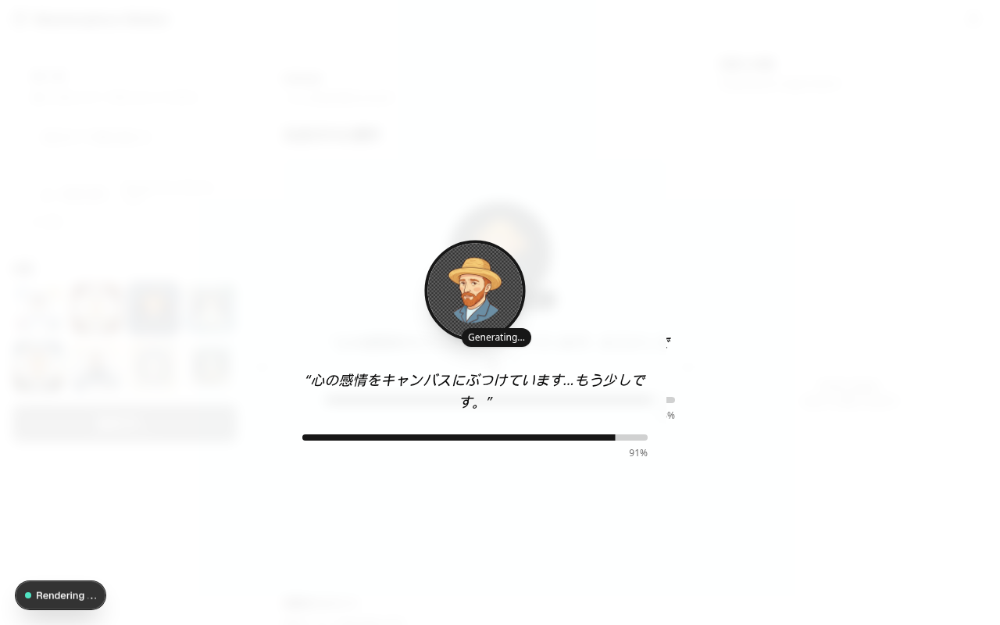
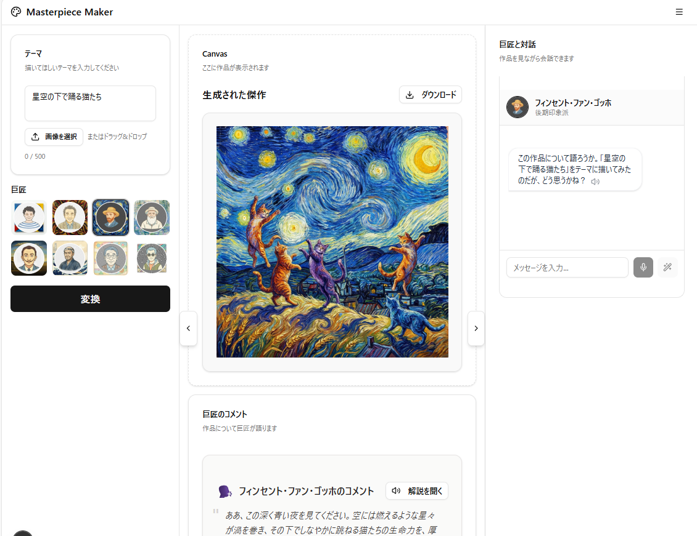

かｒ# Masterpiece Maker (マスターピース・メーカー)

巨匠の画風で自分だけの絵画を作るAIアート・エンターテインメント・プラットフォーム。

[](./CHANGELOG.md)
[](https://nextjs.org/)
[](https://react.dev/)
[](https://www.typescriptlang.org/)

## 📖 目次

- [プロジェクト概要](#プロジェクト概要)
- [開発状況](#開発状況)
- [機能紹介](#機能紹介)
- [技術スタック](#技術スタック)
- [セットアップ](#セットアップ)
  - [前提条件](#前提条件)
  - [インストール手順](#インストール手順)
  - [環境変数の設定](#環境変数の設定)
- [使い方](#使い方)
  - [開発サーバーの起動](#開発サーバーの起動)
  - [本番ビルド](#本番ビルド)
- [プロジェクト構造](#プロジェクト構造)
- [開発ガイド](#開発ガイド)
- [トラブルシューティング](#トラブルシューティング)
- [Git Subtree管理](#git-subtree管理)
- [ライセンス](#ライセンス)

## プロジェクト概要

**コンセプト**:
ピカソ、岡本太郎、ゴッホなどの巨匠の画風で、ユーザーが指定したテーマの絵画をAIが生成する。単なる画像生成ツールではなく、「巨匠に絵を依頼する」という体験そのものをエンターテインメント化する。

**コアバリュー**:

- 🎨 **アート体験の民主化**: 高価な原画を買わずとも、巨匠の画風で自分だけの作品を所有
- 🎭 **エンタメ性**: 生成プロセスの演出、巨匠による解説、バトルモードなど
- 🤝 **教育的価値**: 美術史や画風の特徴を楽しく学べる
- 💡 **創造性の刺激**: AIとの協働による新しいアート体験

## 開発状況

- **ステータス**: ✅ Phase 11.3 (Artist Comment Persistence) 完了
- **最新バージョン**: 0.11.3
- **リポジトリ**: `ssh://git@git.rakuten-it.com:7999/baip/master-piece.git`

### 最新の改善（Phase 11）

- **Phase 11.1: 履歴永続化**: ページリロード後も過去の生成画像が表示され、履歴ナビゲーションが正常に動作
  - 履歴管理をimageIdベースに変更（DataURLではなくID参照）
  - ページロード時の履歴復元機能（LocalStorageから履歴を読み込み）
  - 履歴ナビゲーション時の画像遅延読み込み（IndexedDBから取得）
  - 画像キャッシュ機能（表示中の画像をメモリにキャッシュ）
- **Phase 11.2: パフォーマンス改善**: 体感速度が約90%向上
  - UI更新の即時反映（コメント表示: 30秒 → 3秒）
  - 重複処理の削除（画像生成: 30秒 → 26秒）
  - 真の並列処理により各処理が完了次第表示
- **Phase 11.3: 巨匠コメント永続化**: ページリロード後も過去の作品のコメントが表示される
  - コメントをメタデータに保存
  - 履歴復元時にコメントも復元
  - コメントなしの場合の表示改善

### Phase 10-11で得られた重要な知見

- **IndexedDBの活用**: 大容量画像履歴の永続化を実現（100枚以上）
- **フォールバック戦略**: プライベートモードでも動作する堅牢な設計
- **履歴永続化の実現**: ページリロード後も履歴が消えない
- **パフォーマンス最適化**: 並列処理とUI更新の最適化で体感速度が大幅改善
- **詳細**: [`CHANGELOG.md`](CHANGELOG.md)を参照

## 機能紹介

### 🎨 画像生成機能

- **巨匠画風生成**: ピカソ、ゴッホ、モネ、岡本太郎、北斎、ダリ、藤子・F・不二雄、鳥山明の8人の巨匠の画風で絵画を生成
- **テキストから生成**: テーマやプロンプトを入力して、ゼロから絵画を作成
- **画像から生成**: 自分の写真や画像をアップロードして、巨匠の画風に変換（最大10MB）
- **リミックス機能**: 生成した作品を別の巨匠の画風で描き直す
- **追加指示**: テキストで細かい指示を追加（例：「もっと明るくして」「背景を夜空にして」）

### 🎭 インタラクティブ体験

- **キャンバスUI**: リアルタイムな生成プロセスの演出
- **巨匠切り替え検知**: 巨匠が異なる場合に自動的にリミックスを提案
- **待機アニメーション**: 巨匠ごとのユニークな待機メッセージ
- **Artist Avatar Chat**: 生成された作品について、巨匠のペルソナを持つAIとチャットで対話
- **Interactive Adjustments**: 自然言語で作品の修正を依頼

### 🎪 エンターテインメント機能

- **The Master's Voice**: 巨匠本人による作品解説（AI生成テキスト + 音声読み上げ）
- **Art Battle Mode**: 2人の巨匠に同じテーマで描かせて対決させるモード
- **ダウンロード**: 生成された作品を高解像度で保存

### 🎨 対応している巨匠

1. **パブロ・ピカソ** (1881-1973) - キュビスム
2. **岡本太郎** (1911-1996) - 前衛芸術
3. **フィンセント・ファン・ゴッホ** (1853-1890) - 後期印象派
4. **クロード・モネ** (1840-1926) - 印象派
5. **サルバドール・ダリ** (1904-1989) - シュルレアリスム
6. **葛飾北斎** (1760-1849) - 浮世絵
7. **藤子・F・不二雄** (1933-1996) - SF漫画
8. **鳥山明** (1955-2025) - 冒険漫画

## スクリーンショット

### メイン画面



巨匠を選択してテーマを入力する初期画面。8人の巨匠から好きなアーティストを選べます。

### テーマ入力画面



「星空の下で踊る猫たち」というテーマを入力した例。巨匠（ゴッホ）が選択され、変換ボタンがアクティブになっています。

### 生成中画面



作品生成中の画面。選択した巨匠のアバターが表示され、巨匠らしいメッセージとプログレスバーで生成状況を演出します。

### 完成画面



作品生成完了後の画面。ゴッホの画風で描かれた「星空の下で踊る猫たち」が表示されています。以下の機能が利用できます：

- **ダウンロードボタン**: 生成された作品を高解像度で保存
- **巨匠のコメント**: フィンセント・ファン・ゴッホによる作品解説（AI生成）
- **音声読み上げ**: 「解説を聞く」ボタンで巨匠の解説を音声で聴ける
- **巨匠と対話**: 右側のチャット機能で作品について巨匠と会話できる

## 技術スタック

### フロントエンド

- **Framework**: [Next.js 16.1](https://nextjs.org/) (App Router)
- **UI Library**: [React 19.2](https://react.dev/)
- **Language**: [TypeScript 5.x](https://www.typescriptlang.org/)
- **Styling**: [Tailwind CSS 4.x](https://tailwindcss.com/)
- **UI Components**: [Radix UI](https://www.radix-ui.com/)
- **Animation**: [Framer Motion 12.x](https://www.framer.com/motion/)
- **Icons**: [Lucide React](https://lucide.dev/)

### AI・API

- **Image Generation**: [Gemini 3.0 Pro Image](https://ai.google.dev/) via Rakuten AI Gateway
- **Text Generation**: Gemini 3.0 Pro Preview via Rakuten AI Gateway
- **Voice**: Web Speech API (ブラウザ標準)

### 開発ツール

- **Linter**: ESLint 9.x
- **Package Manager**: npm

## セットアップ

### 前提条件

このプロジェクトを実行するには、以下が必要です：

- **Node.js**: 18.x 以上（推奨: 20.x LTS）
- **npm**: 9.x 以上（Node.jsに同梱）
- **Gemini API Key**: Rakuten AI Gatewayから取得

#### Node.jsのインストール確認

```bash
node --version  # v18.0.0 以上であることを確認
npm --version   # v9.0.0 以上であることを確認
```

Node.jsがインストールされていない場合は、[公式サイト](https://nodejs.org/)からダウンロードしてください。

### インストール手順

#### 1. リポジトリのクローン

```bash
# SSH経由でクローン（推奨）
git clone ssh://git@git.rakuten-it.com:7999/baip/master-piece.git
cd master-piece

# または、HTTPS経由
git clone https://git.rakuten-it.com/scm/baip/master-piece.git
cd master-piece
```

#### 2. 依存関係のインストール

**重要**: 初回は必ず実行してください。

```bash
npm install
```

このコマンドは以下を実行します：

- 約500個のパッケージをインストール（約40秒）
- `node_modules/` ディレクトリを作成
- Next.js、React、TypeScriptなどの依存関係を解決

**インストール完了の確認**:

```bash
ls node_modules/  # パッケージが大量に表示されればOK
```

#### 3. 環境変数の設定

```bash
# .env.example をコピーして .env を作成
cp .env.example .env
```

`.env` ファイルを編集して、APIキーを設定します：

```bash
# エディタで開く（例: nano, vim, code など）
nano .env
```

### 環境変数の設定

`.env` ファイルに以下の環境変数を設定してください：

#### 必須項目

```env
# Gemini API Key（必須）
GEMINI_API_KEY=your-actual-api-key-here
```

**APIキーの取得方法**:

1. [Rakuten AI Gateway](https://api.ai.public.rakuten-it.com/)にアクセス
2. ログイン後、APIキーを生成
3. 生成されたキーを上記の `your-actual-api-key-here` に置き換え

#### オプション項目

```env
# カスタムAPIベースURL（オプション）
# デフォルト: https://api.ai.public.rakuten-it.com/google-vertexai/v1/
# GEMINI_API_BASE_URL=https://your-custom-endpoint.com/

# OpenAI互換APIベースURL（TTS用、オプション）
# デフォルト: https://api.ai.public.rakuten-it.com/openai/v1
# OPENAI_API_BASE_URL=https://your-custom-openai-endpoint.com/
```

**設定例**（デフォルト設定を使用する場合）:

```env
GEMINI_API_KEY=raik-pat-c15d44390r10aie498f94e5e63d4a6b1b141216d656c40e498f94e5e63d4a6b1
```

## 使い方

### 開発サーバーの起動

```bash
npm run dev
```

サーバーが起動したら、ブラウザで以下のURLにアクセスしてください：

**🌐 <http://localhost:3000>**

#### 起動確認

ターミナルに以下のようなメッセージが表示されればOKです：

```text
  ▲ Next.js 16.1.1
  - Local:        http://localhost:3000
  - Environments: .env

 ✓ Starting...
 ✓ Ready in 2.3s
```

#### 開発サーバーの停止

`Ctrl + C` を押してサーバーを停止できます。

### 本番ビルド

本番環境用にアプリケーションをビルドする場合：

```bash
# ビルド（最適化されたファイルを生成）
npm run build

# 本番サーバーを起動
npm start
```

ビルドには数分かかる場合があります。完了後、`http://localhost:3000` でアクセスできます。

### その他のコマンド

```bash
# Lintチェック（コード品質の確認）
npm run lint

# 型チェック（TypeScriptの型エラーを確認）
npx tsc --noEmit
```

## プロジェクト構造

```text
master-piece/
├── src/                      # ソースコード
│   ├── app/                  # Next.js App Router
│   │   ├── page.tsx          # トップページ
│   │   ├── layout.tsx        # レイアウト
│   │   ├── globals.css       # グローバルスタイル
│   │   └── api/              # APIルート
│   │       ├── generate/     # 画像生成API
│   │       ├── chat/         # チャットAPI
│   │       └── tts/          # 音声合成API
│   ├── components/           # Reactコンポーネント
│   │   ├── ui/               # 再利用可能なUIコンポーネント
│   │   ├── canvas.tsx        # キャンバスコンポーネント
│   │   ├── artist-selector.tsx  # 巨匠選択UI
│   │   └── ...
│   ├── lib/                  # ユーティリティ・ヘルパー
│   │   ├── gemini.ts         # Gemini API クライアント
│   │   ├── artists.ts        # 巨匠データ定義
│   │   └── utils.ts          # 汎用ユーティリティ
│   └── types/                # TypeScript型定義
├── public/                   # 静的ファイル
│   ├── artists/              # 巨匠の画像
│   └── ...
├── docs/                     # ドキュメント
│   ├── git-extraction-guide.md    # Git抽出ガイド
│   ├── sync-to-remote.md          # リモート同期方法
│   ├── readonly-local-setup.md    # ローカルセットアップ
│   └── doing/                     # 開発中のドキュメント
├── .env.example              # 環境変数のサンプル
├── .env                      # 環境変数（要作成、gitignore対象）
├── package.json              # 依存関係とスクリプト
├── tsconfig.json             # TypeScript設定
├── next.config.ts            # Next.js設定
├── tailwind.config.ts        # Tailwind CSS設定
├── CHANGELOG.md              # 変更履歴
└── README.md                 # このファイル
```

### 主要ディレクトリの説明

- **`src/app/`**: Next.js App Routerのページとレイアウト
- **`src/components/`**: 再利用可能なReactコンポーネント
- **`src/lib/`**: ビジネスロジックとユーティリティ関数
- **`public/`**: 画像やフォントなどの静的アセット
- **`docs/`**: プロジェクトのドキュメント

## 開発ガイド

### 新しい巨匠を追加する

1. [`src/lib/artists.ts`](src/lib/artists.ts) に巨匠データを追加
2. `public/artists/` に巨匠の画像を配置
3. プロンプトテンプレートを定義

### APIエンドポイントの追加

1. `src/app/api/` に新しいディレクトリを作成
2. `route.ts` ファイルを作成してハンドラーを実装

### UIコンポーネントの追加

1. `src/components/` に新しいコンポーネントを作成
2. 必要に応じて `src/components/ui/` の基本コンポーネントを使用

## トラブルシューティング

### よくある問題と解決方法

#### 1. `npm install` が失敗する

**症状**: パッケージのインストール中にエラーが発生

**解決方法**:

```bash
# キャッシュをクリア
npm cache clean --force

# node_modules と package-lock.json を削除
rm -rf node_modules package-lock.json

# 再インストール
npm install
```

#### 2. 開発サーバーが起動しない

**症状**: `npm run dev` でエラーが発生

**解決方法**:

```bash
# ポート3000が使用中の場合、別のポートを指定
PORT=3001 npm run dev

# または、使用中のプロセスを終了
lsof -ti:3000 | xargs kill -9
```

#### 3. APIキーエラー

**症状**: 画像生成時に「API key is invalid」エラー

**解決方法**:

1. `.env` ファイルが存在するか確認
2. `GEMINI_API_KEY` が正しく設定されているか確認
3. APIキーに余分なスペースや改行がないか確認
4. 開発サーバーを再起動（`.env` の変更を反映）

```bash
# サーバーを停止（Ctrl + C）
# 再起動
npm run dev
```

#### 4. 画像が生成されない

**症状**: 生成ボタンを押しても画像が表示されない

**チェックリスト**:

- [ ] ブラウザのコンソールにエラーが表示されていないか確認（F12で開発者ツールを開く）
- [ ] ネットワークタブでAPIリクエストが成功しているか確認
- [ ] `.env` ファイルのAPIキーが正しいか確認
- [ ] Rakuten AI Gatewayのステータスを確認

#### 5. TypeScriptエラー

**症状**: 型エラーが表示される

**解決方法**:

```bash
# 型定義を再生成
npm install

# 型チェックを実行
npx tsc --noEmit
```

#### 6. ビルドエラー

**症状**: `npm run build` が失敗する

**解決方法**:

```bash
# .next ディレクトリを削除
rm -rf .next

# 再ビルド
npm run build
```

### サポート

問題が解決しない場合は、以下を確認してください：

1. **ログの確認**: ターミナルとブラウザのコンソールのエラーメッセージ
2. **バージョン確認**: Node.js、npm、依存パッケージのバージョン
3. **ドキュメント**: [`docs/`](docs/) ディレクトリの関連ドキュメント
4. **変更履歴**: [`CHANGELOG.md`](CHANGELOG.md) で既知の問題を確認

## Git Subtree管理

このリポジトリは、親リポジトリ（`self-consultation`）から `git subtree` を使用して独立管理されています。

### 開発ワークフロー

**推奨**: すべての開発は親リポジトリ（`self-consultation/tools/master-piece`）で行い、定期的にこのリポジトリに同期してください。

#### 親リポジトリでの開発

```bash
# 親リポジトリで開発
cd /path/to/self-consultation/tools/master-piece
# コードを編集...

# コミット
cd /path/to/self-consultation
git add tools/master-piece/
git commit -m "feat: 新機能追加"
git push
```

#### このリポジトリへの同期

```bash
# 親リポジトリから変更をプッシュ
cd /path/to/self-consultation
git subtree push --prefix=tools/master-piece ssh://git@git.rakuten-it.com:7999/baip/master-piece.git main
```

### 詳細ドキュメント

Git Subtreeの詳細な使い方については、以下のドキュメントを参照してください：

- **[git-extraction-guide.md](docs/git-extraction-guide.md)**: 初回抽出の手順
- **[sync-to-remote.md](docs/sync-to-remote.md)**: リモートリポジトリへの同期方法
- **[readonly-local-setup.md](docs/readonly-local-setup.md)**: Pull専用ローカルリポジトリの設定

### 注意事項

⚠️ **このリポジトリで直接開発しないでください**

- すべての変更は親リポジトリ（`self-consultation/tools/master-piece`）で行う
- このリポジトリは同期先として使用する
- 直接変更すると履歴が分岐し、同期が困難になる

## ライセンス

このプロジェクトは社内プロジェクトです。
