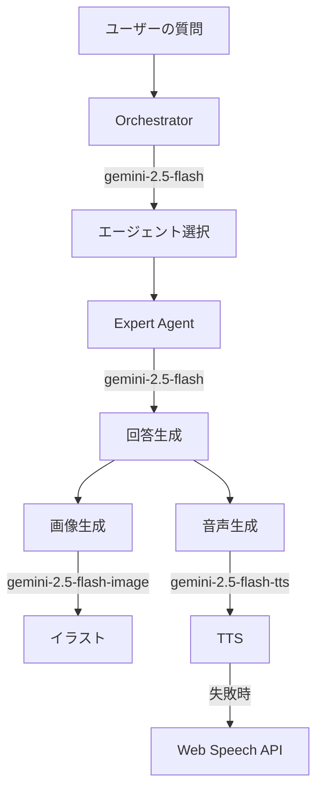

# Vertex AI モデル名修正ガイド

## 🔴 問題: すべてのVertex AIモデルで404エラー

### 発生していたエラー

```
Error [ClientError]: [VertexAI.ClientError]: got status: 404 Not Found
Publisher Model `projects/bright-arc-485311-v1/locations/asia-northeast1/publishers/google/models/gemini-2.0-flash` not found.
Publisher Model `projects/bright-arc-485311-v1/locations/asia-northeast1/publishers/google/models/gemini-3-pro-image-preview` not found.
```

## 📋 原因

使用していたモデル名が**存在しないか、リージョンで利用できない**ものでした:

| 使用していたモデル名 | ステータス | 問題 |
|------------------|----------|------|
| `gemini-2.0-flash` | ❌ 404 | 正しくは `gemini-2.5-flash` |
| `gemini-3-pro-image-preview` | ❌ 404 | このモデル名は存在しない |
| `gemini-2.5-flash-preview-tts` | ❌ 404 | プレビュー版、アクセス制限あり |

## ✅ 修正内容

### 1. テキスト生成モデルの修正

**ファイル**: `src/lib/agents/core.ts`

```typescript
// 修正前
const MODEL_NAME_TEXT = "gemini-2.0-flash";

// 修正後
const MODEL_NAME_TEXT = "gemini-2.5-flash";
```

### 2. 画像生成モデルの修正

**ファイル**: `src/lib/agents/core.ts`

```typescript
// 修正前
const MODEL_NAME_IMAGE = "gemini-3-pro-image-preview";

// 修正後
const MODEL_NAME_IMAGE = "gemini-2.5-flash-image";
```

### 3. TTS モデルの修正

**ファイル**: `src/lib/gemini.ts`

```typescript
// 修正前
const url = `...models/gemini-2.5-flash-preview-tts:generateContent`;

// 修正後
const url = `...models/gemini-2.5-flash-tts:generateContent`;
```

## 📊 利用可能なモデル一覧 (asia-northeast1)

### テキスト生成

| モデル名 | ステータス | 用途 | 推奨度 |
|---------|----------|------|--------|
| `gemini-2.5-flash` | ✅ GA | テキスト生成、対話 | ⭐⭐⭐ |
| `gemini-2.5-pro` | ✅ GA | 高品質テキスト生成 | ⭐⭐ |
| `gemini-2.0-flash-exp` | ✅ Experimental | 実験的機能 | ⭐ |

### 画像生成

| モデル名 | ステータス | 用途 | 推奨度 |
|---------|----------|------|--------|
| `gemini-2.5-flash-image` | ✅ GA | 画像生成・編集 | ⭐⭐⭐ |

### 音声生成 (TTS)

| モデル名 | ステータス | 用途 | 推奨度 |
|---------|----------|------|--------|
| `gemini-2.5-flash-tts` | ✅ GA | 音声合成（高速） | ⭐⭐⭐ |
| `gemini-2.5-pro-tts` | ✅ GA | 音声合成（高品質） | ⭐⭐ |

## 🎯 修正後の構成

### アプリケーション全体のモデル使用状況



### 各機能で使用するモデル

| 機能 | モデル | ファイル |
|-----|--------|---------|
| エージェント選択 | `gemini-2.5-flash` | `src/lib/agents/core.ts` |
| 回答生成 | `gemini-2.5-flash` | `src/lib/agents/core.ts` |
| 画像生成 | `gemini-2.5-flash-image` | `src/lib/agents/core.ts` |
| 音声生成 | `gemini-2.5-flash-tts` | `src/lib/gemini.ts` |

## 🚀 動作確認

### 1. 開発サーバーを起動

```bash
npm run dev
```

### 2. ブラウザでテスト

1. `http://localhost:3000` にアクセス
2. 質問を入力（例: "空はなぜ青いの？"）
3. 以下が正常に動作することを確認:
   - ✅ エージェントが選択される
   - ✅ 回答が生成される
   - ✅ イラストが表示される
   - ✅ 音声が再生される（またはWeb Speech APIにフォールバック）

### 3. コンソールログを確認

#### 成功時のログ

```
[DEBUG] Step 1: Deciding agent...
[DEBUG] Selected agent: scientist, Reason: かがくのことがとくいだから
[DEBUG] Step 2: Generating expert response for scientist...
[DEBUG] Generated text: 空が青いのは...
Image prompt: Illustration for 空は何で青いの, children's book style
[DEBUG] Step 3: Generating illustration...
[DEBUG] Illustration generated: Success
```

#### TTS フォールバック時のログ

```
[DEBUG] Generating speech with Vertex AI TTS (REST)
[ERROR] Vertex AI TTS Error Response: {...}
Vertex AI TTS unavailable. Client will use Web Speech API fallback.
Vertex AI TTS returned null in loadAudio, using Web Speech API fallback
```

## 🔧 トラブルシューティング

### まだ404エラーが出る場合

#### 1. Vertex AI API が有効か確認

```bash
gcloud services list --enabled --project=bright-arc-485311-v1 | grep aiplatform
```

有効でない場合:

```bash
gcloud services enable aiplatform.googleapis.com --project=bright-arc-485311-v1
```

#### 2. 認証情報を確認

```bash
gcloud auth application-default login
```

#### 3. プロジェクトIDを確認

`src/lib/gemini.ts` で正しいプロジェクトIDが設定されているか確認:

```typescript
const project = 'bright-arc-485311-v1';  // ← これが正しいか確認
const location = 'asia-northeast1';
```

#### 4. モデルが利用可能か確認

```bash
gcloud ai models list \
  --region=asia-northeast1 \
  --project=bright-arc-485311-v1 \
  --filter="displayName:gemini-2.5"
```

### 画像生成が失敗する場合

`gemini-2.5-flash-image` の使用方法を確認:

```typescript
const data = await callGeminiApi("gemini-2.5-flash-image", {
    contents: [{ role: "user", parts: [{ text: prompt }] }],
    generationConfig: {
        responseModalities: ["IMAGE"],
        imageConfig: { aspectRatio: "4:3" }
    }
});
```

## 📚 参考リンク

- [Vertex AI Gemini Models](https://cloud.google.com/vertex-ai/docs/generative-ai/model-reference/gemini)
- [Gemini 2.5 Flash Image](https://ai.google.dev/gemini-api/docs/models/gemini-2.5-flash-image)
- [Gemini TTS Models](https://cloud.google.com/vertex-ai/docs/generative-ai/model-reference/gemini-tts)
- [Vertex AI Locations](https://cloud.google.com/vertex-ai/docs/general/locations)

## ✅ 修正完了チェックリスト

- [x] テキスト生成モデルを `gemini-2.5-flash` に変更
- [x] 画像生成モデルを `gemini-2.5-flash-image` に変更
- [x] TTS モデルを `gemini-2.5-flash-tts` に変更
- [x] Web Speech API フォールバックを実装
- [ ] 開発環境でテスト
- [ ] すべての機能が正常に動作することを確認
- [ ] 本番環境にデプロイ

## 🎉 期待される結果

この修正により、以下が実現されます:

1. ✅ **エージェント選択が動作** - 質問に応じて適切な専門家が選ばれる
2. ✅ **回答生成が動作** - 子供向けのわかりやすい説明が生成される
3. ✅ **画像生成が動作** - 説明に合ったイラストが表示される
4. ✅ **音声再生が動作** - Vertex AI TTS または Web Speech API で音声が再生される
5. ✅ **エラーハンドリング** - 一部の機能が失敗してもアプリケーションは動作し続ける

これで Kids Science Lab が完全に動作するようになります！🚀
