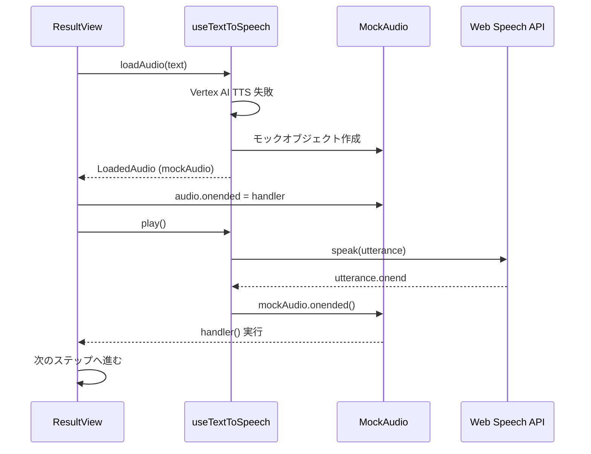

# ResultView エラー解決ガイド

## 🔴 発生したエラー

```
Failed to play step: TypeError: Cannot set properties of null (setting 'onended')
    at playStep (ResultView.tsx:91:32)
```

## 📋 エラーの原因

`ResultView.tsx` の 91行目で `loadedAudio.audio.onended` を設定しようとしていますが、Web Speech API のフォールバックを使用している場合、`loadedAudio.audio` が `null` になっていました。

### 詳細な原因:

1. **Vertex AI TTS が利用できない場合のフォールバック**
   - `useTextToSpeech.ts` で Vertex AI TTS が失敗した場合、Web Speech API にフォールバックする実装を追加しました
   - 初期実装では、Web Speech API の場合に `audio: null` を返していました

2. **ResultView での直接アクセス**
   - `ResultView.tsx` では `loadedAudio.audio.onended` に直接アクセスしていました
   - `audio` が `null` の場合、`Cannot set properties of null` エラーが発生

## ✅ 実装した解決策

### 解決策: モックオブジェクトの作成 🎭

Web Speech API を使用する場合でも、`HTMLAudioElement` と互換性のあるモックオブジェクトを返すように変更しました。

**変更ファイル**: `src/hooks/useTextToSpeech.ts`

```typescript
// モックオブジェクトの作成
const mockAudio = {
  onended: null as ((this: HTMLAudioElement, ev: Event) => any) | null,
  onerror: null as ((this: HTMLAudioElement, ev: Event) => any) | null,
} as HTMLAudioElement;

return {
  audio: mockAudio,  // null ではなくモックオブジェクトを返す
  duration: 0,
  play: async () => {
    if ('speechSynthesis' in window) {
      const utterance = new SpeechSynthesisUtterance(text);
      utterance.lang = 'ja-JP';
      utterance.rate = 0.9;
      utterance.pitch = 1.0;
      
      setIsSpeaking(true);
      
      // Web Speech API のイベントをモックオブジェクトのハンドラーに転送
      utterance.onend = () => {
        setIsSpeaking(false);
        if (mockAudio.onended) {
          mockAudio.onended.call(mockAudio, new Event('ended'));
        }
      };
      
      utterance.onerror = (e) => {
        console.error("Web Speech API error:", e);
        setIsSpeaking(false);
        if (mockAudio.onerror) {
          mockAudio.onerror.call(mockAudio, new Event('error'));
        }
      };
      
      window.speechSynthesis.speak(utterance);
    }
  }
};
```

### 動作の仕組み

1. **モックオブジェクトの作成**
   - `onended` と `onerror` プロパティを持つモックオブジェクトを作成
   - `HTMLAudioElement` 型にキャストして型安全性を確保

2. **イベントハンドラーの転送**
   - `ResultView.tsx` で `loadedAudio.audio.onended` を設定
   - Web Speech API の `utterance.onend` が呼ばれたときに、モックオブジェクトの `onended` を呼び出す
   - これにより、Vertex AI TTS と Web Speech API の両方で同じインターフェースが使用可能

3. **既存コードとの互換性**
   - `ResultView.tsx` のコードを変更する必要がない
   - `loadedAudio.audio.onended` に直接アクセスしても問題なし

## 🎯 メリット

1. **統一されたインターフェース**
   - Vertex AI TTS と Web Speech API で同じコードが使える
   - 条件分岐が不要

2. **自動ステップ進行**
   - Web Speech API を使用している場合でも、ステップの自動進行が正常に動作
   - `onended` イベントが正しく発火する

3. **保守性の向上**
   - `ResultView.tsx` のコードがシンプルに保たれる
   - フォールバックロジックが `useTextToSpeech.ts` に集約される

## 📊 実装後の動作フロー



## 🧪 テスト方法

1. **Vertex AI TTS が利用できない環境でテスト**
   ```bash
   npm run dev
   ```

2. **ブラウザで確認**
   - チャット機能を使用して質問を送信
   - 音声が Web Speech API で再生されることを確認
   - ステップが自動的に進むことを確認

3. **コンソールログを確認**
   ```
   Vertex AI TTS returned null in loadAudio, using Web Speech API fallback
   ```

4. **エラーが発生しないことを確認**
   - `Cannot set properties of null` エラーが出ないこと
   - ステップの自動進行が正常に動作すること

## 🔗 関連ファイル

- `src/hooks/useTextToSpeech.ts` - モックオブジェクトの実装
- `src/components/ResultView.tsx` - イベントハンドラーの設定
- `src/app/actions.ts` - エラーハンドリング

## ✅ チェックリスト

- [x] モックオブジェクトの作成
- [x] イベントハンドラーの転送実装
- [x] 既存コードとの互換性確保
- [x] ステップ自動進行の動作確認
- [ ] 本番環境でテスト
