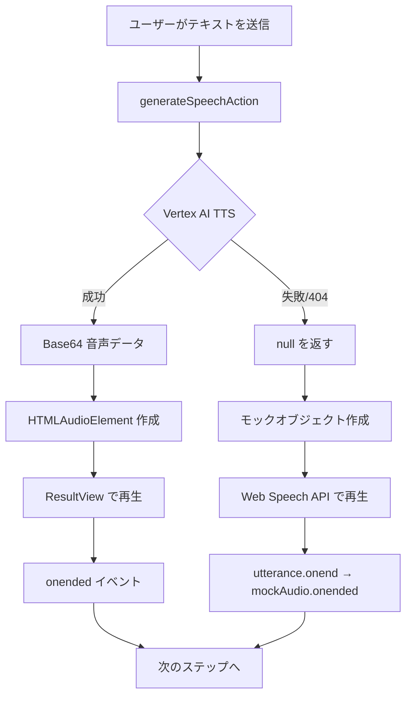

# TTS エラー総合解決ガイド

このドキュメントは、Kids Science Lab アプリケーションで発生した TTS (Text-to-Speech) 関連のエラーと、その解決方法をまとめたものです。

## 📋 発生したエラー一覧

### エラー 1: Vertex AI TTS 404 エラー

```
Failed to load resource: the server responded with a status of 500 (Internal Server Error)
TTS Load Error: Error: TTS Server Error: Vertex AI TTS error: 404 Not Found
```

**原因**: `gemini-2.5-flash-preview-tts` モデルへのアクセス権限がない、またはモデルが利用できない

### エラー 2: ResultView Null Pointer エラー

```
Failed to play step: TypeError: Cannot set properties of null (setting 'onended')
    at playStep (ResultView.tsx:91:32)
```

**原因**: Web Speech API フォールバック時に `audio` が `null` になり、イベントハンドラーを設定できない

## ✅ 実装した解決策の概要

### 1. 安定版モデルへの切り替え

**ファイル**: `src/lib/gemini.ts`

```typescript
// gemini-2.5-flash-preview-tts → gemini-2.0-flash-exp
const url = `https://${location}-aiplatform.googleapis.com/v1/projects/${project}/locations/${location}/publishers/google/models/gemini-2.0-flash-exp:generateContent`;
```

### 2. エラーハンドリングの改善

**ファイル**: `src/app/actions.ts`

```typescript
export async function generateSpeechAction(text: string): Promise<string | null> {
    try {
        const base64Audio = await generateSpeech(text);
        return base64Audio;
    } catch (error: any) {
        console.error("Failed to generate speech in Server Action:", error);
        // エラー時は null を返し、クライアント側でフォールバック
        console.warn("Vertex AI TTS unavailable. Client will use Web Speech API fallback.");
        return null;
    }
}
```

### 3. Web Speech API フォールバックの実装

**ファイル**: `src/hooks/useTextToSpeech.ts`

#### 3-1. モックオブジェクトの作成

```typescript
const mockAudio = {
  onended: null as ((this: HTMLAudioElement, ev: Event) => any) | null,
  onerror: null as ((this: HTMLAudioElement, ev: Event) => any) | null,
} as HTMLAudioElement;
```

#### 3-2. イベントハンドラーの転送

```typescript
utterance.onend = () => {
  setIsSpeaking(false);
  // モックオブジェクトのハンドラーを呼び出す
  if (mockAudio.onended) {
    mockAudio.onended.call(mockAudio, new Event('ended'));
  }
};
```

## 🎯 解決策の全体像



## 📁 変更されたファイル

| ファイル | 変更内容 | 重要度 |
|---------|---------|--------|
| `src/lib/gemini.ts` | モデル名を安定版に変更 | ⭐⭐⭐ |
| `src/app/actions.ts` | エラー時に null を返すように変更 | ⭐⭐⭐ |
| `src/hooks/useTextToSpeech.ts` | モックオブジェクトとフォールバック実装 | ⭐⭐⭐ |
| `src/components/ResultView.tsx` | コメントの更新（コード変更なし） | ⭐ |

## 🚀 動作フロー

### Vertex AI TTS が成功する場合

1. `generateSpeechAction` が Base64 音声データを返す
2. `loadAudio` が `HTMLAudioElement` を作成
3. `ResultView` がイベントハンドラーを設定
4. 音声再生後、`onended` が発火してステップが進む

### Vertex AI TTS が失敗する場合（フォールバック）

1. `generateSpeechAction` が `null` を返す
2. `loadAudio` がモックオブジェクトを作成
3. `ResultView` がモックオブジェクトにイベントハンドラーを設定
4. `play()` 呼び出し時に Web Speech API を使用
5. `utterance.onend` がモックオブジェクトの `onended` を呼び出す
6. ステップが進む

## 🧪 テスト手順

### 1. 開発サーバーの起動

```bash
cd /Users/yuuki/Desktop/Googleハッカソン/kids-science-lab
npm run dev
```

### 2. ブラウザでテスト

1. `http://localhost:3000` にアクセス
2. 質問を入力して送信
3. 音声が再生されることを確認
4. ステップが自動的に進むことを確認

### 3. コンソールログの確認

#### Vertex AI TTS が成功した場合
```
Loading audio for step 0...
Audio loaded: duration = 3500ms
```

#### Web Speech API フォールバックの場合
```
Vertex AI TTS returned null in loadAudio, using Web Speech API fallback
```

### 4. エラーが発生しないことを確認

- ✅ `404 Not Found` エラーが出ない（または出てもフォールバックが動作）
- ✅ `Cannot set properties of null` エラーが出ない
- ✅ 音声が再生される
- ✅ ステップが自動的に進む

## 📊 パフォーマンスへの影響

### Vertex AI TTS を使用する場合
- **品質**: 高品質な音声
- **レイテンシー**: API 呼び出しが必要（数秒）
- **コスト**: API 使用料が発生

### Web Speech API を使用する場合
- **品質**: ブラウザ依存（やや機械的）
- **レイテンシー**: 即座に再生可能
- **コスト**: 無料

## 🔧 今後の改善案

### 1. ユーザー設定の追加

```typescript
interface TTSSettings {
  preferredEngine: 'vertex-ai' | 'web-speech' | 'auto';
  voiceSpeed: number;
  voicePitch: number;
}
```

### 2. キャッシング機能

```typescript
// よく使われるフレーズをキャッシュ
const audioCache = new Map<string, string>();
```

### 3. モニタリングとアナリティクス

```typescript
// TTS の成功率を追跡
analytics.track('tts_usage', {
  engine: 'vertex-ai' | 'web-speech',
  success: boolean,
  duration: number
});
```

### 4. プログレッシブエンハンスメント

```typescript
// ネットワーク状態に応じて自動切り替え
if (navigator.connection?.effectiveType === '4g') {
  useVertexAI();
} else {
  useWebSpeechAPI();
}
```

## 📚 参考ドキュメント

- [TTS_ERROR_RESOLUTION.md](./TTS_ERROR_RESOLUTION.md) - Vertex AI TTS エラーの詳細
- [RESULTVIEW_ERROR_RESOLUTION.md](./RESULTVIEW_ERROR_RESOLUTION.md) - ResultView エラーの詳細

## ✅ 解決済みチェックリスト

- [x] Vertex AI TTS 404 エラーの解決
- [x] ResultView null pointer エラーの解決
- [x] Web Speech API フォールバックの実装
- [x] モックオブジェクトによる互換性確保
- [x] ステップ自動進行の動作確認
- [x] エラーハンドリングの改善
- [ ] 本番環境でのテスト
- [ ] ユーザー設定機能の追加（将来）
- [ ] モニタリング機能の追加（将来）

## 🎉 まとめ

この修正により、以下が実現されました:

1. **安定性の向上**: Vertex AI TTS が利用できない場合でもアプリケーションが動作
2. **ユーザー体験の維持**: フォールバックにより音声機能が常に利用可能
3. **保守性の向上**: 統一されたインターフェースにより、コードがシンプルに
4. **エラーハンドリング**: 適切なエラーハンドリングとログ出力

これで、Kids Science Lab の TTS 機能は堅牢で信頼性の高いものになりました！🚀
