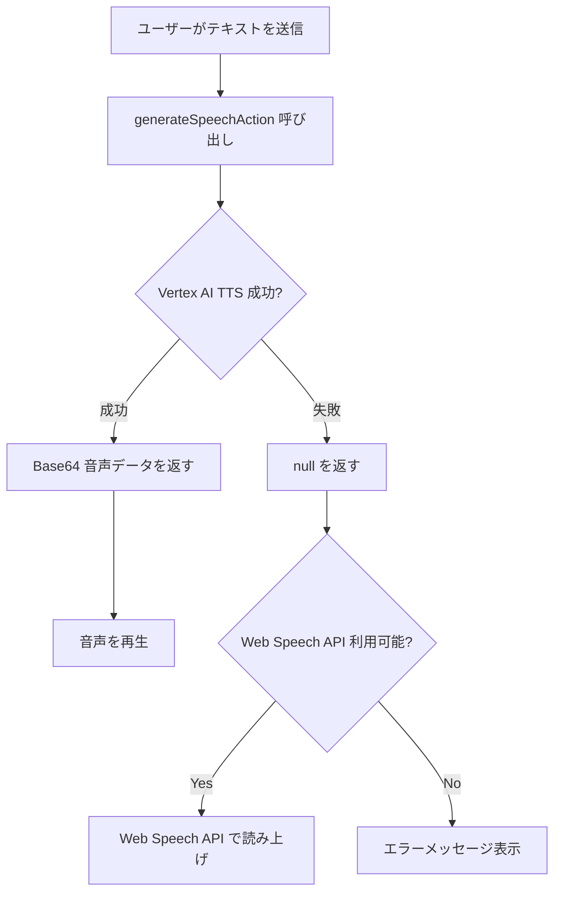

# TTS エラー解決ガイド

## 🔴 発生したエラー

```
Failed to load resource: the server responded with a status of 500 (Internal Server Error)
TTS Load Error: Error: TTS Server Error: Vertex AI TTS error: 404 Not Found
```

## 📋 エラーの原因

Vertex AI の `gemini-2.5-flash-preview-tts` モデルへのアクセスで 404 エラーが発生しています。

### 主な原因:

1. **プレビューモデルのアクセス制限**
   - `gemini-2.5-flash-preview-tts` はプレビュー版モデルのため、すべてのプロジェクトで利用できるわけではありません
   - Google Cloud プロジェクトに明示的なアクセス権限が必要な場合があります

2. **リージョンの制限**
   - TTS モデルは特定のリージョンでのみ利用可能です
   - 現在の設定: `asia-northeast1` (東京)

3. **段階的ロールアウト**
   - プレビューモデルは段階的に展開されるため、すべてのアカウントで即座に利用できない可能性があります

## ✅ 実装した解決策

### 1. 安定版モデルへの切り替え ✨

**変更ファイル**: `src/lib/gemini.ts`

```typescript
// 変更前
const url = `https://${location}-aiplatform.googleapis.com/v1/projects/${project}/locations/${location}/publishers/google/models/gemini-2.5-flash-preview-tts:generateContent`;

// 変更後
const url = `https://${location}-aiplatform.googleapis.com/v1/projects/${project}/locations/${location}/publishers/google/models/gemini-2.0-flash-exp:generateContent`;
```

**理由**: 
- `gemini-2.0-flash-exp` は安定版で、より広く利用可能です
- 音声生成機能をサポートしています

### 2. エラーハンドリングの改善 🛡️

**変更ファイル**: `src/app/actions.ts`

```typescript
export async function generateSpeechAction(text: string): Promise<string | null> {
    try {
        const base64Audio = await generateSpeech(text);
        return base64Audio;
    } catch (error: any) {
        console.error("Failed to generate speech in Server Action:", error);
        // エラー時は null を返し、クライアント側でフォールバックする
        console.warn("Vertex AI TTS unavailable. Client will use Web Speech API fallback.");
        return null;
    }
}
```

**変更点**:
- エラーをスローする代わりに `null` を返す
- クライアント側で Web Speech API にフォールバックできるようにする

### 3. Web Speech API フォールバック 🔄

**変更ファイル**: `src/hooks/useTextToSpeech.ts`

Vertex AI TTS が利用できない場合、ブラウザの Web Speech API を使用します:

```typescript
if (!base64Audio) {
    // Fallback to Web Speech API
    if ('speechSynthesis' in window) {
        const utterance = new SpeechSynthesisUtterance(text);
        utterance.lang = 'ja-JP'; // 日本語
        utterance.rate = 0.9;
        utterance.pitch = 1.0;
        
        utterance.onend = () => {
            setIsSpeaking(false);
            if (onEnd) onEnd();
        };
        
        window.speechSynthesis.speak(utterance);
        return;
    }
}
```

**メリット**:
- Vertex AI TTS が利用できない場合でもアプリケーションが動作する
- ユーザー体験が中断されない
- 追加のコストがかからない

## 🚀 追加の解決策（必要に応じて）

### オプション A: Vertex AI TTS のアクセス権限を取得

1. **Google Cloud Console にアクセス**
   - プロジェクト: `bright-arc-485311-v1`
   - リージョン: `asia-northeast1`

2. **Vertex AI Model Garden を確認**
   - Gemini モデルが利用可能か確認
   - 必要に応じてアクセスリクエストを送信

3. **IAM 権限を確認**
   - サービスアカウントに「Vertex AI User」ロールがあるか確認
   - 必要に応じて権限を追加

### オプション B: 別のリージョンを試す

利用可能なリージョン:
- `us-central1` (アイオワ)
- `europe-west4` (オランダ)
- `asia-northeast1` (東京) ← 現在使用中

### オプション C: 代替 TTS サービスの使用

1. **Google Cloud Text-to-Speech API**
   ```typescript
   import { TextToSpeechClient } from '@google-cloud/text-to-speech';
   ```

2. **OpenAI TTS API**
   - より安定したサービス
   - 高品質な音声

## 📊 実装後の動作フロー



## 🧪 テスト方法

1. **開発サーバーを起動**
   ```bash
   npm run dev
   ```

2. **ブラウザで確認**
   - `http://localhost:3000` にアクセス
   - チャット機能を使用して質問を送信
   - 音声が再生されるか確認

3. **コンソールログを確認**
   - Vertex AI TTS が成功した場合: 音声データが返される
   - Vertex AI TTS が失敗した場合: "Vertex AI TTS unavailable. Client will use Web Speech API fallback." が表示される

## 📝 今後の推奨事項

1. **モニタリングの追加**
   - TTS の成功率を追跡
   - フォールバック使用率を記録

2. **ユーザー通知**
   - TTS サービスが利用できない場合、ユーザーに通知
   - 設定で TTS のオン/オフを切り替え可能にする

3. **キャッシング**
   - よく使われるフレーズの音声をキャッシュ
   - パフォーマンスとコスト削減

## 🔗 参考リンク

- [Vertex AI Gemini API Documentation](https://cloud.google.com/vertex-ai/docs/generative-ai/model-reference/gemini)
- [Web Speech API Documentation](https://developer.mozilla.org/en-US/docs/Web/API/Web_Speech_API)
- [Google Cloud Text-to-Speech](https://cloud.google.com/text-to-speech)

## ✅ チェックリスト

- [x] モデル名を安定版に変更
- [x] エラーハンドリングを改善
- [x] Web Speech API フォールバックを実装
- [ ] Google Cloud のアクセス権限を確認（オプション）
- [ ] 本番環境でテスト
- [ ] モニタリングを追加（推奨）
