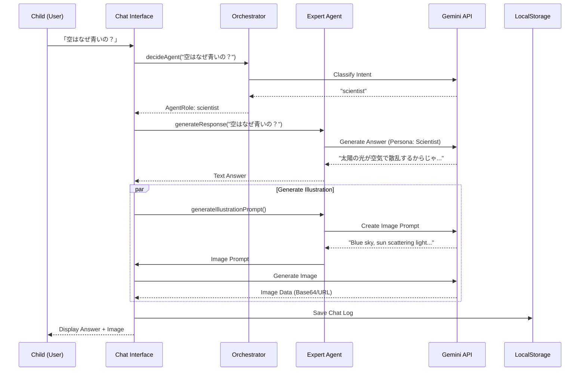

# Architecture Documentation

## 1. Overview
Kids Science Lab は、子供たちの素朴な疑問に対して、個性豊かなAIエージェント（博士や専門家）が対話形式で答え、画像や音声を交えて解説するWebアプリケーションです。
Next.js App Router をベースに構築され、Google Gemini API を活用したマルチモーダルな体験を提供します。

## 2. Tech Stack

### Frontend
- **Framework**: [Next.js 14+](https://nextjs.org/) (App Router)
- **Language**: [TypeScript](https://www.typescriptlang.org/)
- **Styling**: [Tailwind CSS](https://tailwindcss.com/)
- **UI Components**: [shadcn/ui](https://ui.shadcn.com/) (Radix UI based)
- **Icons**: Lucide React

### AI / Backend Services
- **LLM**: Google Gemini Pro (`gemini-3-pro-preview`) - テキスト生成、対話制御
- **Image Generation**: Google Gemini Pro Vision / Imagen (`gemini-3-pro-image-preview`) - 解説イラスト生成
- **Speech**: Web Speech API (Browser Native) - *現状はブラウザ標準機能を使用。品質向上のためServer-side TTS (OpenAI compatible API等) の導入を検討中*

### State Management & Storage
- **Local State**: React Hooks (`useState`, `useReducer`)
- **Persistence**: `localStorage` (Chat history persistence on client-side for MVP)

## 3. Agent Architecture

本システムは **Orchestrator-Workers Pattern** を採用しています。ユーザーの質問をまず「オーケストレーター」が受け取り、最適な「専門家エージェント」に振り分けます。

### Core Components
- **Orchestrator Agent**: ユーザーの入力内容を分析し、適切な専門家（Scientist, Biologist, etc.）を選定します。
- **Expert Agents**: 特定の分野（科学、生物、歴史、芸術など）に特化したペルソナを持つエージェント。回答の生成と、画像生成プロンプトの作成を行います。
- **Gemini Wrapper**: AIモデルとの通信を抽象化し、エラーハンドリングやレスポンスの整形を行います。

### Interaction Flow



## 4. Data Models

### Chat Message
会話の履歴は以下の構造で管理されます。

```typescript
type Role = "user" | "model";

interface ChatMessage {
  id: string;
  role: Role;
  content: string; // テキスト本文
  agentId?: string; // どのエージェントが発言したか
  timestamp: number;
  imageUrl?: string; // 生成された画像のURL
  audioUrl?: string; // 生成された音声のURL
  style?: string; // 説明スタイル
}
```

### Chat Session
一連の会話はセッションとしてグループ化されます。

```typescript
interface ChatSession {
  id: string;
  title: string; // 最初の質問などから生成
  messages: ChatMessage[];
  topics?: string[]; // カテゴリ分類・トピック
  startTime: number;
  lastUpdated: number;
}
```

## 5. Directory Structure

主要なディレクトリ構成は以下の通りです。

- `src/app`: Next.js App Router ページコンポーネント
- `src/components`: UIコンポーネント (Atomic Design的な粒度で配置)
  - `ui/`: shadcn/ui コンポーネント
- `src/lib`: ユーティリティ、ビジネスロジック
  - `agents/`: AIエージェント関連のロジック (`core.ts`, `definitions.ts`)
  - `gemini.ts`: Gemini API クライアント
  - `chat-history.ts`: 履歴管理ロジック

## 6. Future Considerations
- **Backend Database**: 履歴の永続化と親向けレポート機能の強化のために、SupabaseやVercel PostgresなどのDB導入を検討。
- **Voice Interaction**: Web Speech APIだけでなく、より高品質な音声合成(TTS)サービスの統合。
- **User Accounts**: 親と子のプロファイル管理、認証機能の実装。
