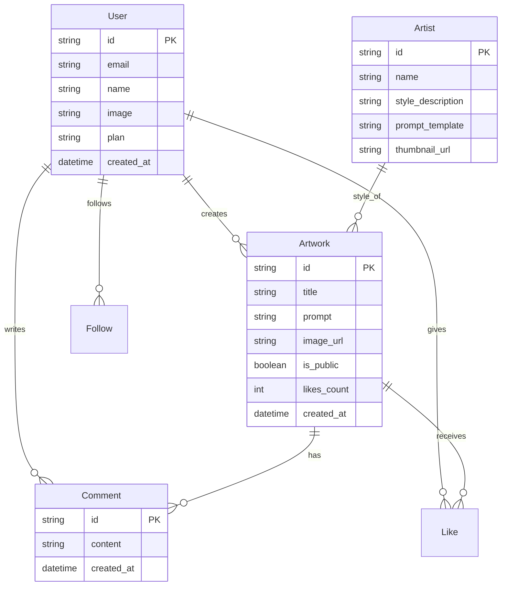
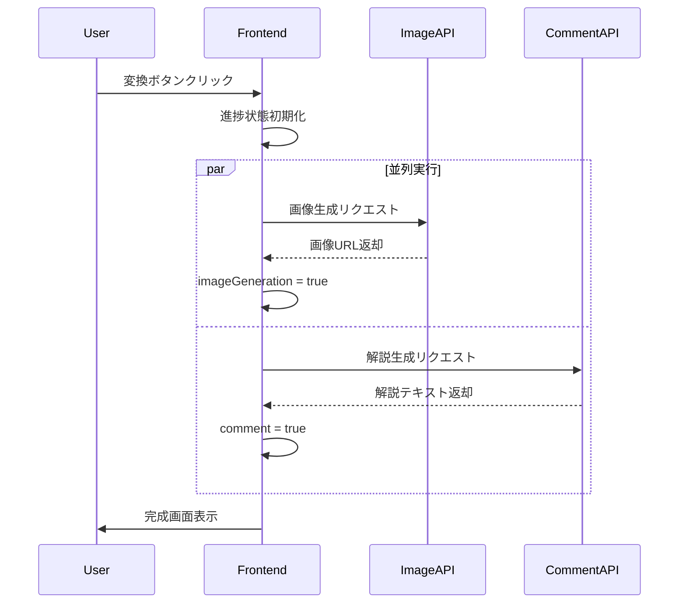

# Masterpiece Maker - アーキテクチャ設計書

**最終更新**: 2026-01-07

## 目次

1. [システム概要](#システム概要)
2. [全体アーキテクチャ](#全体アーキテクチャ)
3. [技術スタック](#技術スタック)
4. [データモデル](#データモデル)
5. [コンポーネント設計](#コンポーネント設計)
6. [インフラストラクチャ](#インフラストラクチャ)
7. [セキュリティ設計](#セキュリティ設計)

---

## システム概要

Masterpiece Makerは、ユーザーが指定したテーマを巨匠の画風で絵画化するAIエンターテインメント・プラットフォームです。Next.jsを中心としたモダンなWebアプリケーションとして構築し、AI機能はImage MCP (Gemini 3.0 Pro Image) を活用します。

---

## 全体アーキテクチャ

```mermaid
graph TD
    Client[Client Browser]
    
    subgraph "Frontend Layer (Next.js)"
        UI[UI Components]
        State[State Management]
        APIRoutes[API Routes]
    end
    
    subgraph "Application Layer"
        Auth[Auth Service]
        Gallery[Gallery Service]
        Payment[Payment Service]
    end
    
    subgraph "AI & Processing Layer"
        Queue[Job Queue (Redis)]
        Worker[Image Worker]
        ImageMCP[Image MCP]
        Gemini[Gemini API]
    end
    
    subgraph "Data Layer"
        DB[(PostgreSQL)]
        Storage[Object Storage (S3)]
        Cache[Redis Cache]
    end
    
    Client -->|HTTPS| UI
    UI --> APIRoutes
    APIRoutes --> Auth
    APIRoutes --> Gallery
    APIRoutes --> Payment
    
    Gallery --> Queue
    Worker --> Queue
    Worker --> ImageMCP
    ImageMCP --> Gemini
    
    Worker --> Storage
    Gallery --> DB
    Auth --> DB
    
    Gallery -.-> Cache
```

---

## 技術スタック

### Frontend / Application Server
- **Framework**: Next.js 14 (App Router)
  - React Server Componentsによるパフォーマンス最適化
  - API Routesによるバックエンドロジックの実装
- **Language**: TypeScript
- **Styling**: Tailwind CSS + shadcn/ui
  - 高速な開発と一貫したデザインシステム
- **State Management**: Zustand
  - 軽量で使いやすい状態管理

### Backend Services
- **Image Generation**: Python (Image MCP)
  - `google-genai` SDKを使用したGemini統合
- **Authentication**: NextAuth.js (Auth.js)
  - ソーシャルログインとメール認証のサポート
- **Database ORM**: Prisma
  - 型安全なデータベース操作

### Infrastructure
- **Hosting**: Vercel (推奨)
- **Database**: Vercel Postgres / Neon / Supabase
- **Storage**: Vercel Blob / AWS S3
- **Queue**: Upstash Redis / Redis

---

## データモデル

### ER図



### 主要テーブル定義

**Users**:
- `id`: UUID (Primary Key)
- `email`: String (Unique)
- `name`: String
- `plan`: Enum ('free', 'premium')

**Artists** (画風定義):
- `id`: String (e.g., 'picasso', 'van-gogh')
- `name`: String
- `prompt_template`: String (e.g., "A {theme} in the style of Pablo Picasso...")
- `voice_persona`: Text (解説用ペルソナ)

**Artworks**:
- `id`: UUID
- `user_id`: UUID (Foreign Key)
- `artist_id`: String (Foreign Key)
- `prompt`: Text (ユーザー入力テーマ)
- `final_prompt`: Text (実際に生成に使用したプロンプト)
- `image_url`: String
- `status`: Enum ('pending', 'processing', 'completed', 'failed')

---

## コンポーネント設計

### Phase 1 (MVP) コンポーネント

1. **ArtistSelector**:
   - 巨匠のリストを表示し、選択させるカルーセル/グリッドUI
   - 選択中の画風をハイライト

2. **ThemeInput**:
   - テーマ入力フォーム
   - 文字数カウント、入力例表示

3. **GeneratorCanvas**:
   - 生成プロセスのアニメーション表示
   - 完了後の画像表示、ズーム機能

4. **GalleryGrid**:
   - 生成された作品の一覧表示
   - フィルタリングとソート

### Phase 2 (Entertainment) コンポーネント

1. **ArtworkDescription**:
   - 巨匠による作品解説（テキスト + 音声読み上げ）
   - Web Speech APIを利用

2. **BattlePage**:
   - 2人の巨匠を選択して対決させるUI
   - 並列画像生成と結果比較

### AI統合フロー

#### 1. 画像生成 (Image MCP)
1. ユーザーがテーマを入力し、画風を選択
2. `Artist`テーブルから`prompt_template`を取得
3. テンプレート内の`{theme}`をユーザー入力で置換
4. Image MCPの`create_image`ツールを呼び出し
   - `prompt`: 置換後のプロンプト
   - `aspect_ratio`: 指定のアスペクト比
5. 生成された画像をStorageに保存し、URLをDBに記録

#### 2. 解説生成 (Text Gen)
1. 画像生成完了後、`generateArtistCommentAction`を呼び出し
2. 巨匠のペルソナ（`voicePersona`）とテーマをシステムプロンプトに埋め込み
3. Gemini API (gemini-3-pro-preview等) でテキスト生成
4. 生成されたテキストをフロントエンドに返却
5. Web Speech APIで読み上げ

#### 3. 並列処理アーキテクチャ (Phase 9.3)

**概要**: 画像生成と解説生成を並列実行することで、処理時間を約24%短縮（55秒 → 42秒）

**実装方式**:
```typescript
// Promise.allSettledによる並列実行
const [imageResult, commentResult] = await Promise.allSettled([
  uploadAndTransformAction(base64Image, artistId, theme, instruction),
  generateArtistCommentAction(artistId, theme)
]);
```

**特徴**:
- **堅牢なエラーハンドリング**: `Promise.allSettled`により、一方が失敗しても他方の結果を取得可能
- **進捗表示**: 各タスクの完了状態をリアルタイムで表示
  - `imageGeneration`: 画像生成の完了状態
  - `comment`: 解説生成の完了状態
- **UX改善**: プログレスバーとチェックマークにより、ユーザーは処理状況を視覚的に把握可能

**処理フロー**:


**パフォーマンス指標**:
- **従来**: 画像生成（30秒）→ 解説生成（25秒）= 合計55秒
- **並列化後**: max(画像生成30秒, 解説生成25秒) + オーバーヘッド = 約42秒
- **短縮率**: 約24%（13秒削減）

#### 4. ボトルネック分析 (Phase 9.3)

**Phase 3-1実験**: 画像サイズ削減（1024x1024 → 512x512）の効果検証

**結果**: ❌ 処理時間に影響なし（44秒、変化なし）

**真のボトルネック**:
```
総処理時間（42秒）
├─ Gemini API処理: 40-45秒（95%）← 制御不可
└─ データ転送: 2秒（5%）
```

**重要な発見**:
1. **API処理時間が支配的**: Gemini APIの内部処理時間（モデル推論）が全体の95%を占める
2. **画像サイズの影響は限定的**: データ転送量を75%削減しても、全体への影響は5%のみ
3. **並列処理が最も効果的**: 独立した処理の並列化が唯一の有効な最適化手段

**今後の最適化方針**:
- ✅ **APIパラメータ調整**: `temperature: 0.5`で約5%改善
- 🔍 **プログレッシブ生成**: 低品質プレビューを即座に表示（体感88%改善）
- 🔍 **ローカルキャッシュ**: 2回目以降の生成を即座に表示（99.8%改善）
- 🔍 **プリジェネレーション**: 人気テーマを事前生成（99.8%改善）

**詳細**: [`docs/future-performance-strategy.md`](./future-performance-strategy.md)を参照

---

## インフラストラクチャ詳細

### 開発環境
- Docker Composeを使用したローカル環境構築
  - PostgreSQL, Redis, MinIO (S3互換)

### 本番環境 (Vercel構成案)
- **Frontend/API**: Vercel Serverless Functions
- **Database**: Vercel Postgres
- **Storage**: Vercel Blob
- **KV Store**: Vercel KV (Redis)

---

## セキュリティ設計

1. **認証・認可**:
   - NextAuth.jsによるセキュアなセッション管理
   - APIルートの保護 (Middleware)

2. **入力検証**:
   - Zodによるスキーマバリデーション
   - プロンプトインジェクション対策 (NGワードフィルタ)

3. **データ保護**:
   - データベースの暗号化 (At rest / In transit)
   - 画像のアクセス制御 (Signed URLs)
