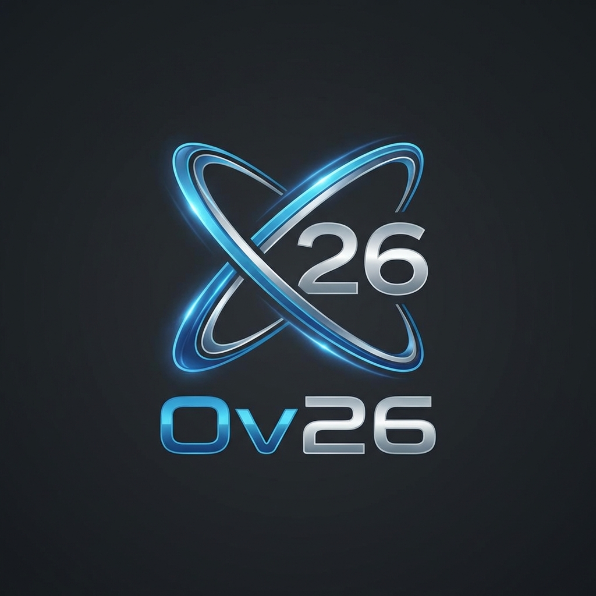
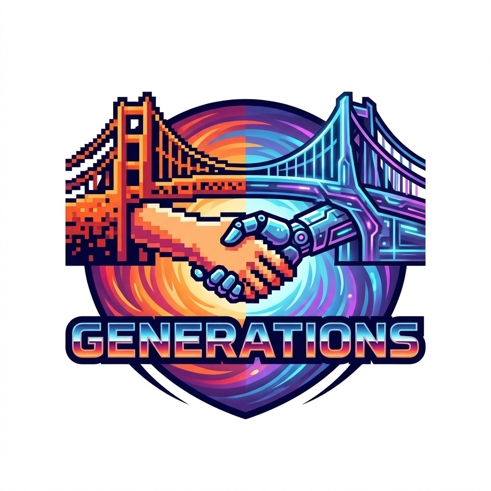
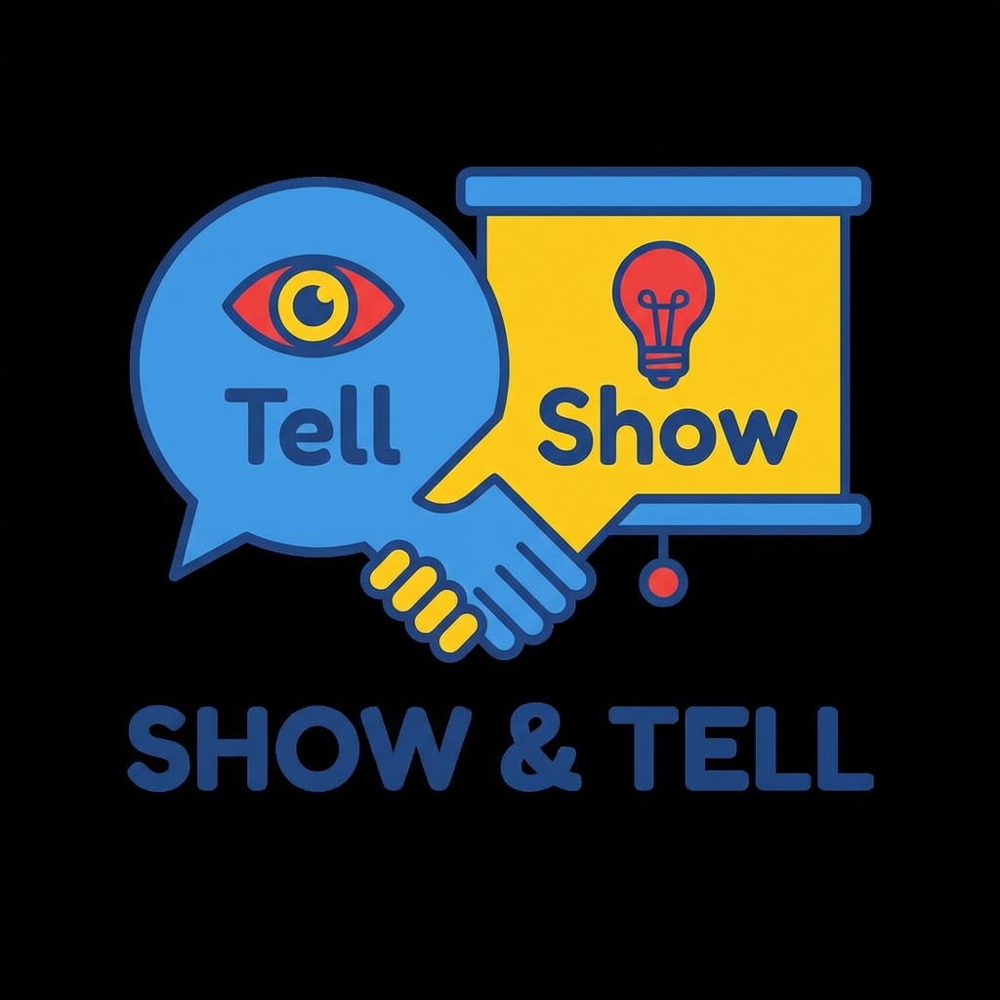
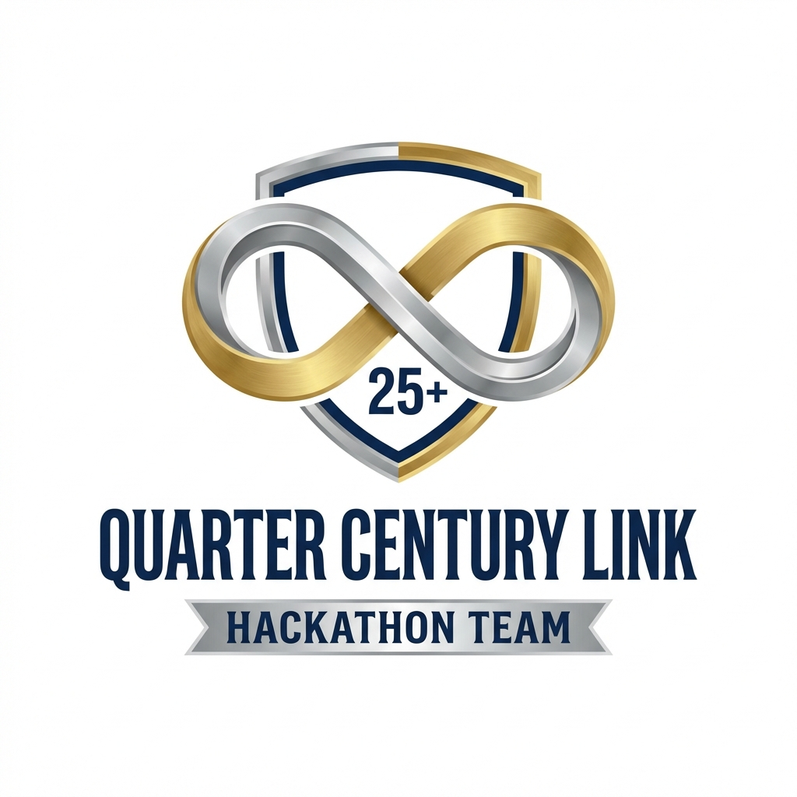
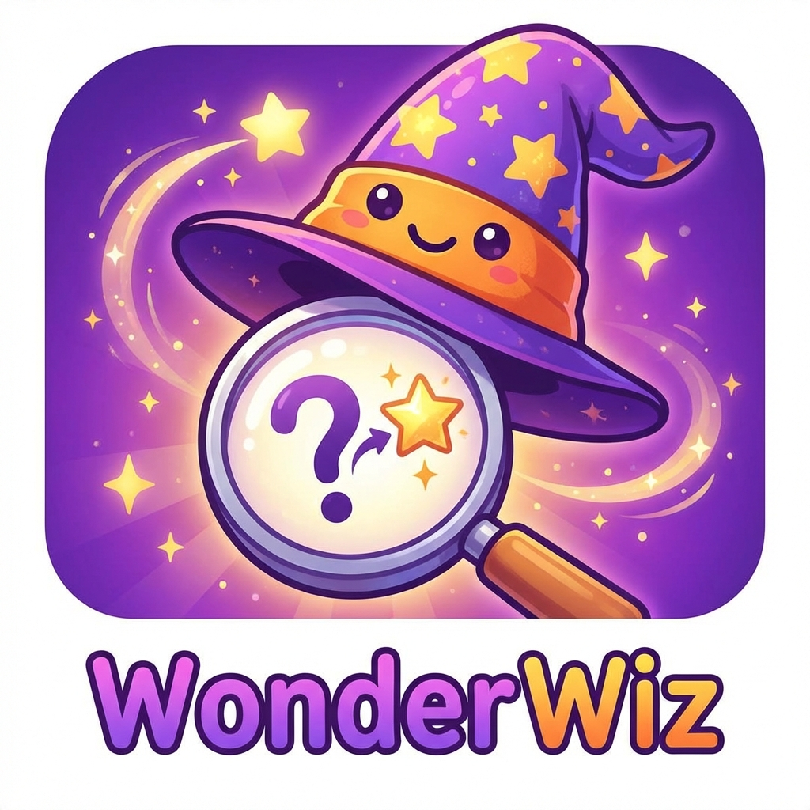
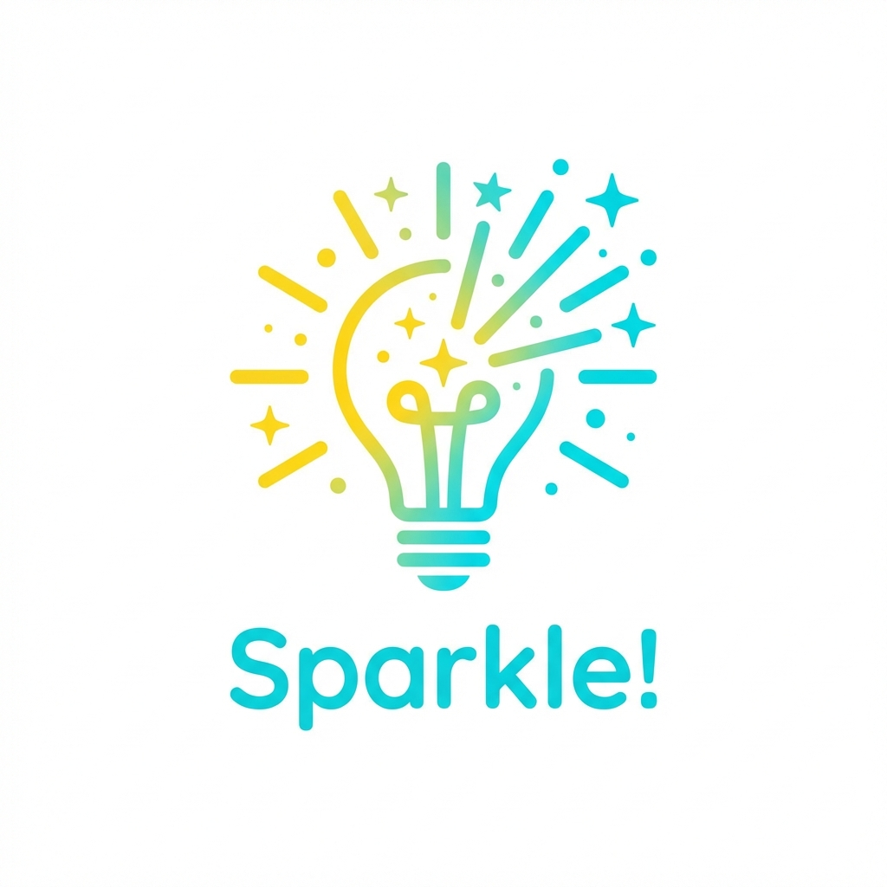
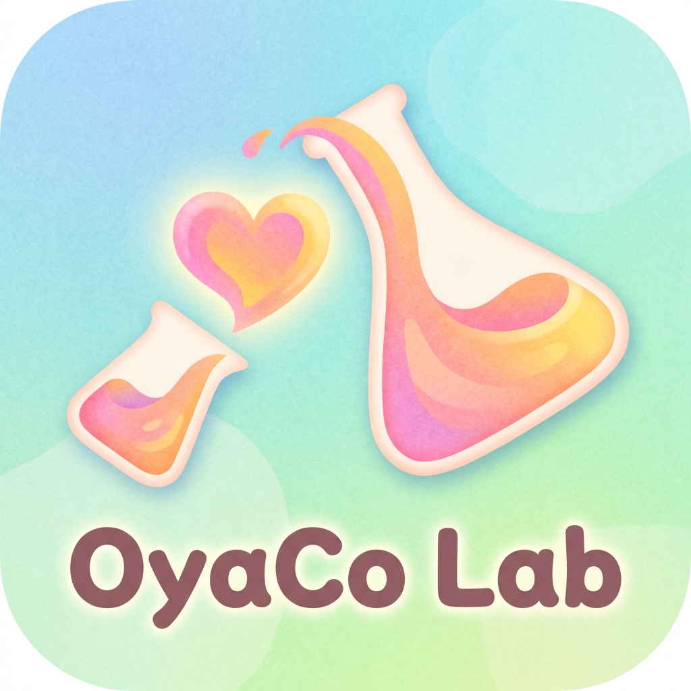
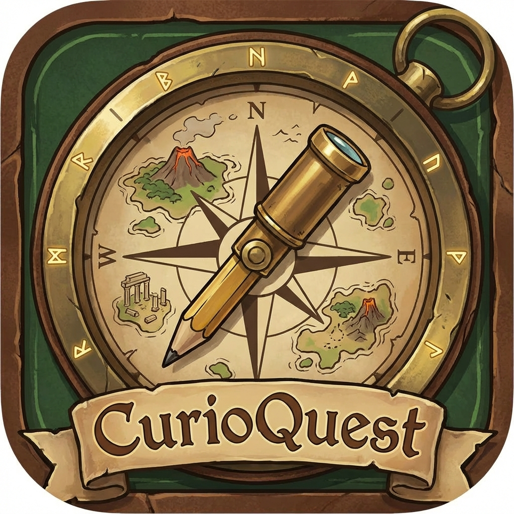

# ハッカソン用チーム名・ツール名ネーミング案

## チーム名案（年の差26歳コンビ：上田さん×西村さん）

| No. | チーム名 | アイコン | 由来・コンセプト | アピールポイント |
| :--- | :--- | :---: | :--- | :--- |
| 1 | **Ov26** (Over26 / Orbit26) |  | 年の差「26」を越え(Over)、二人の軌道(Orbit)が重なる | 数字のインパクト大。ハッカソンらしい勢いと、「年齢を超えた技術」を強調。 |
| 2 | **Generations** (ジェネレーションズ) |  | 世代を超えたタッグ × AIの「生成(Generate)」 | 親子向けアプリのテーマとも合致。シンプルで覚えやすい。 |
| 3 | **Show & Tell** (ショウ・アンド・テル) |  | 欧米の学校行事「発表会」× ビジネス(Show)と技術(Tell) | 教育系アプリらしさと、二人の役割（見せるビジネス側＋語る技術側）を表現。 |
| 4 | **Quarter Century Link** |  | 四半世紀（約26年）の時を超えたリンク | 重厚感と信頼感。EC事業部15年のキャリアへのリスペクトも込めた表現。 |
| 5 | **Root & Branch** |  | 根(Root=ベテランの経験)と枝(Branch=若手の技術) | 開発用語（Gitのブランチ）を含みつつ、木（Science Tree）を育てるイメージ。 |

## ツール名案（「Kids Science Lab」の発展・別案）

| No. | ツール名 | アイコン | 由来・コンセプト | アピールポイント |
| :--- | :--- | :---: | :--- | :--- |
| 1 | **WonderWiz** (ワンダーウィズ) |  | Wonder(驚き) + Wizard(博士) + With(親子) | 「魔法のような体験」を強調。語呂が良く、ポップな印象。 |
| 2 | **Sparkle!** (スパークル！) |  | 子供の目が輝く瞬間(Sparkle)・知的好奇心の火花 | 短く、ロゴやアイコン映えする。直感的に「楽しそう」と思わせる。 |
| 3 | **OyaCo Lab** (オヤコラボ) |  | 親子(Oyaco) + Lab + Collaboration | 日本語の響きを活かした親しみやすさ。「親と子の対話」に焦点を当てる。 |
| 4 | **Seven Sense** (セブン・センス) |  | 7人のAI博士 × 第7感（科学の目・センス） | 「7人の博士」というアプリの独自機能を強く打ち出す。SFチックでかっこいい。 |
| 5 | **CurioQuest** (キュリオ・クエスト) |  | Curiosity(好奇心) + Quest(冒険) | 「学び＝冒険」というワクワク感。ゲーム性のあるUIデザインとも相性が良い。 |
