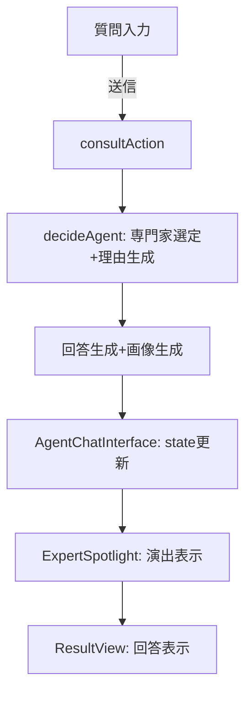

# 専門家選択演出の設計と実装完了

## 概要
質問入力後、回答が生成されるまでの待ち時間に、どの専門家（博士や先生）が選ばれるかをワクワクしながら待てるような演出を導入しました。

## 実装済みの演出のフロー
1. **質問の表示**: ユーザーが入力した質問が画面上部に表示されます（「きみのしつもん」）
2. **全員集合**: 画面に利用可能な全専門家のアバターが半透明で並びます
3. **スポットライト開始**: 0.4秒ごとにスポットライトが次の専門家へ移動します
4. **専門家決定**: APIから回答が返ってきたら、該当する専門家でスポットライトが止まります
5. **決定アクション**: 選ばれた専門家が拡大＆キラキラエフェクトで強調されます
6. **選定理由の表示**: 子供向けの優しい言葉で、なぜその専門家が選ばれたかを表示します
7. **遷移**: 約3秒の演出後、回答画面へ遷移します

## データフロー

## 実装詳細

### 1. データモデルの拡張
- **`AgentResponse`** に `selectionReason?: string` を追加
- 子供向けの選定理由をレスポンスに含めるようになりました

### 2. API層の改善
- **`decideAgent`** 関数を改修し、`{ agentId, reason }` を返すように変更
- Gemini APIに子供向けの理由（例: "うちゅうのことがとくいだから"）を生成させます
- JSON形式でレスポンスを受け取り、パース処理を追加

### 3. ExpertSpotlightコンポーネントの実装
#### プロップス
- `selectedExpert`: 選ばれた専門家のID
- `selectionReason`: 選定理由（子供向け）
- `question`: ユーザーの質問内容
- `onAnimationComplete`: 演出完了時のコールバック

#### 演出の流れ
1. 質問内容を上部に表示（Framer Motionでフェードイン）
2. 専門家アバターを順番にハイライト（0.4秒間隔）
3. 専門家が決定したら、そこで停止
4. 0.8秒後に選定理由を表示（スケールアニメーション付き）
5. 3秒後に次の画面へ遷移

### 4. AgentChatInterfaceの改善
- `currentQuestion` ステートを追加し、質問内容を保持
- `ExpertSpotlight` と `ResultView` に質問と選定理由を渡します

### 5. ResultViewの改善
- 画面上部に質問内容を常に表示
- 半透明の背景で見やすく表示

## 演出タイミング
- スポットライト移動: 0.4秒間隔
- 専門家確定後、メッセージ表示まで: 0.8秒
- 合計演出時間: 約3秒
- その後、回答画面へ自動遷移

## 実装ファイル一覧
- ✅ `src/lib/agents/types.ts` - `AgentResponse`にselectionReasonを追加
- ✅ `src/lib/agents/core.ts` - `decideAgent`を改修
- ✅ `src/app/actions.ts` - 選定理由をレスポンスに含める
- ✅ `src/components/ExpertSpotlight.tsx` - 演出コンポーネント
- ✅ `src/components/AgentChatInterface.tsx` - 状態管理とデータ受け渡し
- ✅ `src/components/ResultView.tsx` - 質問内容の表示

## 子供向けUIの工夫
- 「きみのしつもん」「こたえてくれるのは...」「えらばれたりゆう」など、全てひらがな表記
- カラフルな背景とボーダー（空色、黄色）
- 優しいアニメーション（フェードイン、スケール、パルス）
- キラキラエフェクト（✨）で楽しさを演出

## ステータス
✅ 実装完了
