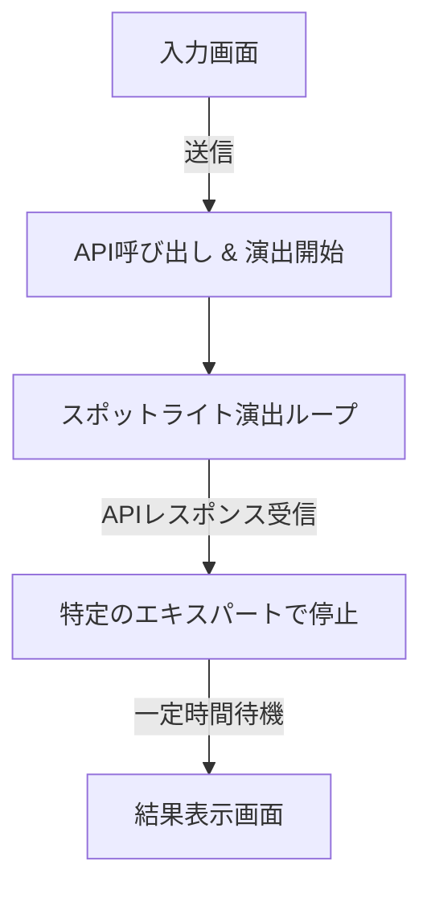

# 専門家選択演出の設計案

## 概要
質問入力後、回答が生成されるまでの待ち時間に、どの専門家（博士や先生）が選ばれるかをワクワクしながら待てるような演出を導入します。

## 演出のフロー
1. **全員集合**: 画面に利用可能な全専門家のアバターが半透明（またはモノクロ）で並びます。
2. **スポットライト開始**: 左から右へ、あるいはランダムにスポットライト（明るくなる演出）が移動します。
3. **専門家決定**: APIから回答が返ってきたら、該当する専門家でスポットライトが止まります。
4. **決定アクション**: 選ばれた専門家が「ぴょん」と跳ねたり、大きくなったりして強調されます。
5. **遷移**: 「〇〇博士が解説するよ！」というメッセージと共に、回答画面へ遷移します。

## ステート制御の改善
現在の `viewMode` に「演出中」のステータスを意識した制御を追加します。

## 実装上の工夫
- **最低演出時間**: APIが瞬時に返ってきた場合でも、少なくとも2〜3秒は演出を見せることで、AIが考えている雰囲気とワクワク感を演出します。
- **並列処理**: API呼び出しとアニメーションを並行して行い、レスポンスが来たタイミングでアニメーションの「停止目標」を決定します。

## ターゲットファイル
- `src/components/ExpertSpotlight.tsx` (新規作成)
- `src/components/AgentChatInterface.tsx` (表示切り替えロジック)
- `src/lib/agents/definitions.ts` (専門家データの取得元)
