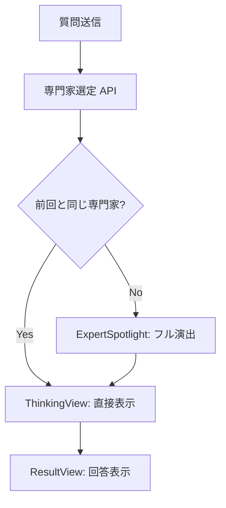

# 専門家選出演出の最適化設計 (ストーリー2)

追加質問時に、前回と同じ専門家が選ばれた場合の無駄な待ち時間を減らし、会話のテンポを向上させるための設計。

## 1. ユーザーストーリーのブラッシュアップ

**タイトル:** 同じ専門家が続けて回答する場合の演出スキップと簡易切り替え

**背景:**
現在は追加質問のたびに「誰に聞くか考えているよ...」というスポットライト演出（約1.5s〜3s）が必ず入ります。同じ専門家が回答する場合、この演出は冗長であり、ユーザーの思考を妨げます。

**ストーリー:**
As a インタラクションに慣れてきたユーザー,
I want to 同じ専門家が続けて答えるときは派手な選出アニメーションを省略してほしい,
So that 会話のテンポが崩れず、回答内容に集中できるようにしたい。

**受け入れ基準 (Acceptance Criteria):**
1. **[完全同一時のスキップ]** 前回と同じ専門家が選ばれ、かつ選定理由もほぼ同じ（または追加質問である）場合、`ExpertSpotlight` 演出を完全にスキップし、直接 `ThinkingView`（または回答画面）へ進む。
2. **[役割切り替え時の簡易演出]** 前回と同じ専門家だが、新しい視点や理由で選ばれた場合、スポットライト演出は行わず、「引き続き 〇〇はかせ が答えるよ！」といった短い告知（1秒以内）のみを表示する。
3. **[別専門家への交代]** 専門家が変わる場合は、これまで通りフル演出（スポットライト）を行い、視点の変化を強調する。
4. **[視覚的一貫性]** 演出をスキップしても、現在「誰が」考えているのかが常に画面上でわかるようにする。

---

## 2. システム設計

### 2.1 状態管理の変更 (`AgentChatInterface.tsx`)

`AgentChatInterface` に前回の専門家情報を保持するステートを追加または拡張します。

```typescript
// 追加するステート
const [previousExpert, setPreviousExpert] = useState<AgentRole | undefined>(undefined);

// handleQuestion 内でのロジック
const handleQuestion = async (question: string) => {
  // ... (既存の処理)
  
  // APIを呼ぶ前に、現在の専門家を保持
  setPreviousExpert(selectedExpert); 
  
  // APIを呼ぶ
  const result = await consultAction(question, history, 'default');
  
  if (result.success && result.data) {
    const newExpert = result.data.agentId;
    
    if (newExpert === previousExpert) {
      // 同じ専門家の場合のフラグを立てる、または viewMode を直接調整
      // 例: setViewMode('thinking'); // spotlightを飛ばして直接 thinking へ
    } else {
      setViewMode('selecting'); // 違うならフル演出
    }
  }
}
```

### 2.2 アニメーション分岐ロジック

演出の分岐条件を以下のように定義します。

| 条件 | 演出タイプ | 内容 |
| :--- | :--- | :--- |
| `currentExpert !== previousExpert` | **フル演出** | `ExpertSpotlight` (スポットライト + 理由表示) |
| `currentExpert === previousExpert` | **簡易演出 / スキップ** | 直接 `ThinkingView` へ。ただし `ThinkingView` 内で「引き続き〇〇が答えるよ」と表示 |

### 2.3 `ThinkingView.tsx` の拡張

`ThinkingView` に「継続して回答していること」を示すプロパティを追加します。

```typescript
interface ThinkingViewProps {
  agent: Agent;
  question: string;
  isContinuing?: boolean; // 追加
}
```

- `isContinuing` が `true` の場合：
  - 「〇〇はかせ が ひきつづき かんがえているよ...」というテキストを表示。
  - スポットライト演出の時間をショートカットして、すぐに思考中アニメーションを見せる。

---

## 3. UI/UX 詳細

### 3.1 簡易演出のシーケンス (同一専門家の場合)

1. ユーザーが質問を送信。
2. 背景で API が走り、専門家を決定。
3. `AgentChatInterface` が「前回と同じ」と判定。
4. **`ExpertSpotlight` を表示せず**、直接 `ThinkingView` を表示。
5. `ThinkingView` では、アバターが最初から確定状態で表示され、「ひきつづき 〇〇はかせ が かんがえているよ」というメッセージを出す。
6. API 完了次第、`ResultView` へ。

### 3.2 Mermaid ダイアログ (分岐ロジック)



## 4. 修正が必要なファイル

1. `src/components/AgentChatInterface.tsx`: 判定ロジックの追加
2. `src/components/ThinkingView.tsx`: 継続表示のUIサポート
3. `src/components/ExpertSpotlight.tsx`: (オプション) スキップ時のフラグ対応
