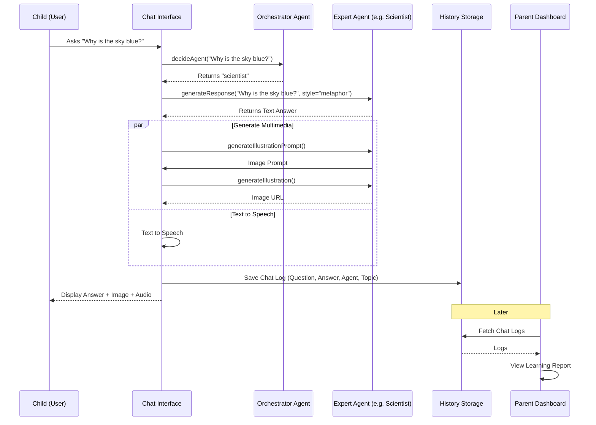
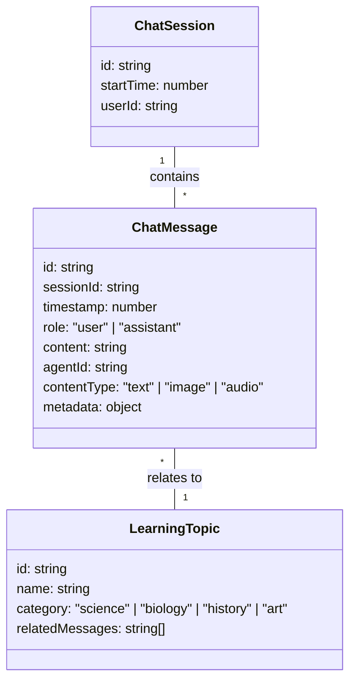

# Agent Architecture Design (Completed)

Status: ✅ Completed
Date: 2026-01-24

This architecture has been implemented in `src/lib/agents/` and `src/components/AgentChatInterface.tsx`.

---

## Sequence Diagram: User Interaction Flow

## Data Model: Chat History

To support "Parent Reporting" feature, we need a dedicated Chat Log storage separate from Image Generation History.

