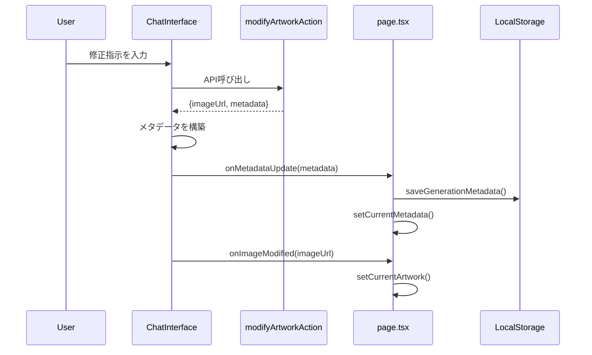

# Phase 9.1: チャット修正時のプロンプト履歴保存 - 実装計画書

**作成日**: 2026-01-07  
**ステータス**: 実装準備完了 ✅  
**見積もり**: 40分  
**優先度**: 高（既存機能の不具合修正）

## 1. 問題の概要

### 現状の問題
チャットインターフェースで画像修正を依頼した際、`modifyArtworkAction`はメタデータを返却しているが、**フロントエンド側で保存されていない**ため、プロンプト詳細ダイアログで修正履歴を確認できない。

### 影響範囲
- ユーザーが「もっと明るくして」などの修正指示を出しても、そのプロンプトが履歴に残らない
- プロンプト詳細ダイアログで初回生成のプロンプトしか表示されない
- 修正の系譜（どのような指示で画像が変化したか）が追跡できない

### 根本原因
[`ChatInterface.tsx`](../../src/components/ChatInterface.tsx:97-126)の`handleModifyRequest`関数で、`modifyArtworkAction`の返却値から`result.metadata`を取得しているが、保存処理が実装されていない。

```typescript
// 現在のコード（111-116行目）
const result = await modifyArtworkAction(artist.id, currentImageUrl, instruction);

if (result.success && result.imageUrl) {
  onImageModified(result.imageUrl);  // 画像URLのみ更新
  // ❌ result.metadata が保存されていない！
}
```

## 2. 解決策の設計

### アーキテクチャ方針

**コールバック方式**を採用し、責任分離を明確にする：
- **子コンポーネント（ChatInterface）**: UI処理とAPI呼び出し
- **親コンポーネント（page.tsx）**: データ管理とLocalStorage操作

### データフロー



## 3. 実装詳細

### 3.1 ChatInterface.tsxの変更

#### 変更箇所1: インターフェースの拡張

**ファイル**: `src/components/ChatInterface.tsx`  
**行番号**: 20-27

```typescript
interface ChatInterfaceProps {
  artist: Artist;
  initialMessage?: string;
  theme: string;
  currentImageUrl: string | null;
  onImageModified: (newImageUrl: string) => void;
  onModifyingChange: (isModifying: boolean) => void;
  onMetadataUpdate?: (metadata: GenerationMetadata) => void;  // 追加
  currentMetadata?: GenerationMetadata | null;  // 追加（親IDの取得用）
}
```

**変更理由**:
- `onMetadataUpdate`: メタデータを親コンポーネントに通知するコールバック
- `currentMetadata`: 修正前の画像のメタデータ（親IDとして使用）

#### 変更箇所2: import文の追加

**ファイル**: `src/components/ChatInterface.tsx`  
**行番号**: 1-13（import文のセクション）

```typescript
import { GenerationMetadata } from "@/lib/generation-history";  // 追加
```

#### 変更箇所3: handleModifyRequest関数の修正

**ファイル**: `src/components/ChatInterface.tsx`  
**行番号**: 97-126

```typescript
const handleModifyRequest = async () => {
  if (!input.trim() || !currentImageUrl) return;
  
  const instruction = input;
  setInput("");
  onModifyingChange(true);
  
  // Add user instruction to chat
  setMessages((prev) => [...prev, { role: "user", content: `(修正依頼) ${instruction}` }]);
  
  // Add temporary system message
  setMessages((prev) => [...prev, { role: "assistant", content: "ふむ...修正か。やってみよう。" }]);

  try {
    const result = await modifyArtworkAction(artist.id, currentImageUrl, instruction);
    
    if (result.success && result.imageUrl) {
      // 画像URLを更新
      onImageModified(result.imageUrl);
      
      // ✅ メタデータを保存（追加）
      if (result.metadata && onMetadataUpdate) {
        const fullMetadata: GenerationMetadata = {
          ...result.metadata,
          timestamp: Date.now(),
          imageUrl: result.imageUrl,
          artistId: artist.id,
          artistName: artist.name,
          userTheme: instruction,  // 修正指示をテーマとして記録
          isModification: true,
          modificationInstruction: instruction,
          parentId: currentMetadata?.id,  // 修正前の画像のIDを親IDとして記録
        };
        onMetadataUpdate(fullMetadata);
      }
      
      setMessages((prev) => [...prev, { role: "assistant", content: "どうだ？指示通りに筆を入れてみたぞ。" }]);
      toast.success("作品を修正しました");
    } else {
      setMessages((prev) => [...prev, { role: "assistant", content: "すまない、うまくいかなかったようだ..." }]);
      toast.error(result.error || "修正に失敗しました");
    }
  } catch (error) {
    toast.error("エラーが発生しました");
  } finally {
    onModifyingChange(false);
  }
};
```

**変更内容**:
1. `result.metadata`の存在確認
2. `GenerationMetadata`の構築（親IDを含む）
3. `onMetadataUpdate`コールバックの呼び出し

### 3.2 page.tsxの変更

#### 変更箇所: ChatInterfaceコンポーネントの呼び出し

**ファイル**: `src/app/page.tsx`  
**行番号**: 403-421

```typescript
<ChatInterface
  artist={selectedArtist}
  initialMessage={
    generatedComment
      ? `この作品について語ろうか。「${
          currentArtwork.theme || "この作品"
        }」をテーマに描いてみたのだが、どう思うかね？`
      : selectedArtist.firstMessage
  }
  theme={currentArtwork.theme || ""}
  currentImageUrl={currentArtwork.imageUrl}
  onImageModified={(newImageUrl) =>
    setCurrentArtwork({
      ...currentArtwork,
      imageUrl: newImageUrl,
    })
  }
  onModifyingChange={(isModifying) => setIsModifying(isModifying)}
  currentMetadata={currentMetadata}  // 追加
  onMetadataUpdate={(metadata) => {  // 追加
    saveGenerationMetadata(metadata);
    setCurrentMetadata(metadata);
  }}
/>
```

**変更内容**:
1. `currentMetadata`プロパティを渡す（親IDの取得用）
2. `onMetadataUpdate`コールバックを実装
   - `saveGenerationMetadata()`でLocalStorageに保存
   - `setCurrentMetadata()`でStateを更新

## 4. テスト計画

### 4.1 単体テスト

#### テスト1: メタデータの構築
- **目的**: `handleModifyRequest`が正しいメタデータを構築するか確認
- **手順**:
  1. チャットで修正指示を入力
  2. `onMetadataUpdate`が呼ばれることを確認
  3. メタデータの各フィールドが正しいか確認
- **期待結果**:
  - `isModification: true`
  - `modificationInstruction`に修正指示が含まれる
  - `parentId`が設定されている

#### テスト2: LocalStorageへの保存
- **目的**: メタデータがLocalStorageに保存されるか確認
- **手順**:
  1. チャットで修正指示を入力
  2. ブラウザのDevToolsでLocalStorageを確認
- **期待結果**:
  - `masterpiece_history`キーに新しいメタデータが追加されている

### 4.2 統合テスト

#### テスト3: プロンプト詳細ダイアログでの表示
- **目的**: 修正履歴がプロンプト詳細ダイアログで確認できるか
- **手順**:
  1. 画像を生成
  2. チャットで「もっと明るくして」と修正指示
  3. プロンプト詳細ダイアログを開く
- **期待結果**:
  - 修正指示のプロンプトが表示される
  - `isModification: true`のフラグが表示される
  - 親IDが表示される

#### テスト4: 複数回の修正
- **目的**: 複数回修正した場合の履歴が正しく保存されるか
- **手順**:
  1. 画像を生成
  2. 「もっと明るくして」と修正
  3. 「背景を青くして」と再修正
  4. プロンプト詳細ダイアログで履歴を確認
- **期待結果**:
  - 2つの修正履歴が保存されている
  - 親子関係が正しく設定されている

### 4.3 エッジケースのテスト

#### テスト5: メタデータがnullの場合
- **目的**: `result.metadata`がnullの場合にエラーが発生しないか
- **手順**:
  1. APIエラーをシミュレート
  2. エラーハンドリングが正しく動作するか確認
- **期待結果**:
  - エラーメッセージが表示される
  - アプリケーションがクラッシュしない

#### テスト6: LocalStorageが無効の場合
- **目的**: LocalStorageが無効な環境でもアプリが動作するか
- **手順**:
  1. ブラウザのLocalStorageを無効化
  2. 修正指示を実行
- **期待結果**:
  - 警告メッセージがコンソールに表示される
  - 画像修正は正常に動作する

## 5. 実装手順

### Step 1: ChatInterface.tsxの変更（15分）

1. **import文の追加**
   ```typescript
   import { GenerationMetadata } from "@/lib/generation-history";
   ```

2. **インターフェースの拡張**
   - `onMetadataUpdate`プロパティを追加
   - `currentMetadata`プロパティを追加

3. **handleModifyRequest関数の修正**
   - メタデータ構築ロジックを追加
   - `onMetadataUpdate`コールバックの呼び出し

### Step 2: page.tsxの変更（10分）

1. **ChatInterfaceコンポーネントの呼び出し修正**
   - `currentMetadata`プロパティを渡す
   - `onMetadataUpdate`コールバックを実装

### Step 3: テスト（15分）

1. **開発サーバーの起動**
   ```bash
   cd tools/master-piece
   npm run dev
   ```

2. **手動テスト**
   - 画像生成 → チャットで修正 → プロンプト詳細確認
   - 複数回修正 → 履歴確認
   - LocalStorageの内容確認

3. **ビルドテスト**
   ```bash
   npm run build
   ```

## 6. 成功基準

- [ ] チャットで修正指示を出した際、メタデータが保存される
- [ ] プロンプト詳細ダイアログで修正履歴を確認できる
- [ ] 複数回修正した場合、すべての履歴が保存される
- [ ] 親子関係（parentId）が正しく設定される
- [ ] LocalStorageが無効でもアプリがクラッシュしない
- [ ] ビルドエラーが発生しない

## 7. ロールバック計画

万が一問題が発生した場合の対処法：

1. **Gitで変更を元に戻す**
   ```bash
   git checkout src/components/ChatInterface.tsx
   git checkout src/app/page.tsx
   ```

2. **問題の切り分け**
   - ChatInterface.tsxの変更のみロールバック
   - page.tsxの変更のみロールバック

## 8. 次のステップ（Phase 9.2）

Phase 9.1完了後、以下の機能拡張を検討：

### 修正履歴の可視化
- 親画像からの修正履歴をツリー表示
- 各修正のプロンプトを比較表示
- 修正前/後の画像を並べて表示

### プロンプト詳細ダイアログの改善
- 修正履歴タブの追加
- 時系列での表示
- 修正指示のハイライト表示

**見積もり**: 2-3時間

## 9. 参考資料

- Phase 9設計書: [`phase9-prompt-history-design.md`](./phase9-prompt-history-design.md)
- 履歴管理ロジック: [`generation-history.ts`](../../src/lib/generation-history.ts)
- Server Actions: [`actions.ts`](../../src/app/actions.ts)
- ChatInterface: [`ChatInterface.tsx`](../../src/components/ChatInterface.tsx)
- メインページ: [`page.tsx`](../../src/app/page.tsx)

## 10. 実装チェックリスト

### 実装前
- [ ] 設計書のレビュー
- [ ] 既存コードの理解
- [ ] テスト計画の確認

### 実装中
- [ ] ChatInterface.tsxの変更
- [ ] page.tsxの変更
- [ ] TypeScriptコンパイルエラーの解消

### 実装後
- [ ] 手動テスト（基本機能）
- [ ] 手動テスト（エッジケース）
- [ ] ビルドテスト
- [ ] LocalStorageの確認
- [ ] ドキュメント更新（CHANGELOG.md）

---

**実装担当**: Code モード  
**レビュー担当**: Architect モード  
**承認**: Toshio Ueda
