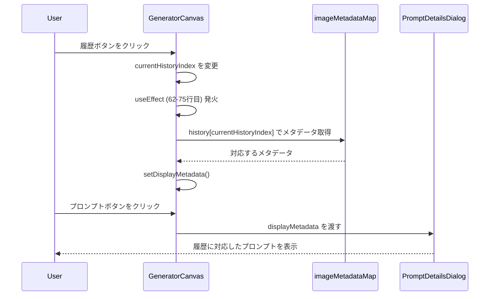

# Phase 9.2: 履歴UI修正 - 実装計画書

**作成日**: 2026-01-07  
**ステータス**: 実装準備完了  
**見積もり**: 1-2時間  
**優先度**: 高（ユーザー体験の改善）

## 1. 問題の概要

Phase 9.1のテスト中に発見された3つのUI問題を修正します。

### 問題2: 画像修正時プロンプトが更新されていない

**現象**:
- プロンプト詳細ダイアログを開くと、常に最新の画像のプロンプトが表示される
- 履歴で過去の画像に戻っても、プロンプトは最新のまま

**原因**:
- [`GeneratorCanvas.tsx:206`](../../src/components/GeneratorCanvas.tsx:206)で`currentMetadata`を使用
- `currentMetadata`は親コンポーネントから渡される最新のメタデータ

### 問題3: 履歴機能で戻ったとき、戻った絵のプロンプトが表示されていない

**現象**:
- 履歴ボタンで過去の画像に戻る
- プロンプト詳細ダイアログを開くと、最新のプロンプトが表示される

**原因**:
- 問題2と同じ根本原因

### 問題4: ダウンロードは履歴で戻っても常に最新の画像になっている

**現象**:
- 履歴で過去の画像に戻る
- ダウンロードボタンをクリック
- 最新の画像がダウンロードされる

**原因**:
- [`page.tsx:212-220`](../../src/app/page.tsx:212-220)の`handleDownload`が`currentArtwork.imageUrl`を使用
- `currentArtwork`は常に最新の画像情報

## 2. 解決策の設計

### 2.1 問題2&3の修正: プロンプト表示の修正

**変更箇所**: [`GeneratorCanvas.tsx:206`](../../src/components/GeneratorCanvas.tsx:206)

**修正前**:
```typescript
<PromptDetailsDialog
  open={showPromptDetails}
  onOpenChange={setShowPromptDetails}
  metadata={currentMetadata || null}  // ❌ 常に最新
/>
```

**修正後**:
```typescript
<PromptDetailsDialog
  open={showPromptDetails}
  onOpenChange={setShowPromptDetails}
  metadata={displayMetadata || null}  // ✅ 履歴に対応
/>
```

**動作フロー**:


**既存の準備**:
- [`GeneratorCanvas.tsx:32`](../../src/components/GeneratorCanvas.tsx:32): `displayMetadata`ステートが既に存在
- [`GeneratorCanvas.tsx:62-75`](../../src/components/GeneratorCanvas.tsx:62-75): 履歴インデックス変更時にメタデータを更新するuseEffectが実装済み

**影響範囲**: 最小（1行の変更）

### 2.2 問題4の修正: ダウンロード機能の修正

**アプローチ**: ダウンロード処理をGeneratorCanvas内に移動

**変更箇所1**: [`GeneratorCanvas.tsx:14-21`](../../src/components/GeneratorCanvas.tsx:14-21)

**修正前**:
```typescript
interface GeneratorCanvasProps {
  imageUrl: string | null;
  isLoading: boolean;
  onDownload?: () => void;  // ❌ 親から渡される
  selectedArtist: Artist | null;
  currentMetadata?: GenerationMetadata | null;
  onMetadataChange?: (metadata: GenerationMetadata | null) => void;
}
```

**修正後**:
```typescript
interface GeneratorCanvasProps {
  imageUrl: string | null;
  isLoading: boolean;
  // onDownload を削除
  selectedArtist: Artist | null;
  currentMetadata?: GenerationMetadata | null;
  onMetadataChange?: (metadata: GenerationMetadata | null) => void;
}
```

**変更箇所2**: [`GeneratorCanvas.tsx:26`](../../src/components/GeneratorCanvas.tsx:26)

**修正前**:
```typescript
export function GeneratorCanvas({ imageUrl, isLoading, onDownload, selectedArtist, currentMetadata, onMetadataChange }: GeneratorCanvasProps) {
```

**修正後**:
```typescript
export function GeneratorCanvas({ imageUrl, isLoading, selectedArtist, currentMetadata, onMetadataChange }: GeneratorCanvasProps) {
```

**変更箇所3**: GeneratorCanvas内に`handleDownload`関数を追加

**追加位置**: [`GeneratorCanvas.tsx:76`](../../src/components/GeneratorCanvas.tsx:76)の直後

```typescript
// ダウンロード処理（履歴に対応）
const handleDownload = () => {
  if (currentDisplayImage) {
    const link = document.createElement("a");
    link.href = currentDisplayImage;
    
    // ファイル名にアーティスト名と日時を含める
    const timestamp = Date.now();
    const artistName = selectedArtist?.name || "masterpiece";
    link.download = `${artistName}-${timestamp}.jpg`;
    
    document.body.appendChild(link);
    link.click();
    document.body.removeChild(link);
  }
};
```

**変更箇所4**: [`GeneratorCanvas.tsx:141`](../../src/components/GeneratorCanvas.tsx:141)

**修正前**:
```typescript
{currentDisplayImage && !isLoading && (
  <Button variant="outline" size="sm" onClick={onDownload}>
    <Download className="mr-2 h-4 w-4" />
    ダウンロード
  </Button>
)}
```

**修正後**:
```typescript
{currentDisplayImage && !isLoading && (
  <Button variant="outline" size="sm" onClick={handleDownload}>
    <Download className="mr-2 h-4 w-4" />
    ダウンロード
  </Button>
)}
```

**変更箇所5**: [`page.tsx:337`](../../src/app/page.tsx:337)

**修正前**:
```typescript
<GeneratorCanvas
  imageUrl={currentArtwork?.imageUrl || null}
  isLoading={isGenerating || isModifying}
  onDownload={handleDownload}  // ❌ 削除
  selectedArtist={selectedArtist || null}
  currentMetadata={currentMetadata}
  onMetadataChange={(metadata) => setCurrentMetadata(metadata)}
/>
```

**修正後**:
```typescript
<GeneratorCanvas
  imageUrl={currentArtwork?.imageUrl || null}
  isLoading={isGenerating || isModifying}
  selectedArtist={selectedArtist || null}
  currentMetadata={currentMetadata}
  onMetadataChange={(metadata) => setCurrentMetadata(metadata)}
/>
```

**変更箇所6**: [`page.tsx:212-220`](../../src/app/page.tsx:212-220)の`handleDownload`関数を削除

**削除するコード**:
```typescript
const handleDownload = () => {
  if (currentArtwork?.imageUrl) {
    const link = document.createElement("a");
    link.href = currentArtwork.imageUrl;
    link.download = `masterpiece-${Date.now()}.jpg`;
    document.body.appendChild(link);
    link.click();
    document.body.removeChild(link);
  }
};
```

## 3. 実装手順

### Step 1: GeneratorCanvas.tsxの修正（30分）

1. **プロンプト表示の修正**
   - 206行目: `currentMetadata`を`displayMetadata`に変更

2. **ダウンロード機能の追加**
   - インターフェースから`onDownload`を削除（14-21行目）
   - 関数シグネチャから`onDownload`を削除（26行目）
   - `handleDownload`関数を追加（76行目の後）
   - ダウンロードボタンのonClickを変更（141行目）

### Step 2: page.tsxの修正（15分）

1. **handleDownload関数の削除**
   - 212-220行目を削除

2. **GeneratorCanvasの呼び出し修正**
   - 337行目: `onDownload`プロパティを削除

### Step 3: テスト（30分）

#### テスト1: プロンプト表示の確認
1. 画像を生成
2. チャットで修正指示（例: 「もっと明るくして」）
3. 履歴ボタンで最初の画像に戻る
4. プロンプトボタンをクリック
5. **期待結果**: 最初の画像のプロンプトが表示される

#### テスト2: 履歴プロンプトの確認
1. 画像を生成
2. チャットで2回修正（例: 「明るく」→「暗く」）
3. 履歴ボタンで各画像に移動
4. 各画像でプロンプトボタンをクリック
5. **期待結果**: 各画像に対応するプロンプトが表示される

#### テスト3: ダウンロード機能の確認
1. 画像を生成
2. チャットで修正
3. 履歴ボタンで最初の画像に戻る
4. ダウンロードボタンをクリック
5. **期待結果**: 最初の画像がダウンロードされる
6. 履歴ボタンで最新の画像に移動
7. ダウンロードボタンをクリック
8. **期待結果**: 最新の画像がダウンロードされる

#### テスト4: ファイル名の確認
1. ゴッホで画像を生成
2. ダウンロード
3. **期待結果**: ファイル名が`フィンセント・ファン・ゴッホ-{timestamp}.jpg`

## 4. 成功基準

- [ ] プロンプト詳細ダイアログが履歴に対応したプロンプトを表示する
- [ ] 履歴で戻った画像のプロンプトが正しく表示される
- [ ] ダウンロードボタンが履歴で表示中の画像をダウンロードする
- [ ] ファイル名にアーティスト名が含まれる
- [ ] 既存の機能（画像生成、修正、比較）が正常に動作する

## 5. リスク評価

### 低リスク
- プロンプト表示の修正: 1行の変更、既存のステートを使用
- ダウンロード機能の移動: 責任の明確化、副作用なし

### 注意点
- `displayMetadata`が`null`の場合の処理（既に実装済み）
- `currentDisplayImage`が`null`の場合の処理（既に実装済み）

## 6. 次のステップ（Phase 10）

Phase 9.2完了後、Phase 10でストレージ改善を実施：
- LocalStorage容量問題の解決
- IndexedDBへの移行
- メタデータとBlobの分離

詳細は[`phase10-storage-improvement.md`](./phase10-storage-improvement.md)を参照。

---

**実装担当**: Code モード  
**レビュー担当**: Architect モード  
**承認**: Toshio Ueda
