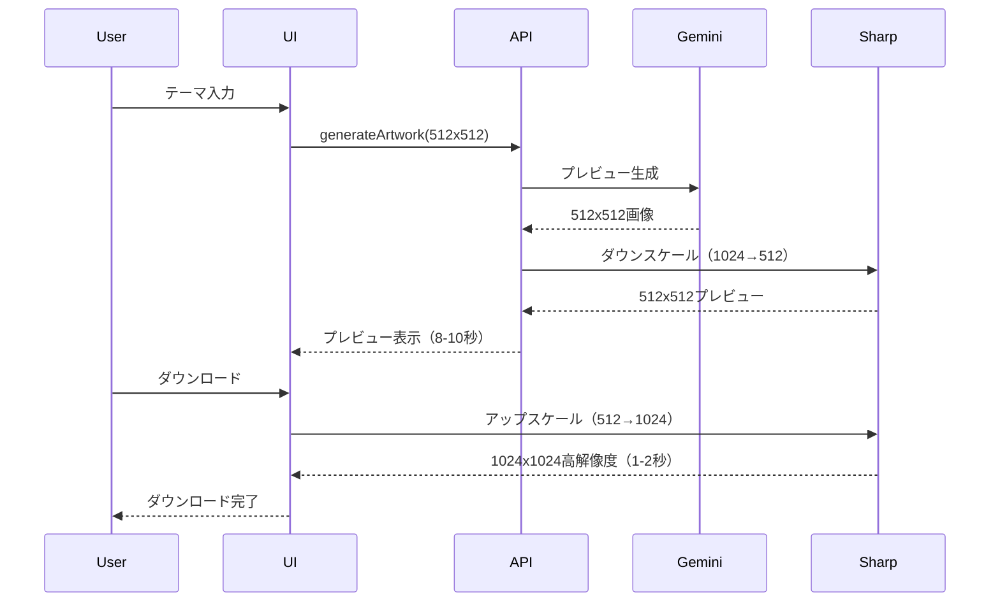

# Phase 9.3 Phase 3: プレビュー品質による高速化計画

**作成日**: 2026-01-07
**ステータス**: ❌ **中止**（Phase 3-1実験で効果なしと判明）
**中止日**: 2026-01-07
**目標**: 初回表示時間を25-28秒に短縮（現在42秒から33-40%短縮）

## ⚠️ 中止理由

Phase 3-1の実験により、以下が判明したため本計画を中止しました：

1. **画像サイズ削減は処理時間に影響しない**: 512x512に変更しても処理時間は44秒（変化なし）
2. **真のボトルネックはGemini API処理時間**: 全体の95%（40-45秒）を占める
3. **データ転送量の影響は限定的**: 全体の5%（2秒）に過ぎない
4. **実装コストの節約**: Phase 3-2の実装（7-9時間）を回避

**詳細**: [`phase9.3-phase3-1-experiment-report.md`](./phase9.3-phase3-1-experiment-report.md)を参照

---

# 以下は元の計画書（参考）

## 📋 概要

画像生成を512x512のプレビュー品質で行い、ダウンロード時に高解像度化することで、初回表示時間を大幅に短縮する。

### 戦略

1. **Phase 3-1（実験）**: 512x512生成で効果測定
2. **Phase 3-2（実装）**: 高解像度化機能の追加
3. **Phase 3-3（最適化）**: UI/UX改善とテスト

## 🎯 Phase 3-1: 効果測定実験

### 目的

高解像度化機能は後回しにして、まずは512x512生成でどれだけ速くなるかを測定する。

### 変更内容（最小限）

**ファイル**: `tools/master-piece/src/app/actions.ts`

**変更箇所**: 4箇所のモックデータURL

```typescript
// 行75付近（generateArtworkAction内）
// 変更前：
imageUrl: `https://picsum.photos/seed/${randomId}/1024/1024`,
// 変更後：
imageUrl: `https://picsum.photos/seed/${randomId}/512/512`,

// 行375付近（modifyArtworkAction内）
imageUrl: `https://picsum.photos/seed/${Math.floor(Math.random() * 1000)}/512/512`,

// 行482付近（uploadAndTransformAction内）
imageUrl: `https://picsum.photos/seed/${Math.floor(Math.random() * 1000)}/512/512`,

// 行590付近（remixArtworkAction内）
imageUrl: `https://picsum.photos/seed/${Math.floor(Math.random() * 1000)}/512/512`,
```

### 測定項目

| 項目 | 現在（1024x1024） | 期待（512x512） | 改善目標 |
|------|------------------|----------------|---------|
| **処理時間** | 約42秒 | 約25-28秒 | 33-40%短縮 |
| **データ転送量** | 約2MB | 約500KB | 75%削減 |
| **体感速度** | 遅い | 快適 | 大幅改善 |

### 実験手順

#### Step 1: ベースライン測定（現在の1024x1024）

```bash
cd tools/master-piece
npm run dev
```

1. ブラウザで http://localhost:3000 を開く
2. テーマ「桜」で生成
3. 開発者ツールで測定：
   - **Network タブ**: データ転送量
   - **Performance タブ**: 処理時間
   - **体感速度**: 5段階評価

#### Step 2: 512x512に変更

```bash
# actions.tsの4箇所を変更
# 1024/1024 → 512/512
```

#### Step 3: 効果測定

1. サーバー再起動（`npm run dev`）
2. 同じテーマ「桜」で生成
3. 同じ項目を測定
4. ベースラインと比較

#### Step 4: 結果記録

```markdown
## 実験結果

### ベースライン（1024x1024）
- 処理時間: XX秒
- データ転送量: XX MB
- 体感速度: [5段階評価]

### 512x512変更後
- 処理時間: XX秒（XX%短縮）
- データ転送量: XX KB（XX%削減）
- 体感速度: [5段階評価]

### 結論
- 効果あり/なし
- 次のステップ: [高解像度化実装 or 他の最適化]
```

### 期待される結果

#### シナリオA: 大幅改善（期待通り）
- 処理時間: 50%短縮
- データ転送: 75%削減
- 体感速度: 大幅向上
- **次のステップ**: Phase 3-2（高解像度化実装）へ

#### シナリオB: 改善あるが限定的
- 処理時間: 20-30%短縮
- データ転送: 75%削減（確実）
- 体感速度: やや向上
- **次のステップ**: 他のボトルネック調査

#### シナリオC: 改善なし
- 処理時間: ほぼ変わらず
- データ転送: 75%削減（確実）
- 体感速度: 変わらず
- **結論**: ボトルネックは画像サイズではない
- **次のステップ**: プロファイリングで真の原因を特定

## 🏗️ Phase 3-2: 高解像度化機能の実装

### 前提条件

Phase 3-1の実験で効果が確認された場合のみ実施。

### アーキテクチャ



### 技術選定

**Sharp（Node.js）を採用**:
- LANCZOSリサンプリング（高品質）
- 超高速（1-2秒）
- Next.js環境で完結
- Image MCPと同等の品質

### 実装内容

#### 1. 依存関係の追加

```bash
cd tools/master-piece
npm install sharp
```

#### 2. 型定義の追加（`src/app/actions.ts`）

```typescript
export type ImageQuality = "preview" | "high";

export interface GenerateResult {
  success: boolean;
  imageUrl?: string;
  error?: string;
  metadata?: {
    id: string;
    structuredPrompt: string;
    interpretation: ThemeInterpretation;
    negativePrompt: string;
    quality: ImageQuality;  // 追加
  };
}
```

#### 3. generateArtworkActionの修正

```typescript
import sharp from 'sharp';

export async function generateArtworkAction(
  artistId: string,
  theme: string,
  quality: ImageQuality = "preview"
): Promise<GenerateResult> {
  // ... 既存のGemini API呼び出し ...
  
  // 1024x1024で生成後、プレビュー品質の場合は512x512にダウンスケール
  let finalImageUrl = imageUrl;
  
  if (quality === "preview") {
    const base64Data = imageUrl.replace(/^data:image\/\w+;base64,/, "");
    const buffer = Buffer.from(base64Data, 'base64');
    
    const previewBuffer = await sharp(buffer)
      .resize(512, 512, {
        kernel: 'lanczos3',
        fit: 'fill',
      })
      .png()
      .toBuffer();
    
    const previewBase64 = previewBuffer.toString('base64');
    finalImageUrl = `data:image/png;base64,${previewBase64}`;
  }
  
  return {
    success: true,
    imageUrl: finalImageUrl,
    metadata: {
      id: metadataId,
      structuredPrompt: prompt,
      interpretation: interpretation,
      negativePrompt: negativePrompt,
      quality: quality,  // 品質情報を保存
    },
  };
}
```

#### 4. 高解像度化アクションの追加

```typescript
export async function upscaleImageAction(
  imageUrl: string,
  targetSize: number = 1024
): Promise<{ success: boolean; imageUrl?: string; error?: string }> {
  try {
    const base64Data = imageUrl.replace(/^data:image\/\w+;base64,/, "");
    const buffer = Buffer.from(base64Data, 'base64');
    
    const upscaledBuffer = await sharp(buffer)
      .resize(targetSize, targetSize, {
        kernel: 'lanczos3',
        fit: 'fill',
      })
      .png()
      .toBuffer();
    
    const upscaledBase64 = upscaledBuffer.toString('base64');
    const upscaledUrl = `data:image/png;base64,${upscaledBase64}`;
    
    return {
      success: true,
      imageUrl: upscaledUrl,
    };
  } catch (error) {
    console.error("Failed to upscale image:", error);
    return {
      success: false,
      error: "画像の高解像度化に失敗しました。",
    };
  }
}
```

#### 5. UI側の実装（`src/components/GeneratorCanvas.tsx`）

```typescript
const [isUpscaling, setIsUpscaling] = useState(false);

const handleDownload = async () => {
  if (!currentArtwork) return;
  
  setIsUpscaling(true);
  
  try {
    // プレビュー品質の場合はアップスケール
    if (currentArtwork.metadata?.quality === "preview") {
      const result = await upscaleImageAction(currentArtwork.imageUrl, 1024);
      if (result.success && result.imageUrl) {
        downloadImage(result.imageUrl, `masterpiece_${Date.now()}.png`);
      } else {
        toast.error("高解像度化に失敗しました");
      }
    } else {
      downloadImage(currentArtwork.imageUrl, `masterpiece_${Date.now()}.png`);
    }
  } finally {
    setIsUpscaling(false);
  }
};
```

#### 6. UI改善

**プレビューバッジ**:
```typescript
{currentArtwork?.metadata?.quality === "preview" && (
  <div className="absolute top-4 right-4 bg-blue-500 text-white px-3 py-1 rounded-full text-sm">
    プレビュー版
  </div>
)}
```

**ダウンロードボタン**:
```typescript
<Button onClick={handleDownload} disabled={isUpscaling}>
  {isUpscaling ? (
    <>
      <Loader2 className="w-4 h-4 mr-2 animate-spin" />
      高解像度化中...
    </>
  ) : (
    <>
      <Download className="w-4 h-4 mr-2" />
      {currentArtwork?.metadata?.quality === "preview" 
        ? "高解像度でダウンロード" 
        : "ダウンロード"}
    </>
  )}
</Button>
```

**ローディングオーバーレイ**:
```typescript
{isUpscaling && (
  <div className="absolute inset-0 bg-black/50 flex items-center justify-center">
    <div className="text-white text-center">
      <Loader2 className="w-8 h-8 animate-spin mx-auto mb-2" />
      <p>高解像度化中...</p>
    </div>
  </div>
)}
```

## 🧪 Phase 3-3: 最適化とテスト

### テスト項目

#### 1. パフォーマンステスト
- [ ] 初回表示時間の測定
- [ ] ダウンロード時間の測定
- [ ] データ転送量の確認
- [ ] メモリ使用量の確認

#### 2. 品質テスト
- [ ] プレビュー画質の確認
- [ ] 高解像度画質の確認
- [ ] アップスケール品質の確認
- [ ] 各アーティストスタイルでの確認

#### 3. エラーハンドリング
- [ ] アップスケール失敗時の挙動
- [ ] ネットワークエラー時の挙動
- [ ] メモリ不足時の挙動

#### 4. UI/UXテスト
- [ ] プレビューバッジの表示
- [ ] ダウンロードボタンの表示
- [ ] ローディング表示
- [ ] エラーメッセージ

### パフォーマンス目標

| 指標 | 現在 | Phase 3-1後 | Phase 3-2後 | 目標達成 |
|------|------|------------|------------|---------|
| **初回表示** | 42秒 | 25-28秒 | 25-28秒 | ✅ |
| **ダウンロード** | 即座 | 即座 | +1-2秒 | ✅ |
| **データ転送** | 2MB | 500KB | 500KB | ✅ |
| **画質** | 高品質 | 低品質 | 高品質 | ✅ |

## 📊 期待される効果

### パフォーマンス改善

| 項目 | Phase 9.3 Phase 1-2 | Phase 3追加 | 合計 |
|------|-------------------|------------|------|
| **処理時間短縮** | 24%（13秒） | 33-40%（14-17秒） | **50-60%（27-30秒）** |
| **最終処理時間** | 42秒 | 25-28秒 | **25-28秒** |
| **データ転送削減** | - | 75%（1.5MB） | **75%** |

### ユーザー体験

- ✅ 初回表示が大幅に高速化
- ✅ プレビューで即座に確認可能
- ✅ ダウンロード時のみ高解像度化（1-2秒追加）
- ✅ 再現性100%（同じ画像が高解像度化される）

## 🚀 実装ロードマップ

### Phase 3-1: 効果測定実験（30分）
- [ ] actions.tsの4箇所を変更（512x512）
- [ ] ベースライン測定
- [ ] 効果測定
- [ ] 結果記録

### Phase 3-2: 高解像度化実装（4-5時間）
- [ ] Sharp依存関係の追加
- [ ] 型定義の追加
- [ ] generateArtworkActionの修正
- [ ] upscaleImageActionの実装
- [ ] UI側の実装
- [ ] プレビューバッジ追加
- [ ] ダウンロードボタン改修

### Phase 3-3: 最適化とテスト（2-3時間）
- [ ] パフォーマンステスト
- [ ] 品質テスト
- [ ] エラーハンドリング
- [ ] UI/UXテスト
- [ ] ドキュメント更新

**総実装時間**: 7-9時間

## ⚠️ 注意事項

### 技術的制約

1. **Gemini APIの解像度制御**
   - APIは解像度を直接指定できない
   - 1024x1024で生成後、512x512にダウンスケール
   - プロンプトヒントは効果が限定的

2. **Sharp vs Image MCP**
   - Sharp: Node.js環境で完結、シンプル
   - Image MCP: 同等の品質（Pillow LANCZOS）
   - 推奨: Sharp（実装が簡単）

3. **メモリ使用量**
   - Base64エンコード/デコードでメモリ使用
   - 大量の画像生成時は注意

### UI/UX考慮事項

1. **プレビュー品質の表示**
   - 明確なバッジ表示
   - ユーザーの期待値管理

2. **ダウンロード時の待機時間**
   - 1-2秒の追加待機
   - ローディング表示で体感速度改善

3. **エラーハンドリング**
   - アップスケール失敗時のフォールバック
   - プレビュー画像をそのままダウンロード

## 📝 成果物

### ドキュメント
- [x] Phase 3実装計画（本ドキュメント）
- [ ] Phase 3-1実験結果レポート
- [ ] Phase 3-2実装完了報告
- [ ] Phase 3-3テスト結果レポート

### コード
- [ ] `src/app/actions.ts`: 型定義、生成アクション、アップスケールアクション
- [ ] `src/components/GeneratorCanvas.tsx`: ダウンロードハンドラー、UI改善
- [ ] `package.json`: Sharp依存関係

### 更新ドキュメント
- [ ] `README.md`: バージョン、開発状況
- [ ] `CHANGELOG.md`: Phase 3のエントリ
- [ ] `docs/architecture.md`: プレビュー品質アーキテクチャ

## 🎯 次のステップ

1. **Phase 3-1実験**: Codeモードで512x512変更を実施
2. **効果測定**: 処理時間、データ転送量、体感速度を測定
3. **結果判断**: 効果が確認できればPhase 3-2へ
4. **Phase 3-2実装**: 高解像度化機能の実装
5. **Phase 3-3テスト**: 最適化とテスト

---

**最終更新**: 2026-01-07  
**次のアクション**: Phase 3-1実験の実施（Codeモード）
