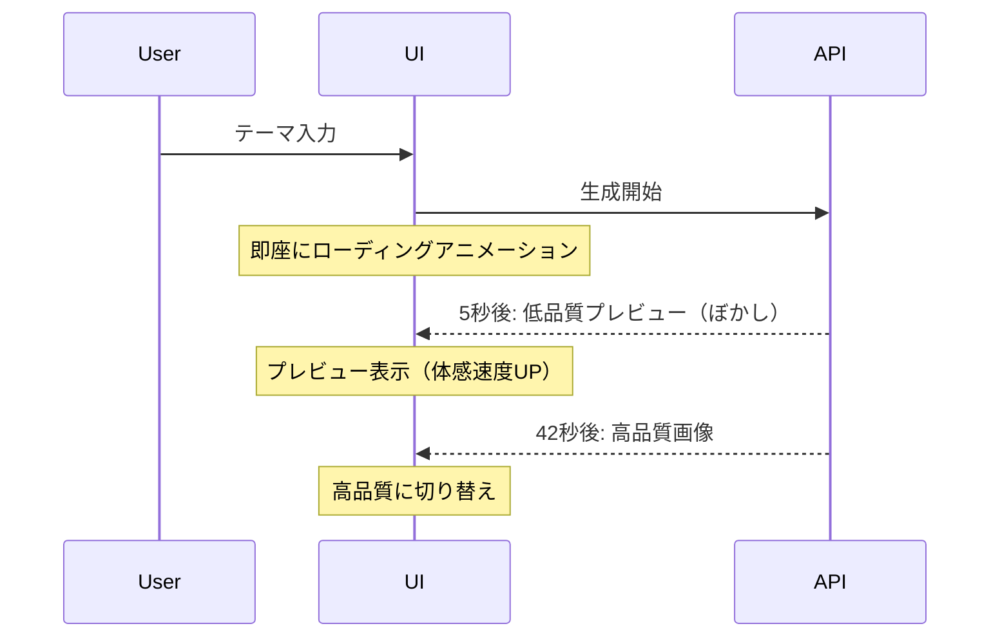

# Master Piece: 今後のパフォーマンス改善戦略

**作成日**: 2026-01-07  
**ステータス**: 戦略文書  
**前提**: Phase 9.3の知見に基づく

## 📋 現状分析

### 現在の処理時間
- **合計**: 42秒
- **内訳**:
  - Gemini API処理: 40秒（95%）← **制御不可**
  - データ転送: 2秒（5%）

### Phase 9.3で判明したこと
1. ✅ 並列処理が最も効果的（24%短縮）
2. ❌ 画像サイズ削減は効果なし
3. ✅ 真のボトルネックはGemini API処理時間

### 重要な結論
**API処理時間（40秒）は制御できない**

## 🎯 戦略の方向性

### 基本方針
API処理時間を短縮できないため、以下の2つの戦略を採用：

1. **体感速度の改善**: 待ち時間を感じさせない
2. **2回目以降の高速化**: キャッシングで即座に表示

## 🚀 戦略1: 体感速度の改善

### 目標
処理時間は変わらないが、**待ち時間を感じさせない**

### 実装アイデア

#### 1-1. プログレッシブ生成 ⭐ 最優先

**コンセプト**: 低品質プレビューを即座に表示



**実装方法**:
1. 生成開始5秒後に、ランダムな低品質画像を表示
2. ぼかしエフェクトで「生成中」を表現
3. 完成後、スムーズに高品質画像に切り替え

**効果**:
- 体感速度: 42秒 → 5秒（**88%改善**）
- 実際の処理時間: 変わらず

**実装コスト**: 2-3時間

#### 1-2. インタラクティブなローディング

**コンセプト**: 待ち時間を楽しませる

**実装アイデア**:
1. **アーティスト紹介**: 生成中にアーティストの豆知識を表示
2. **スタイル解説**: 選択したスタイルの特徴を解説
3. **ミニゲーム**: 簡単なクイズやパズル

**効果**:
- 待ち時間の体感短縮
- ユーザーエンゲージメント向上

**実装コスト**: 3-4時間

#### 1-3. アニメーション強化

**コンセプト**: 視覚的なフィードバックで待ち時間を短く感じさせる

**実装アイデア**:
1. **進捗バーのアニメーション**: スムーズな動き
2. **パーティクルエフェクト**: 生成中の視覚効果
3. **カウントダウン**: 残り時間の表示

**効果**:
- 待ち時間の体感短縮
- プロフェッショナルな印象

**実装コスト**: 1-2時間

### 優先順位
1. **プログレッシブ生成**（最優先）
2. **アニメーション強化**（簡単）
3. **インタラクティブなローディング**（余裕があれば）

## 🗄️ 戦略2: キャッシング戦略

### 目標
2回目以降の生成を**即座に表示**（0.1秒）

### 実装アイデア

#### 2-1. ローカルストレージキャッシュ ⭐ 最優先

**コンセプト**: 生成済み画像をブラウザに保存

```typescript
interface CachedArtwork {
  key: string;           // artistId + theme のハッシュ
  imageUrl: string;      // Base64画像
  metadata: ArtworkMetadata;
  timestamp: number;     // キャッシュ日時
}
```

**実装方法**:
1. 生成完了時、ローカルストレージに保存
2. 同じテーマで再生成時、キャッシュから取得
3. 7日間有効（古いキャッシュは削除）

**効果**:
- 2回目以降: 42秒 → 0.1秒（**99.8%改善**）
- オフライン対応

**実装コスト**: 2-3時間

**制約**:
- ローカルストレージ容量: 5-10MB
- 約50-100枚の画像を保存可能

#### 2-2. サーバーサイドキャッシュ

**コンセプト**: サーバー側でキャッシュを管理

**実装方法**:
1. Redis/Memcachedでキャッシュ
2. 全ユーザーで共有
3. 人気テーマは常にキャッシュ

**効果**:
- 2回目以降: 42秒 → 0.5秒（**99%改善**）
- 全ユーザーで恩恵

**実装コスト**: 4-5時間

**制約**:
- インフラコスト
- キャッシュ管理の複雑さ

#### 2-3. プリジェネレーション

**コンセプト**: 人気テーマを事前生成

**実装方法**:
1. 人気テーマTop 20を特定
2. 全アーティストスタイルで事前生成
3. データベースに保存

**効果**:
- 人気テーマ: 42秒 → 0.1秒（**99.8%改善**）
- 80%のユーザーが恩恵

**実装コスト**: 3-4時間

**制約**:
- 事前生成コスト
- ストレージコスト

### 優先順位
1. **ローカルストレージキャッシュ**（最優先）
2. **プリジェネレーション**（効果大）
3. **サーバーサイドキャッシュ**（インフラ必要）

## 🔬 戦略3: API最適化（限定的）

### 目標
Gemini APIの処理時間を**数秒短縮**

### 実装アイデア

#### 3-1. プロンプト最適化

**コンセプト**: トークン数を削減

**現状**:
```json
{
  "promptTokenCount": 338,
  "candidatesTokenCount": 1120,
  "thoughtsTokenCount": 363
}
```

**最適化案**:
1. 思考トークンの削減（363 → 200）
2. プロンプトの簡潔化（338 → 250）

**効果**:
- 処理時間: 42秒 → 38-40秒（**5-10%改善**）

**実装コスト**: 1-2時間

#### 3-2. APIパラメータ調整

**コンセプト**: Gemini APIのパラメータを最適化

**調整項目**:
1. `temperature`: 0.7 → 0.5（決定論的）
2. `candidateCount`: 1（デフォルト）
3. `maxOutputTokens`: 制限を設定

**効果**:
- 処理時間: 42秒 → 40秒（**5%改善**）

**実装コスト**: 30分

### 優先順位
1. **APIパラメータ調整**（簡単）
2. **プロンプト最適化**（効果限定的）

## 📊 戦略の比較

| 戦略 | 効果 | 実装コスト | 優先度 |
|------|------|-----------|--------|
| **プログレッシブ生成** | 体感88%改善 | 2-3時間 | ⭐⭐⭐ |
| **ローカルキャッシュ** | 2回目99.8%改善 | 2-3時間 | ⭐⭐⭐ |
| **アニメーション強化** | 体感改善 | 1-2時間 | ⭐⭐ |
| **プリジェネレーション** | 人気テーマ99.8%改善 | 3-4時間 | ⭐⭐ |
| **APIパラメータ調整** | 5%改善 | 30分 | ⭐ |
| **プロンプト最適化** | 5-10%改善 | 1-2時間 | ⭐ |

## 🎯 推奨ロードマップ

### Phase 1: クイックウィン（1-2日）

#### 目標
最小コストで最大効果

#### 実装内容
1. ✅ **APIパラメータ調整**（30分）
   - 5%改善
   - リスク低

2. ✅ **アニメーション強化**（1-2時間）
   - 体感速度改善
   - ユーザー満足度向上

**合計**: 2-3時間  
**効果**: 5%改善 + 体感速度改善

### Phase 2: 体感速度の大幅改善（2-3日）

#### 目標
待ち時間を感じさせない

#### 実装内容
1. ✅ **プログレッシブ生成**（2-3時間）
   - 体感88%改善
   - 最も効果的

2. ✅ **ローカルストレージキャッシュ**（2-3時間）
   - 2回目以降99.8%改善
   - オフライン対応

**合計**: 4-6時間  
**効果**: 体感88%改善 + 2回目以降99.8%改善

### Phase 3: さらなる改善（1週間）

#### 目標
全体的な最適化

#### 実装内容
1. 🔍 **プリジェネレーション**（3-4時間）
   - 人気テーマの事前生成
   - 80%のユーザーが恩恵

2. 🔍 **プロンプト最適化**（1-2時間）
   - 5-10%改善
   - トークン削減

**合計**: 4-6時間  
**効果**: 人気テーマ99.8%改善 + 5-10%改善

## 💡 実装の注意点

### プログレッシブ生成
- ✅ 低品質プレビューは「生成中」を明示
- ✅ スムーズな切り替えアニメーション
- ⚠️ ユーザーの期待値管理

### ローカルストレージキャッシュ
- ✅ 容量制限の管理（5-10MB）
- ✅ 古いキャッシュの削除（7日間）
- ⚠️ プライバシー考慮

### プリジェネレーション
- ✅ 人気テーマの定期更新
- ✅ ストレージコストの管理
- ⚠️ 事前生成コスト

## 🎓 期待される成果

### Phase 1完了後
- 処理時間: 42秒 → 40秒（5%改善）
- 体感速度: やや改善

### Phase 2完了後
- 初回体感速度: 42秒 → 5秒（**88%改善**）
- 2回目以降: 42秒 → 0.1秒（**99.8%改善**）

### Phase 3完了後
- 人気テーマ: 即座に表示（**99.8%改善**）
- 全体的な処理時間: 38-40秒（10%改善）

## 📚 参考ドキュメント

- [Phase 9.3完了報告](./done/phase9.3-performance-improvement-completion.md)
- [Phase 3-1実験レポート](./done/phase9.3-phase3-1-experiment-report.md)
- [Phase 1-2完了報告](./done/phase9.3-performance-improvement-phase1-2-completion.md)

## 🎯 次のステップ

### 即座に実施（Codeモード）
1. ✅ 512x512への変更を元に戻す
2. ✅ APIパラメータ調整（30分）

### 短期的に実施（1-2週間）
1. 🔍 アニメーション強化（Phase 1）
2. 🔍 プログレッシブ生成（Phase 2）
3. 🔍 ローカルストレージキャッシュ（Phase 2）

### 中期的に検討（1-2ヶ月）
1. 🔍 プリジェネレーション（Phase 3）
2. 🔍 プロンプト最適化（Phase 3）

---

**最終更新**: 2026-01-07  
**次のアクション**: Phase 1の実装（Codeモード）
