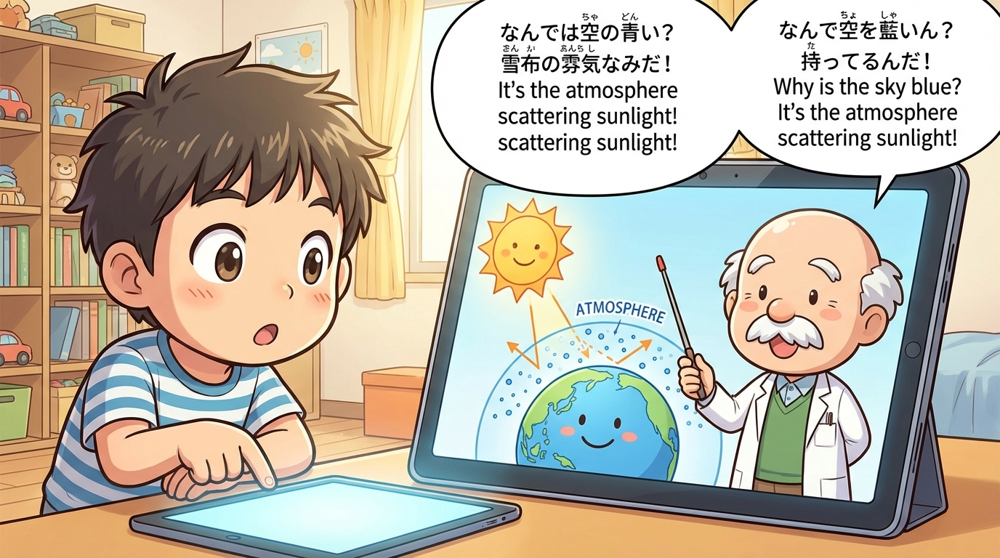
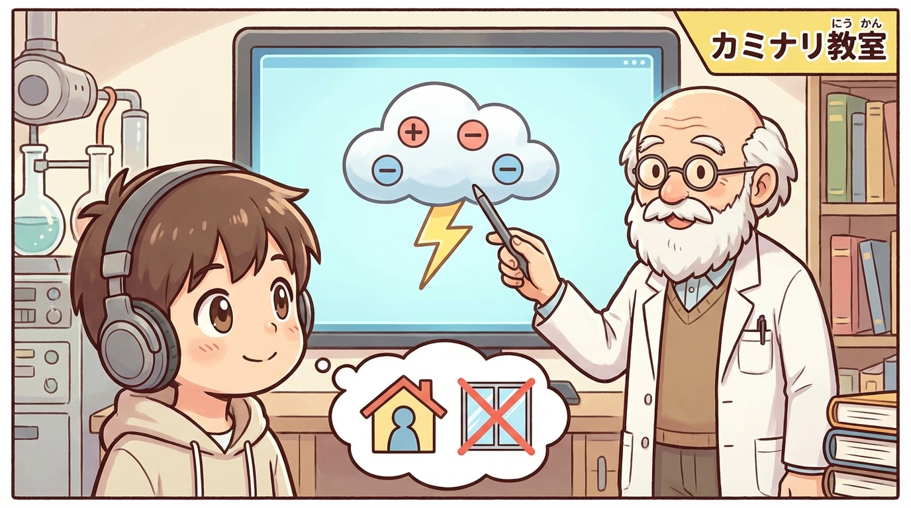
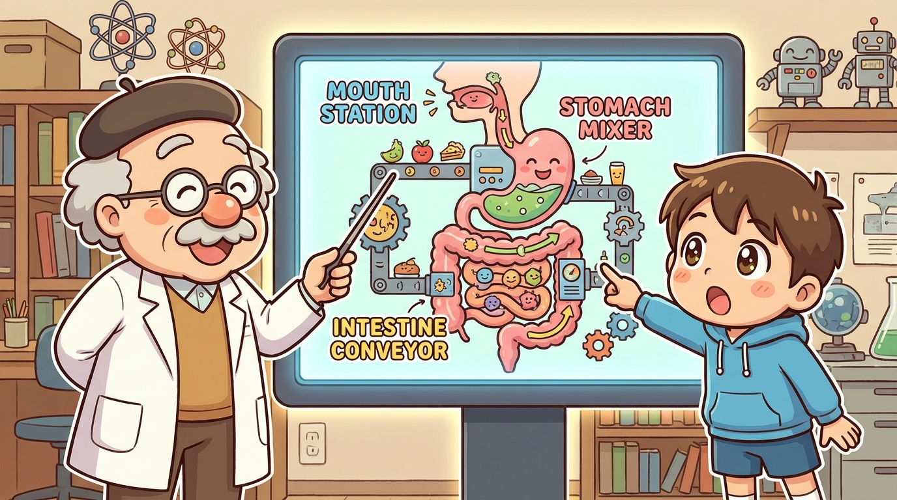

# 忙しい共働き夫婦と子供のコミュニケーション支援エージェント：ユーザーストーリー

## 🔳 大きなテーマ
忙しい共働き夫婦と子供のコミュニケーション支援するエージェント

## 🔳 課題
子供は好奇心旺盛。色々知りたいのでお父さん・お母さんに「空はなぜ青いの」と言った質問を次々してくる。
夫婦は忙しいので時間があまりないので構いづづけることが難しい。
また本やPCを与えて一人で学習させることも不安だし、放置することへの罪悪感が半端ない。

そこでエージェントが子供からの質問に、動画や画像などのマルチメディアを駆使してインタラクティブに回答する。
回答に対する質問への対応も可能。

質問・回答に関しては記録として残り、それの結果を親に対して返すことができる。
親はその内容に基づいて、子供との会話に活かすことができコミュニケーションを深めることができる。

学習まんが風に、博士のようなよく知っている人と対話しながら進められる。

---

## 🏗️ エピック整理（全体像）

### エピック1：子どもの「なぜ？」に付き合い続ける対話エージェント
- タクヤが「空はなぜ青いの？」「雷ってなに？」など、素朴な疑問を自然言語で質問できる
- お茶の水博士アバターが、子どもの理解レベルに合わせて対話で答え続ける
- 「続きを聞く」「別の説明」「例え話で」などの選択肢で、子ども側から“説明スタイル”を選べる

### エピック2：マンガ／インフォグラフィック×音声のマルチメディア説明
- 問いに対して、テキストだけでなく、図解・インフォグラフィック・マンガ風コマ割りを生成
- 博士アバターが、その図を指し示しながら音声で説明してくれる
- 子どもはタップ／クリックしながら、図やアニメーションを見て理解を深める

### エピック3：質問と学びの履歴を可視化する「親向けレポート」
- 子どもの質問と博士の回答ログを自動記録
- トピック別（宇宙／生き物／天気／身近なものなど）に整理
- 親のスマホやPCで「タクヤが最近興味を持っていること」が一目でわかるレポートを生成

### エピック4：親子コミュニケーションを促す「会話きっかけジェネレータ」
- エージェントが、ログを元に「今夜これを聞いてみよう」「週末に一緒にできる実験」など会話ネタを提案
- 忙しい親でも、短時間で“深い話題”に入れるようにサポート

### エピック5：安心・安全な利用のためのガードレール
- 子どもが不適切なトピックを聞いた場合のフィルタリングと、子ども向けのソフトな説明
- 個人情報の扱い、利用時間制限、保護者による管理機能

---

## 📄 代表的な主要ユーザーストーリー

### ストーリー1：素朴な疑問を博士に聞ける
**Title:** タクヤが素朴な「なぜ？」を博士に相談できる
**As a** 6歳の男の子のタクヤ,
**I want to** 気になったことをその場でお茶の水博士に質問したい,
**So that** 忙しいお父さんお母さんを待たずに、すぐに「なぜ？」を教えてもらえる。

### ストーリー2：インフォグラフィック付きの解説
**Title:** 図解と音声で「目で見てわかる」説明を受けられる
**As a** 6歳の男の子のタクヤ,
**I want to** 博士に教えてもらうときに、絵や図も一緒に見たい,
**So that** 言葉だけではわかりにくいことも、目で見てイメージしながら理解できる。

### ストーリー3：「例え話」や「身近な説明」を選べる
**Title:** 説明スタイルを「例え話」や「身近な話」に切り替えられる
**As a** 6歳の男の子のタクヤ,
**I want to** 「例え話で教えて」「身近なことで説明して」などのボタンを選べる,
**So that** むずかしい説明だったときでも、自分にわかりやすい別の説明で教えてもらえる。

### ストーリー4：対話を続けながら深掘りできる
**Title:** 回答に対してさらに聞き返しながら理解を深められる
**As a** 6歳の男の子のタクヤ,
**I want to** 博士の答えを聞いたあとに「じゃあ、○○は？」と続けて質問したい,
**So that** 一つのテーマについて、納得するまでじっくり聞いて理解を深められる。

### ストーリー5：親が後から「何を学んだか」を確認できる
**Title:** 親が子どもの質問と学びの内容を後から把握できる
**As a** 忙しい共働きの親,
**I want to** 子どもが博士とどんな質問・会話をしたかを一覧で確認したい,
**So that** 限られた時間でも、その話題をきっかけに子どもとの会話を深められる。

---

## 💬 対話シナリオ例

### シナリオ1：「空はなぜ青いの？」

1. タクヤ：「はかせー、そらはなんであおいの？」
2. 博士：「いい質問じゃな、タクヤくん！」（太陽、地球、大気の図解を表示）
3. タクヤ：「例え話で教えて！」
4. 博士：「白いボールをたくさん投げるときに、青いボールだけいっぱいはねかえってくるイメージじゃ」

### シナリオ2：「雷ってこわいの？」

1. タクヤ：「かみなりってこわい？ おこられてるみたい」
2. 博士：「びっくりする音じゃが、ちゃんと気をつければだいじょうぶじゃよ。」（雲の中で電気がたまる図解を表示）
3. タクヤ：「どうしたらあんぜん？」
4. 博士：「外にいるときは、木のしたには入らないこと。家の中なら、まどからは少しはなれておくともっとあんぜんじゃ。」

### シナリオ3：「からだのなかでごはんはどうなるの？」

1. タクヤ：「ごはんって、おなかのなかでどうなるの？」
2. 博士：「タクヤくんがたべたごはんはな、からだのなかの“こうじょう”みたいなところで、元気のもとに変わるんじゃ。」（消化器官の工場風イラストを表示）
3. タクヤ：「べつのからだのなぞ」
4. 博士：「たとえば『なんでねむくなるの？』とか、きいてみたいかの？」
