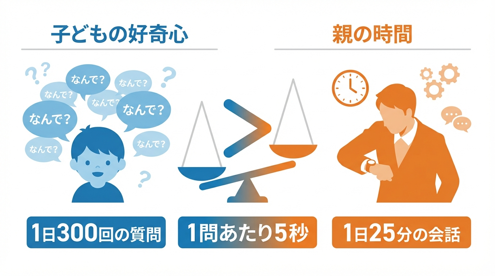
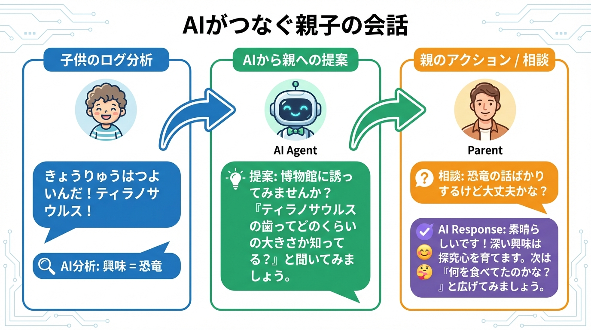
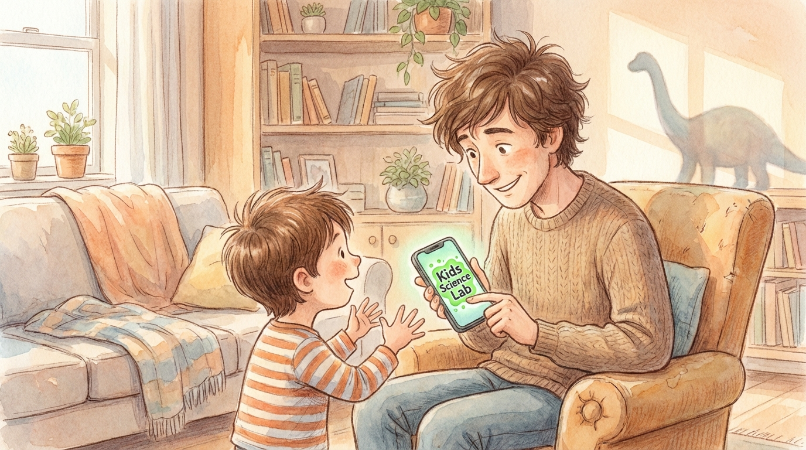
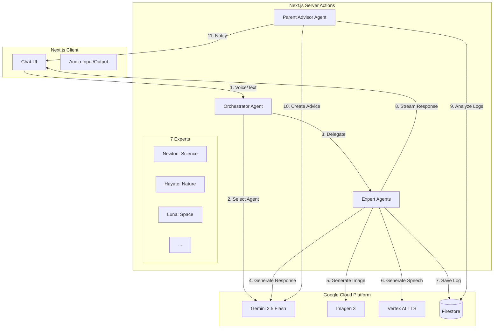
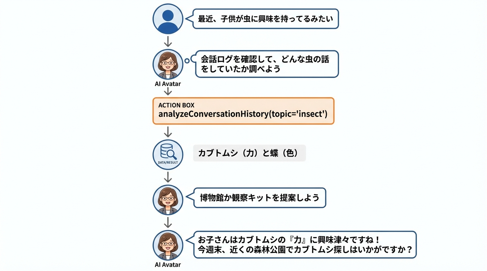
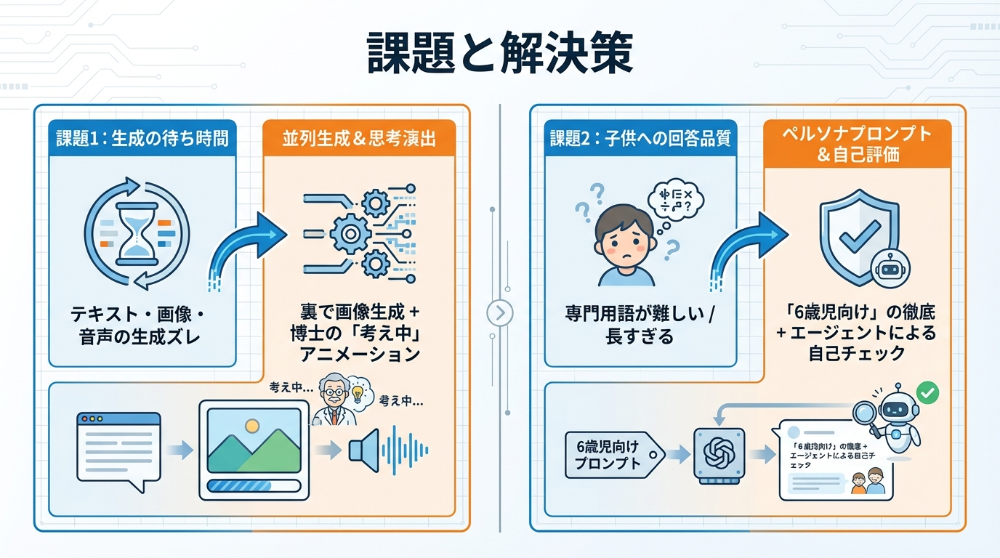

# 【Gemini 2.5 × Next.js】親子の会話を「ネタ切れ」から救う！AI科学研究所「Kids Science Lab」開発ログ

## はじめに

みなさん、こんにちは。「Kids Science Lab」開発チームです。

突然ですが、小さなお子さんを持つ親御さん、こんな経験はありませんか？

「パパ、なんで空は青いの？」
「ママ、なんで月はついてくるの？」

子供の好奇心は無限大です。
ある研究によると、**4歳の子供は1日に平均して200回から300回もの質問をする**と言われています。特に好奇心が旺盛な時期には、約2分に1回という驚異的な頻度で「なぜ？」が繰り返されます。

一方で、私たち親には時間がありません。
共働き世帯の増加に伴い、平日に親子が一緒に過ごせる時間は**約2時間**。そのうち、純粋に会話をしている時間は**わずか25分**程度というデータもあります。

**「1日300回の質問」 vs 「1日25分の会話」。**

単純計算しても、1つの質問に対して親が割ける時間は**わずか5秒**しかありません。これでは、子供の「なぜ？」に正面から向き合うことは物理的に不可能です。
その結果、多くの親が「あとでね」と遮ってしまったり、スマホを見せたりしてやり過ごし、後になって「もっと話を聞いてあげればよかった」と**罪悪感（ギルティ）**を抱えています。

私たちは、この**「圧倒的な需要（子供の好奇心）と供給（親の時間）のミスマッチ」**こそが、現代の子育てにおける最大のペインポイントであると考えました。

そして開発したのが、**「Kids Science Lab」**です。

これは単なる子供向けの学習アプリではありません。**AIが子供の「好奇心の相棒」として300回の質問を受け止め、そこで得た発見を親に「会話のネタ」として届けることで、限られた25分の会話を「濃密な時間」に変える**ためのプロダクトです。

本記事では、Next.js 16とGoogle Vertex AI (Gemini 2.5 Flash) を駆使して構築したこのプロダクトの裏側、特に**Orchestrator-Workersパターン**を用いたエージェント設計や、**ReActパターン**による保護者支援機能の実装について解説します。


## 解決したかった課題 (The Pain)



### 1. 構造的な「会話時間の欠乏」
前述の通り、子供の質問欲求に対して親のリソースは圧倒的に不足しています。
東北大学の研究によれば、親子で「多様な会話」を持つ頻度は、子供の言語理解能力や脳（右上側頭回）の発達に直接的な影響を与えるとされています。しかし、日々の業務や家事に追われる中で、その時間を確保するのは至難の業です。

### 2. 「何を話せばいいかわからない」問題
いざ時間があっても、「今日学校どうだった？」「楽しかった」で会話が終了してしまう...。そんな「ネタ切れ」に悩む親も少なくありません。
子供が今、具体的に何に興味を持っているのか（例えば「恐竜」といっても、ティラノサウルスの強さなのか、化石の発掘なのか）を把握できていないため、話を広げられないのです。

### 3. 親の心理的負担（罪悪感）
調査によると、6割以上の親が「子供への関わり方に自信がない」「申し訳ない」と感じています。
「忙しいから」という理由で子供の好奇心をスルーしてしまった時の申し訳なさは、親の自己肯定感をも下げてしまいます。

私たちのミッションは、**「好奇心に、最高の相棒を。家族に、会話の架け橋を。」**です。
AIを使って、この構造的なミスマッチを解消し、親子の時間を「量」だけでなく「質」で満たすことを目指しました。

## ソリューション (The Core): 発見とつながりのサイクル

Kids Science Labは、子供とAIだけで完結するのではなく、そこから親子の会話が生まれる**「発見とつながりのサイクル」**をデザインしました。


このサイクルは、大きく以下の3つのステップで構成されています。

1.  **Exploration (探求)**: 子供がAI博士と一緒に疑問を解決する
2.  **Bridge (架け橋)**: AIがその体験を親に「会話のネタ」として翻訳する
3.  **Connection (対話)**: 親子が会話を通じて、デジタルの知識をリアルの体験へ広げる

---

### ① 子供の体験：疑問をぶつけ、解説を受ける
アプリを開くと、7人の個性豊かなAI博士たちが待っています。

#### 1. 「誰が答えてくれるかな？」のワクワク感
子供が「なんで空は青いの？」と話しかけると、まずは**「博士選定フェーズ（Expert Spotlight）」**が始まります。
ステージ上のライトが博士たちを順に照らし、「誰がこの質問に詳しいかな？」と探す演出が入ります。これにより、単なるローディング時間を「誰が登場するか予想する楽しみな時間」に変えています。
今回は科学の質問なので、ニュートン博士が「ワシの出番じゃな！」と登場します。

#### 2. 飽きさせない「待ち時間」の演出
AIによる画像や音声の生成には、どうしても数秒の時間がかかります。
そこで、ニュートン博士が腕を組んで考え込むアニメーションや、「ふむふむ、いい質問じゃ...」といったつなぎの言葉（Thinking Phase）を挟むことで、子供の注意を持続させます。
技術的な「待機時間」を、キャラクターの「思考時間」として演出することで、体感的な待ち時間を短縮しています。

#### 3. 絵本のような「読み聞かせ」体験
回答は一度にすべて表示されるのではなく、**「文章（Text）＋ 音声（Audio）＋ 挿絵（Image）」**がセットになったシーンごとに順次再生されます。
文字が読めない小さなお子さんでも、まるで絵本を読み聞かせてもらっているかのように、目と耳で直感的に理解できるよう工夫しています。

### ② AIの役割：子供の関心事を「翻訳」して渡す（かすがい）
ここが重要なポイントです。子供と博士の会話は、ログとして蓄積されるだけでなく、親向けのアドバイス生成に使われます。



AIは会話ログを分析し、「子供が今、光の屈折に興味を持っています」という事実だけでなく、**「お風呂でシャワーを使って虹を作ってみよう、と誘ってみてください」**といった、**具体的なアクションプラン（会話のネタ）**に翻訳して親に届けます。

具体的には、以下の2つのアプローチで親を支援します。

#### 1. AIからの会話きっかけ提案
保護者ダッシュボードを開くと、AIが「今日の会話の切り出し方」を提案してくれます。
「最近、恐竜の話が多いですね。博物館に誘ってみてはどうでしょう？」といった提案だけでなく、**まだ触れていない分野（未探索領域）**への誘導も行います。
例えば、「最近は科学の話ばかりなので、次は『音楽』についてパレット先生に聞いてみよう、と提案してみては？」といった具合に、子供の興味の幅を広げるサポートも行います。

#### 2. 何でも相談できる「子育てアドバイザー」
「子供が最近、宇宙に興味を持ち始めたんだけど、おすすめの絵本ある？」
「なんで勉強しなきゃいけないの？って聞かれたらどう答えればいい？」

そんな親の悩みに答えるチャットボットも搭載しています。このアドバイザーは、子供と博士たちの過去の会話ログすべてを記憶しているため、**「あの子、昨日ニュートン博士とこんな話をしていましたよ」**という文脈を踏まえた、世界でただ一つのパーソナライズされたアドバイスが可能です。

### ③ 親子の体験：ネタ（アドバイス）を持った親が話しかけ、会話が弾む



ネタを受け取った親は、専門知識がなくても子供と会話を広げることができます。

「ねえ、今日ニュートン博士と『虹』の話をしたんだって？」
「うん！ 太陽の光がお水で屈折するんだよ！」
「すごいね！ じゃあ、今度お風呂でシャワーを使って虹を作ってみようか？ 実はね、夕焼けが赤いのも同じ理由なんだよ」

AIからのパスを受け取った親の一言が、子供の知識欲にさらに火をつけます。
ただの「画面の中の体験」が、お風呂での実験や、夕方の散歩での発見といった**「リアルの体験」へと拡張**されていく。
AIが親子の間に割って入るのではなく、**AIが黒子となって親子の会話をプロデュースし、日常の風景をすべて『科学の実験室』に変えていく**。

それが、私たちが「Kids Science Lab」で実現したい世界観です。

## アーキテクチャと技術スタック

システム全体は、Google Cloud Platform (GCP) と Next.js を中心に構成されています。特に、子供の即座の反応に対応するための**低遅延設計**と、親への高度なアドバイス生成のための**推論能力**の両立を意識しました。

### Tech Stack

| カテゴリ | 技術 | 選定理由 |
| :--- | :--- | :--- |
| **Frontend** | **Next.js 16.1 (App Router)** | Server Actionsによるバックエンドロジックの統合が容易。React 19の新機能（useActionState等）も活用。 |
| **AI (LLM)** | **Gemini 2.5 Flash** | **圧倒的な生成速度とコストパフォーマンス**。子供を待たせないレスポンス実現の鍵。 |
| **AI (Image)** | **Imagen 3 (Vertex AI)** | プロンプトへの忠実度が高く、子供向けの「絵本のような」スタイルを一貫して生成できるため。 |
| **AI (Audio)** | **Vertex AI TTS** | 自然な日本語発話が可能。Web Speech APIもフォールバックとして併用。 |
| **Database** | **Firebase (Firestore)** | リアルタイム性、認証（Firebase Auth）との親和性、そしてNoSQLによる柔軟なデータ構造。 |
| **Backend** | **Firebase Admin SDK** | Next.js Server Actions内でのセキュアなDB操作。 |

### システム構成図

全体のアーキテクチャは以下の通りです。子供との対話は「Orchestrator-Workersパターン」、親へのアドバイスは「ReActパターン」を採用しています。



### なぜこの構成なのか？

#### 1. Gemini 2.5 Flash の採用
子供は待つのが苦手です。特に音声対話において、数秒の沈黙は「無視された」と感じさせ、興味を失わせる原因になります。Gemini 2.5 Flashは、従来のモデルと比較してレイテンシが劇的に低く、かつコンテキストウィンドウも十分広いため、会話履歴を踏まえた高速な応答が可能でした。これに加えて、前述のスポットライト演出などを組み合わせることで、システム全体の体感速度を向上させています。

#### 2. Server Actions × Firebase
バックエンドAPIを別途構築せず、Next.jsのServer Actionsで完結させることで、開発スピードを最大化しました。Firebase Admin SDKをServer Actions内で使うことで、クライアントサイドに強い権限を持たせることなく、セキュアにFirestoreへアクセスしています。

## 実装の工夫ポイント (The Special Sauce)

単にAPIを叩くだけでは、子供が楽しめる体験は作れません。UXを向上させるために実装したいくつかの工夫を紹介します。

### 工夫1: 並列生成パイプライン (Parallel Generation)

テキスト、画像、音声を順番に生成していたのでは、子供を待たせてしまいます。そこで、`Promise.all` を活用し、可能な限り処理を並列化しました。

特に工夫したのが、**「テキスト生成中に画像プロンプトを裏で作る」**という点です。
エージェントは回答の生成を開始すると同時に、その回答内容に基づいた画像生成プロンプトを（別スレッドのようなイメージで）並列に考え始めます。

```typescript
// 概念コード: 並列処理のイメージ
async function generateResponse(messages: Message[]) {
  // 1. テキスト回答の生成ストリームを開始
  const textStream = gemini.generateContentStream({
    contents: messages,
    systemInstruction: "あなたは6歳児に優しく教えるニュートン博士です..."
  });

  // 2. (並列) 画像生成プロンプトの作成と画像生成
  // 直前の会話内容から、これから話す内容の挿絵を予測して生成
  const imagePromise = (async () => {
    const prompt = await generateImagePrompt(messages);
    return await generateImage(prompt);
  })();

  // 3. (並列) 音声合成
  // テキストストリームのチャンクが溜まり次第、TTSに投げる処理（別途実装）
  
  return { textStream, imagePromise };
}
```

これにより、子供が博士の最初の言葉（「いい質問じゃな！」など）を聞いている間に、裏で画像生成が完了し、話の展開に合わせてスッと画像が表示される体験を実現しました。

### 工夫2: マルチエージェントオーケストレーション

「科学」から「芸術」まで、あらゆる質問に1つのプロンプトで答えるのは無理があります。そこで、7人の専門家エージェントを用意し、オーケストレーターが質問内容に応じて適切な担当者を指名する設計にしました。

```typescript
// src/lib/agents/definitions.ts より
export const agents: Record<AgentRole, Agent> = {
  orchestrator: {
    id: 'orchestrator',
    name: 'Orchestrator',
    nameJa: '進行役',
    persona: `You are the coordinator...`,
    expertise: ['質問分析', 'エージェント選択'],
  },
  scientist: { /* ニュートン博士: 科学 */ },
  biologist: { /* ハヤテ隊長: 生物 */ },
  // ...他5名
};
```

オーケストレーターは、ユーザーの質問を受け取ると `expertise` と `cannotHandle` メタデータ、そして会話履歴を参照して最適なエージェントを決定します。

### 工夫3: 親向けReActエージェント (Parent Advisor)

親へのアドバイス機能では、単に「会話ログを要約する」だけでは不十分です。「具体的にどうすればいいか」を提案するために、**ReAct (Reasoning + Acting) パターン**を導入しました。

親エージェントには以下の「ツール」を持たせています：
1. `analyzeConversationHistory`: 過去の会話ログから興味の傾向を分析
2. `identifyKnowledgeGaps`: まだ触れていない分野（未探索領域）の特定
3. `generateConversationStarter`: 具体的な会話の切り出し方を生成

GeminiのFunction Calling機能を使い、エージェントは「まず履歴を見て、興味が偏っていることがわかったから、次は違う分野を提案しよう」と自律的に思考します。

```typescript
// src/lib/agents/parent-agent/core.ts
// ReActエージェントの実行ループ（簡略版）
while (step < MAX_STEPS) {
  // 1. Geminiに思考させる（ツールを使うべきか判断）
  const response = await callVertexAI(messages, tools);
  
  // 2. ツール呼び出しがあれば実行
  if (response.functionCall) {
    const result = await executeTool(response.functionCall);
    // 3. 結果を履歴に追加してループ
    messages.push({ role: 'function', content: result });
  } else {
    // 4. 最終回答なら終了
    return response.text;
  }
}
```



このように、データに基づいた「使えるアドバイス」を生成できるのが強みです。

## 苦労した点と解決策



開発を進める中で、いくつかの壁にぶつかりました。

### 1. ストリーミング生成とUIの同期
**課題**: テキストはストリーミングで一瞬で表示されますが、画像や音声は生成に数秒かかります。これらを単純に生成完了順に表示すると、テキストだけ先に進んで画像が追いつかない、といったUXの不整合が発生しました。

**解決策**: フロントエンド側（`ViewRenderer.tsx`）でステート管理を徹底しました。
`generationProgress` と `audioProgress` を細かく監視し、画像生成中は「考え中...」のアニメーションを表示。音声再生とテキスト表示のタイミングを合わせるために、Web Speech APIの `onboundary` イベントやTTSのバッファリング制御を調整し、まるで絵本を読み聞かせているようなスムーズな同期を実現しました。

### 2. 「子供にとって適切な回答」の制御
**課題**: AIは時として、子供には難しすぎる専門用語を使ったり、長すぎる説明をしてしまうことがありました。

**解決策**:
1. **ペルソナプロンプトの強化**: 各エージェントに「6歳児にわかる言葉で」「例え話を必ず使う」という指示を徹底。
2. **Educator Reviewer（スマイル先生）**: 当初は別エージェントによる事後チェックを試みましたが、レイテンシが悪化したため、現在は「自身の出力が子供向けか自己評価させる」プロセスをプロンプトに組み込むことで、速度と品質のバランスを取っています。

## 今後の展望

今回の開発はまだ第一歩に過ぎません。今後は以下の展開を考えています。

1. **ユーザーフィードバックの収集**: 
   実際に親子に使ってもらい、「本当に会話が増えたか？」「子供が楽しんでいるか？」を生の声で検証したいと考えています。定量的なデータだけでなく、親子の表情や会話の質の変化といった定性的なフィードバックを重視します。

2. **記憶の永続化**:
   子供の成長記録として、会話ログを長期保存し、「一年前はこんなことに興味持ってたね」と振り返れる機能。Vector Searchを活用した長期記憶の実装を検討中です。

3. **マルチモーダル入力**:
   散歩中に見つけた花の写真を博士に見せて、「これなに？」と聞ける機能。Geminiのマルチモーダル機能をフル活用します。

## まとめ

Kids Science Labは、「AIは人を孤独にする」という不安に対し、**「AIが人と人をつなぐ架け橋になる」**という一つの答えを提示できたのではないかと思います。

技術は、使いようによって人を幸せにできます。
忙しい現代の親御さんが、少しでも罪悪感から解放され、子供と向き合う時間を楽しめるようになること。それが私たちの願いです。

もし興味を持っていただけたら、ぜひリポジトリを覗いてみてください。そして、一緒にこの「好奇心の研究所」を育ててくれる仲間も募集しています！

---

**Team Kids Science Lab**
- Toshio Ueda (Lead Engineer / PM)

**Repository:** [GitHub Link]
