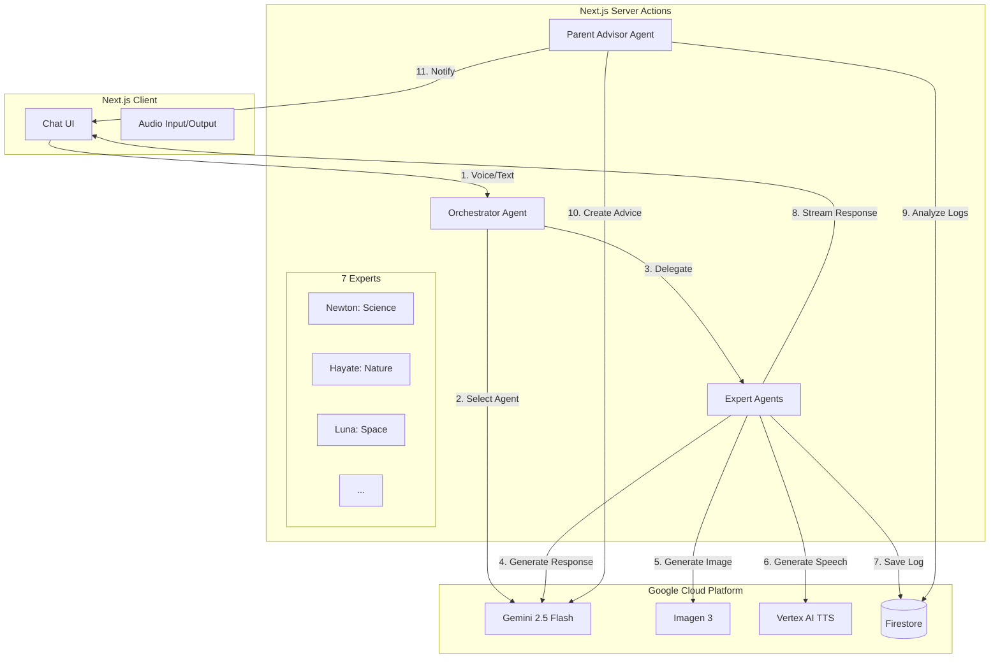

# 【Gemini 2.5 × Next.js】親子の会話を「ネタ切れ」から救う！AI科学研究所「Kids Science Lab」開発ログ

## はじめに

みなさん、こんにちは。「Kids Science Lab」開発チームです。

突然ですが、小さなお子さんを持つ親御さん、こんな経験はありませんか？

「パパ、なんで空は青いの？」
「ママ、なんで月はついてくるの？」

子供の好奇心は無限大です。
ある研究によると、**4歳の子供は1日に平均して200回から300回もの質問をする**と言われています。特に好奇心が旺盛な時期には、約2分に1回という驚異的な頻度で「なぜ？」が繰り返されます。

一方で、私たち親には時間がありません。
共働き世帯の増加に伴い、平日に親子が一緒に過ごせる時間は**約2時間**。そのうち、純粋に会話をしている時間は**わずか25分**程度というデータもあります。

**「1日300回の質問」 vs 「1日25分の会話」。**

単純計算しても、1つの質問に対して親が割ける時間は**わずか5秒**しかありません。これでは、子供の「なぜ？」に正面から向き合うことは物理的に不可能です。
その結果、多くの親が「あとでね」と遮ってしまったり、スマホを見せたりしてやり過ごし、後になって「もっと話を聞いてあげればよかった」と**罪悪感（ギルティ）**を抱えています。

私たちは、この**「圧倒的な需要（子供の好奇心）と供給（親の時間）のミスマッチ」**こそが、現代の子育てにおける最大のペインポイントであると考えました。

そして開発したのが、**「Kids Science Lab」**です。

これは単なる子供向けの学習アプリではありません。**AIが子供の「好奇心の相棒」として300回の質問を受け止め、そこで得た発見を親に「会話のネタ」として届けることで、限られた25分の会話を「濃密な時間」に変える**ためのプロダクトです。

本記事では、Next.js 16とGoogle Vertex AI (Gemini 2.5 Flash) を駆使して構築したこのプロダクトの裏側、特に**Orchestrator-Workersパターン**を用いたエージェント設計や、**ReActパターン**による保護者支援機能の実装について解説します。


## 解決したかった課題 (The Pain)


### 1. 構造的な「会話時間の欠乏」
前述の通り、子供の質問欲求に対して親のリソースは圧倒的に不足しています。
東北大学の研究によれば、親子で「多様な会話」を持つ頻度は、子供の言語理解能力や脳（右上側頭回）の発達に直接的な影響を与えるとされています。しかし、日々の業務や家事に追われる中で、その時間を確保するのは至難の業です。

### 2. 「何を話せばいいかわからない」問題
いざ時間があっても、「今日学校どうだった？」「楽しかった」で会話が終了してしまう...。そんな「ネタ切れ」に悩む親も少なくありません。
子供が今、具体的に何に興味を持っているのか（例えば「恐竜」といっても、ティラノサウルスの強さなのか、化石の発掘なのか）を把握できていないため、話を広げられないのです。

### 3. 親の心理的負担（罪悪感）
調査によると、6割以上の親が「子供への関わり方に自信がない」「申し訳ない」と感じています。
「忙しいから」という理由で子供の好奇心をスルーしてしまった時の申し訳なさは、親の自己肯定感をも下げてしまいます。

私たちのミッションは、**「好奇心に、最高の相棒を。家族に、会話の架け橋を。」**です。
AIを使って、この構造的なミスマッチを解消し、親子の時間を「量」だけでなく「質」で満たすことを目指しました。

## ソリューション (The Core): 発見とつながりのサイクル

Kids Science Labは、子供とAIだけで完結するのではなく、そこから親子の会話が生まれる**「発見とつながりのサイクル」**をデザインしました。


### ① 子供の体験：疑問をぶつけ、解説を受ける
アプリを開くと、7人の個性豊かなAI博士たちが待っています。子供が「なんで空は青いの？」と話しかけると、その質問に最適な専門家（この場合は「ニュートン博士」）が自動的に選ばれ、登場します。

- **🗣️ 音声対話**: 読み上げ機能により、文字が読めない小さなお子さんでも楽しめます。
- **🎨 リアルタイム図解**: 話している内容に合わせて、AIがその場でイラストを生成。視覚的に理解を助けます。
- **⚡️ 爆速レスポンス**: Gemini 2.5 Flashの高速性を活かし、子供を待たせません。

### ② AIの役割：子供の関心事を「翻訳」して渡す（かすがい）
ここが重要なポイントです。子供と博士の会話は、ログとして蓄積されるだけでなく、親向けのアドバイス生成に使われます。

AIは会話ログを分析し、「子供が今、光の屈折に興味を持っています」という事実だけでなく、**「お風呂でシャワーを使って虹を作ってみよう、と誘ってみてください」**といった、**具体的なアクションプラン（会話のネタ）**に翻訳して親に届けます。

### ③ 親子の体験：ネタ（アドバイス）を持った親が話しかけ、会話が弾む
ネタを受け取った親は、専門知識がなくても子供と会話を広げることができます。
「今日、博士と虹の話したんだって？ 夕焼けが赤い理由知ってる？」
AIが親子の間に割って入るのではなく、**AIが黒子となって親子の会話をプロデュースする**。それがKids Science Labの狙いです。

## アーキテクチャと技術スタック

システム全体は、Google Cloud Platform (GCP) と Next.js を中心に構成されています。特に、子供の即座の反応に対応するための**低遅延設計**と、親への高度なアドバイス生成のための**推論能力**の両立を意識しました。

### Tech Stack

| カテゴリ | 技術 | 選定理由 |
| :--- | :--- | :--- |
| **Frontend** | **Next.js 16.1 (App Router)** | Server Actionsによるバックエンドロジックの統合が容易。React 19の新機能（useActionState等）も活用。 |
| **AI (LLM)** | **Gemini 2.5 Flash** | **圧倒的な生成速度とコストパフォーマンス**。子供を待たせないレスポンス実現の鍵。 |
| **AI (Image)** | **Imagen 3 (Vertex AI)** | プロンプトへの忠実度が高く、子供向けの「絵本のような」スタイルを一貫して生成できるため。 |
| **AI (Audio)** | **Vertex AI TTS** | 自然な日本語発話が可能。Web Speech APIもフォールバックとして併用。 |
| **Database** | **Firebase (Firestore)** | リアルタイム性、認証（Firebase Auth）との親和性、そしてNoSQLによる柔軟なデータ構造。 |
| **Backend** | **Firebase Admin SDK** | Next.js Server Actions内でのセキュアなDB操作。 |

### システム構成図

全体のアーキテクチャは以下の通りです。子供との対話は「Orchestrator-Workersパターン」、親へのアドバイスは「ReActパターン」を採用しています。



### なぜこの構成なのか？

#### 1. Gemini 2.5 Flash の採用
子供は待つのが苦手です。特に音声対話において、数秒の沈黙は「無視された」と感じさせ、興味を失わせる原因になります。Gemini 2.5 Flashは、従来のモデルと比較してレイテンシが劇的に低く、かつコンテキストウィンドウも十分広いため、会話履歴を踏まえた高速な応答が可能でした。

#### 2. Server Actions × Firebase
バックエンドAPIを別途構築せず、Next.jsのServer Actionsで完結させることで、開発スピードを最大化しました。Firebase Admin SDKをServer Actions内で使うことで、クライアントサイドに強い権限を持たせることなく、セキュアにFirestoreへアクセスしています。

## 実装の工夫ポイント (The Special Sauce)

単にAPIを叩くだけでは、子供が楽しめる体験は作れません。UXを向上させるために実装したいくつかの工夫を紹介します。

### 工夫1: 並列生成パイプライン (Parallel Generation)

テキスト、画像、音声を順番に生成していたのでは、子供を待たせてしまいます。そこで、`Promise.all` を活用し、可能な限り処理を並列化しました。

特に工夫したのが、**「テキスト生成中に画像プロンプトを裏で作る」**という点です。
エージェントは回答の生成を開始すると同時に、その回答内容に基づいた画像生成プロンプトを（別スレッドのようなイメージで）並列に考え始めます。

```typescript
// 概念コード: 並列処理のイメージ
async function generateResponse(messages: Message[]) {
  // 1. テキスト回答の生成ストリームを開始
  const textStream = gemini.generateContentStream({
    contents: messages,
    systemInstruction: "あなたは6歳児に優しく教えるニュートン博士です..."
  });

  // 2. (並列) 画像生成プロンプトの作成と画像生成
  // 直前の会話内容から、これから話す内容の挿絵を予測して生成
  const imagePromise = (async () => {
    const prompt = await generateImagePrompt(messages);
    return await generateImage(prompt);
  })();

  // 3. (並列) 音声合成
  // テキストストリームのチャンクが溜まり次第、TTSに投げる処理（別途実装）
  
  return { textStream, imagePromise };
}
```

これにより、子供が博士の最初の言葉（「いい質問じゃな！」など）を聞いている間に、裏で画像生成が完了し、話の展開に合わせてスッと画像が表示される体験を実現しました。

### 工夫2: マルチエージェントオーケストレーション

「科学」から「芸術」まで、あらゆる質問に1つのプロンプトで答えるのは無理があります。そこで、7人の専門家エージェントを用意し、オーケストレーターが質問内容に応じて適切な担当者を指名する設計にしました。

```typescript
// オーケストレーターのプロンプト例（簡略化）
const ORCHESTRATOR_PROMPT = `
ユーザーの質問を分析し、最も適切なエージェントIDを返してください。

- Newton: 物理、化学、「なぜ？」という現象の質問
- Hayate: 動物、植物、昆虫、自然環境
- Luna: 宇宙、星、月、天気
- Gen: 歴史、昔話、文化
- Palette: 色、絵、音楽、芸術
- Techun: ロボット、コンピュータ、機械
- Smile: 上記以外、または挨拶や感情的な会話

User Input: "${userQuestion}"
Output:
`;
```

これにより、ニュートン博士なら「〜じゃよ」、テックン博士なら「〜だピコ」といった、キャラクター性を維持したまま専門的な回答が可能になりました。

### 工夫3: 親向けReActエージェント (Parent Advisor)

親へのアドバイス機能では、単に「会話ログを要約する」だけでは不十分です。「具体的にどうすればいいか」を提案するために、**ReAct (Reasoning + Acting) パターン**を導入しました。

親エージェントには以下の「ツール」を持たせています：
1. `analyzeConversationHistory`: 過去1週間の会話ログを取得・分析する
2. `getLearningProgress`: 子供がどの分野（科学、歴史など）に興味を持っているかの統計を取得する
3. `proposeActivity`: 興味に基づいたアクティビティ（実験、外出、本など）を提案する

GeminiのFunction Calling機能を使い、エージェントは自律的に思考します。


このように、データに基づいた「使えるアドバイス」を生成できるのが強みです。

## 苦労した点と解決策

開発を進める中で、いくつかの壁にぶつかりました。

### 1. ストリーミング生成とUIの同期
**課題**: テキストはストリーミングで一瞬で表示されますが、画像や音声は生成に数秒かかります。これらを単純に生成完了順に表示すると、テキストだけ先に進んで画像が追いつかない、といったUXの不整合が発生しました。

**解決策**: フロントエンド側で「再生キュー」のような仕組みを実装しました。テキスト、画像、音声の全てのチャンクが揃った（あるいは再生準備が整った）ステップから順次UIに表示・再生する制御ロジックを組むことで、まるで絵本を読み聞かせているようなスムーズな同期を実現しました。

### 2. 「子供にとって適切な回答」の制御
**課題**: AIは時として、子供には難しすぎる専門用語を使ったり、不適切な表現を含んだりすることがあります。

**解決策**: 専門家エージェントの出力の後に、「Educator Reviewer（スマイル先生）」という別エージェントのチェックレイヤーを挟む構成を試しました。しかし、これを入れるとレイテンシが増加してしまうため、最終的にはプロンプトエンジニアリングで「6歳児にわかる言葉で」という制約を強くかける方針に落ち着きました。また、不適切なコンテンツフィルタリングはVertex AIのセーフティ設定を活用しています。

## 今後の展望

今回の開発はまだ第一歩に過ぎません。今後は以下の展開を考えています。

1. **ユーザーフィードバックの収集**: 
   実際に親子に使ってもらい、「本当に会話が増えたか？」「子供が楽しんでいるか？」を生の声で検証したいと考えています。定量的なデータだけでなく、親子の表情や会話の質の変化といった定性的なフィードバックを重視します。

2. **効果検証とUX改善**:
   フィードバックを元に、アプリの使い勝手を磨き上げます。特に、親向けのアドバイスが本当に「実行しやすい」ものになっているか、継続的に検証・改善していく予定です。

3. **機能拡張**:
   - **記憶の永続化**: 子供の成長記録として、会話ログを長期保存し、「一年前はこんなことに興味持ってたね」と振り返れる機能。
   - **マルチモーダル入力**: 散歩中に見つけた花の写真を博士に見せて、「これなに？」と聞ける機能。

## まとめ

Kids Science Labは、「AIは人を孤独にする」という不安に対し、**「AIが人と人をつなぐ架け橋になる」**という一つの答えを提示できたのではないかと思います。

技術は、使いようによって人を幸せにできます。
忙しい現代の親御さんが、少しでも罪悪感から解放され、子供と向き合う時間を楽しめるようになること。それが私たちの願いです。

もし興味を持っていただけたら、ぜひリポジトリを覗いてみてください。そして、一緒にこの「好奇心の研究所」を育ててくれる仲間も募集しています！

---

**Team Kids Science Lab**
- Toshio Ueda (Lead Engineer / PM)
- [Team Member Names]

**Repository:** [GitHub Link]
