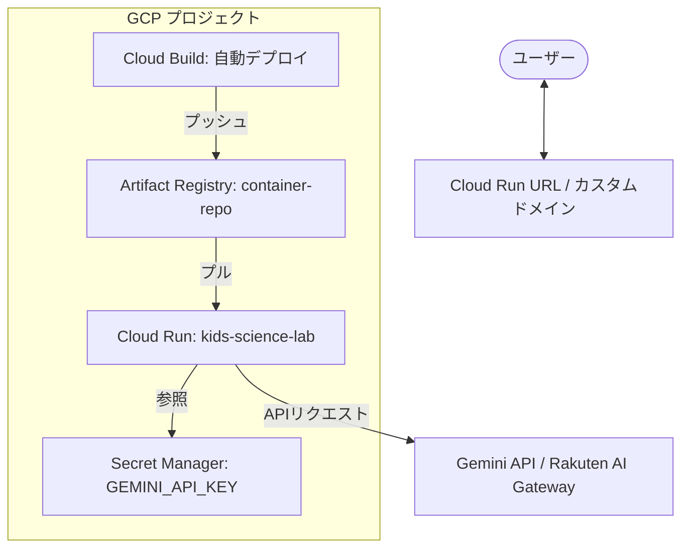

# GCPデプロイ構成案 (MVP)

このプロジェクトをGCP（Google Cloud Platform）にデプロイするための、MVP（最少実行製品）向けの推奨構成案です。

## 1. 推奨アーキテクチャ

現在、アプリはステートレス（データはブラウザの IndexedDB/LocalStorage に保存）な Next.js アプリであるため、**Cloud Run** を中心とした構成が最適です。

## 2. 各コンポーネントの役割

| コンポーネント | 役割 | 選定理由 |
| :--- | :--- | :--- |
| **Cloud Run** | アプリの実行環境 | サーバーレスで、リクエストがない時は料金がほぼゼロ。スケーリングも自動。 |
| **Artifact Registry** | Dockerイメージの保存 | GCP標準のコンテナレポジトリ。 |
| **Secret Manager** | APIキーの管理 | `GEMINI_API_KEY` を安全に保管し、アプリから参照。 |
| **Cloud Build** | CI/CD (自動デプロイ) | GitHubへのプッシュを検知して自動でビルド・デプロイ。 |

## 3. 推計コスト (MVP時)

*   **Cloud Run**: 無料枠が大きく、MVPレベル（月間数万リクエスト程度）であれば、ほぼ **0円〜数百円/月** で収まります。
*   **Artifact Registry / Secret Manager**: 保存量によりますが、月額 **数十円程度** です。

## 4. 将来の拡張性（マネタイズフェーズ）

マネタイズを開始し、ユーザーアカウント管理や永続的なデータ保存が必要になった場合は、以下のサービスを追加できます。

1.  **Firebase Authentication**: ユーザーログイン機能の追加。
2.  **Cloud Firestore / Cloud SQL**: チャット履歴や生成した作品をサーバー側で保存。
3.  **Cloud Storage**: 生成した画像をブラウザ（IndexedDB）ではなくサーバー側に永続保存。
4.  **Cloud Load Balancing + Cloud CDN**: パフォーマンス向上と独自ドメイン・SSLの管理。

## 5. デプロイまでの具体的ステップ

1.  **GCPプロジェクトの準備**
    *   プロジェクト作成、課金有効化。
    *   Cloud Run, Artifact Registry, Cloud Build, Secret Manager APIの有効化。
2.  **シークレットの登録**
    *   `GEMINI_API_KEY` を Secret Manager に登録。
3.  **Dockerイメージのビルドと登録**
    *   既存の `Dockerfile` を使用してビルドし、Artifact Registry へプッシュ。
4.  **Cloud Run へのデプロイ**
    *   プッシュしたイメージを指定してサービスを作成。
    *   Secret Manager から環境変数を読み込むよう設定。

---

このプランでよろしければ、詳細な設定手順をまとめたドキュメント（`docs/deploy-gcp.md`）を作成します。
