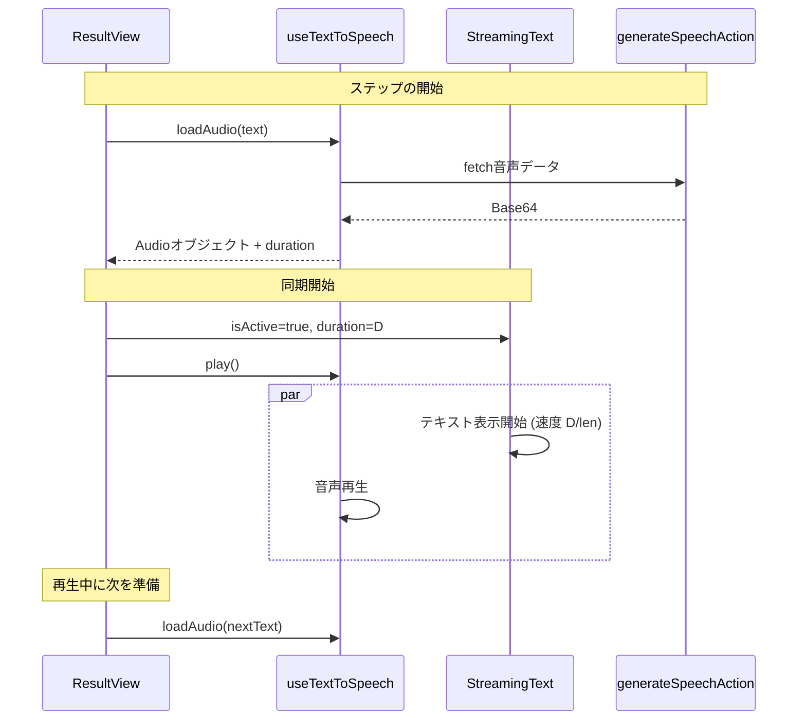

# 音声とテキスト表示の同期改善計画

## 現状の課題
- `ResultView` において、`StreamingText` がテキストの表示を即座に開始する一方、音声（TTS）はサーバーサイドでの生成を待つ必要があるため、音声の開始が数秒遅れる。
- その結果、テキストが先に表示されきってしまい、音声とタイミングが合わない。
- テキストの表示速度（固定値）が音声の再生時間と一致していない。

## 解決策
1.  **音声の「ロード」と「再生」の分離**:
    - `useTextToSpeech` フックを拡張し、音声を事前に取得して `Audio` オブジェクトと `duration`（再生時間）を返す機能を追加する。
2.  **ストリーミングの制御**:
    - `StreamingText` コンポーネントに、再生開始のトリガー（`isActive`）と、再生時間に基づく速度調整機能（`duration`）を追加する。
3.  **同期実行とプリフェッチ**:
    - `ResultView` において、音声のロード完了を待機し、完了後に音声再生とテキスト表示を同時に開始する。
    - 現在のステップを再生中に、次のステップの音声をバックグラウンドでロードしておくことで、ステップ間の待ち時間を解消する。

## 変更内容

### 1. `src/hooks/useTextToSpeech.ts`
- `loadAudio(text: string)` 関数を追加。
- 戻り値として、`duration` と `play()` 関数を含むオブジェクトを返す。
- `isPreparing` などの状態を追加し、ロード中であることを UI に伝えられるようにする。

### 2. `src/components/StreamingText.tsx`
- `isActive?: boolean` プロップを追加。`false` の間は表示を待機し、`true` になった瞬間にアニメーションを開始する。
- `totalDuration?: number` (ms) プロップを追加。これが指定されている場合、`speed = totalDuration / text.length` として計算する。
- `key` プロップなどを利用したリセットへの対応。

### 3. `src/components/ResultView.tsx`
- `audioCache` を `useRef` で保持し、ステップごとの `Audio` オブジェクトをキャッシュする。
- `playStep` を `async` 化し、キャッシュにない場合はロードを待機する。
- 音声の `duration` を `StreamingText` に渡し、`isActive` を制御する。
- `playStep` の開始時に、次のインデックスの音声を `loadAudio` しておく。

## シーケンス図

## 期待される効果
- 音声が鳴り始めた瞬間に文字が書き始められるようになる。
- 音声が終わるタイミングでちょうど文字も出し切るようになる。
- 2ステップ目以降は事前のロードにより待ち時間なしで再生が始まる。
