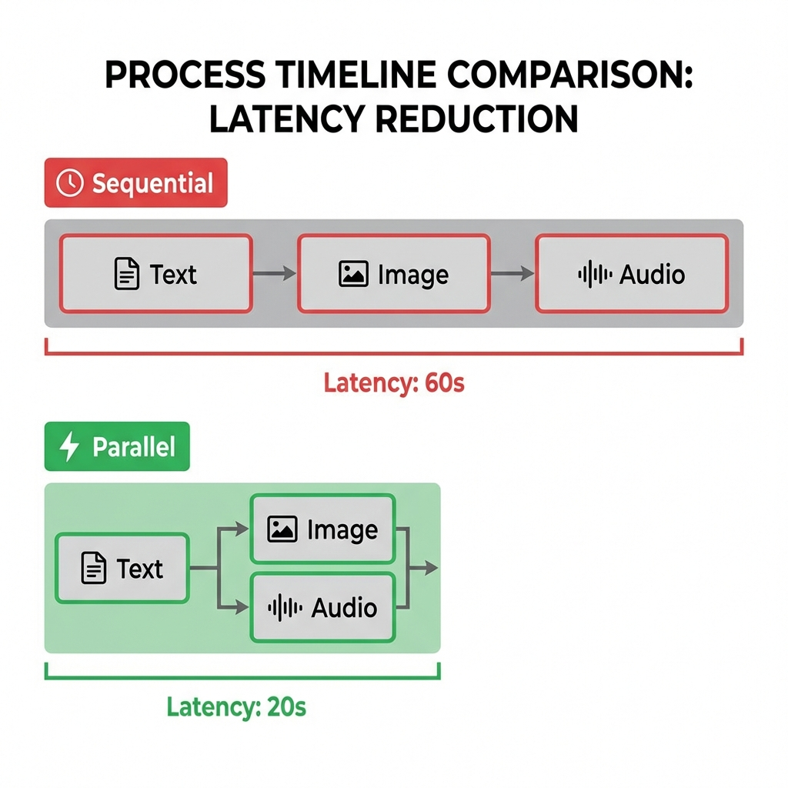
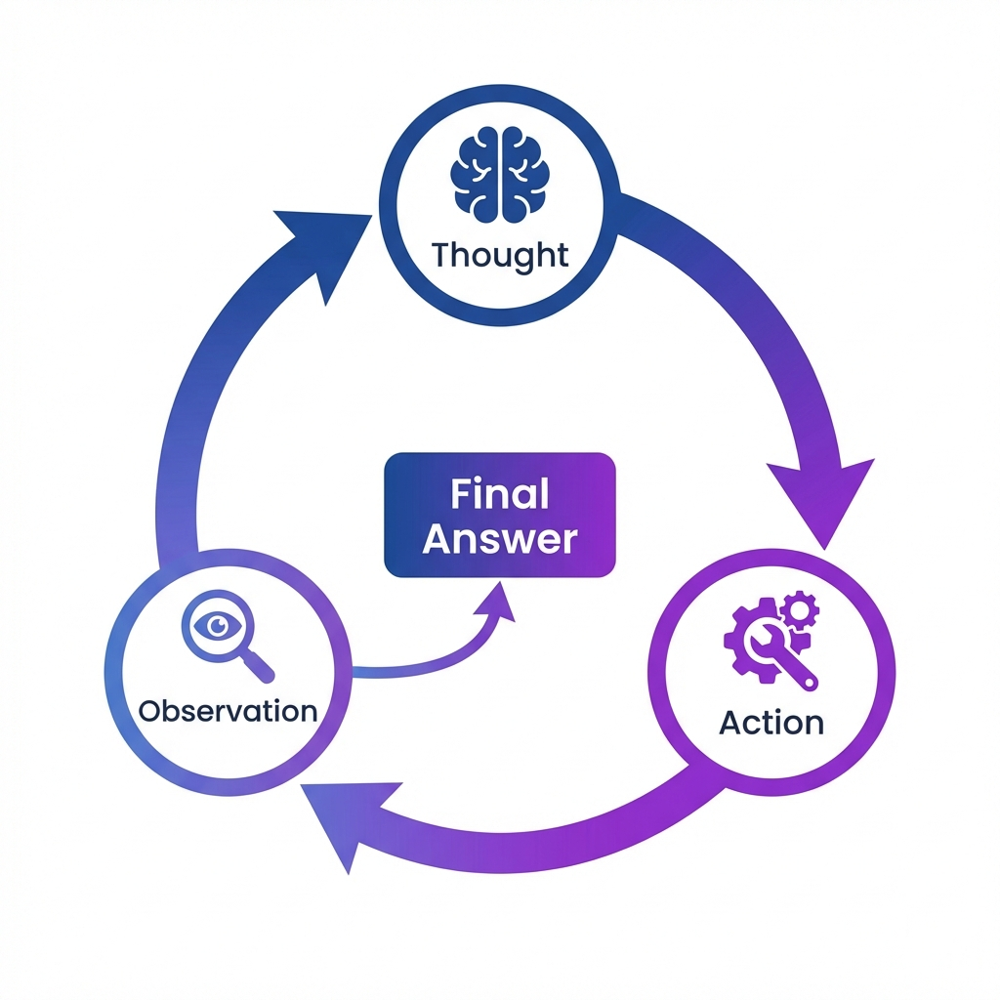
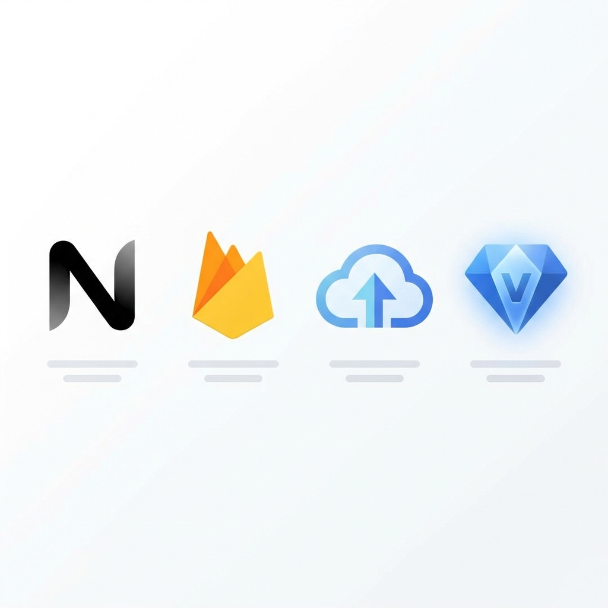

# OyaCo Lab 技術解説動画ストーリーボード (Architecture Overview)

## 動画概要
*   **タイトル**: OyaCo Lab: Technical Deep Dive
*   **ターゲット**: ハッカソン審査員、エンジニア、技術に興味のあるユーザー
*   **目的**: 
    *   Google Cloud (Gemini 2.5 Flash, Vertex AI) を活用した先進的なアーキテクチャをアピールする。
    *   特に「子供を待たせないUX（並列処理・先読み）」と「親への高度なアドバイス（ReAct）」の実装上の工夫を強調する。
*   **尺**: 約1分 (60秒)
*   **トーン**: 知的、先進的、テンポが良い

## ストーリーボード構成

| シーン | 時間 | 画面イメージ・構成 | ナレーション・テロップ | 素材・備考 |
| :--- | :--- | :--- | :--- | :--- |
| **1. Orchestrator-Workers** | 0:00-0:15 | **[画面]**  ・全体システム構成図。 ・Next.js (Client) から Server Actions を経由して Gemini (Orchestrator) へ。 ・Orchestratorが7人のExpert Agentsから選定し、回答生成・TTS・画像生成を並列実行してClientに返すフロー。 ・Google Cloud上のコンポーネント連携を可視化。 | **[テロップ]** Orchestrator-Workers Architecture Next.js + Server Actions + Gemini  **[ナレーション]** OyaCo Labのアーキテクチャ概要です。 Next.jsのServer Actionsをハブとし、Orchestratorが子供の質問を解析。 最適な専門家エージェントを選定し、回答生成からマルチモーダル出力までを一気通貫で処理します。 | ・システム構成図 (plans/assets/architecture.png) |
| **2. Parallel Generation (UX)** | 0:15-0:40 | **[画面]**  ・**Before (直列)**: Text → Image → Audio と順次処理され、長いロードバーが表示される様子（×印で消す）。 ・**After (並列)**: Text生成と同時に、ImageとAudioが並列で走るパイプライン図。 ・さらに「1 Image for 4 Scenes」として、1枚の生成画像が4コマ漫画のように分割される様子を図解。 ・「音声先読み」のインジケーターが動き、紙芝居が途切れず進むプレビュー画面。 | **[テロップ]** Parallel Generation Pipeline Latency: 60s → 20s Zero Waiting Time UX  **[ナレーション]** ここでの最大の挑戦は「待たせないUX」です。 回答・画像・音声を並列処理し、さらに1枚の画像生成で4シーンを描画。 音声の先読み生成と組み合わせることで、まるで絵本のような、途切れない物語体験を実現しました。 | ・パイプライン比較図（直列 vs 並列） ・4コマ分割画像の解説図 ・実際のアプリ画面（紙芝居再生中） |
| **3. ReAct Pattern** | 0:40-0:55 | **[画面]**  ・ReAct (Reasoning + Acting) のループ図。 ・**Thought**: 吹き出し「最近、恐竜の話が多いな」 ・**Action**: ツール「AnalyzeHistory」実行 ・**Observation**: データ「先週は化石の話をした」 ・**Final Answer**: ダッシュボードに「博物館へ行こう」と提案が表示される。 ・これらがリズミカルに表示されるアニメーション。 | **[テロップ]** ReAct Pattern for Parents Autonomous Reasoning Logs → Analysis → Suggestion  **[ナレーション]** 一方、親へのアドバイスには「ReActパターン」を導入。 AIが自律的に会話ログを分析し、学習進捗や興味の推移を特定。 ただの要約ではなく、「今、親子で何を話すべきか」を具体的に提案します。 | ・ReActループ図（思考→行動→観察） ・親向けダッシュボード画面 |
| **4. Tech Stack & Outro** | 0:55-1:00 | **[画面]**  ・使用技術のロゴがシンプルに並ぶ。 ・Next.js 16, Firebase, Cloud Run, Vertex AI。 ・最後にGitHubリポジトリへのQRコードと「Kids Science Lab」ロゴ。 | **[テロップ]** Built with Google Cloud Next.js 16 | Firebase | Vertex AI  **[ナレーション]** 最新のGoogle Cloudスタックで構築されたOyaCo Lab。 技術の力で、親子の時間を「質」で満たします。 | ・技術スタックロゴ一覧 ・QRコード |

## 必要な素材リスト (Assets to Create)

1.  **Orchestrator構成図**: Orchestratorを中心に、7人の博士（Workers）が放射状に配置された図。
2.  **パイプライン比較アニメーション**: 
    *   直列処理（Text→Image→Audio）のタイムライン
    *   並列処理（Text + (Image/Audio)）のタイムライン
3.  **4コマ画像生成の仕組み図**: 1枚の大きな画像が4つのパネルに分割され、それぞれがシーンに対応していることを示す図。
4.  **ReActプロセス図**: Thought, Action, Observationのサイクルを示す図。
5.  **技術スタックロゴ**: Next.js, Firebase, Cloud Run, Vertex AI, Gemini。

## 備考
*   ナレーションは「知的で信頼感のある」トーンで行う。
*   BGMはテクノロジー感のある、少しアップテンポなものを使用する。
