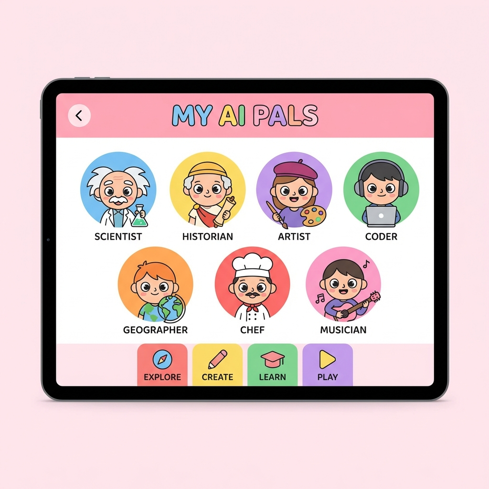
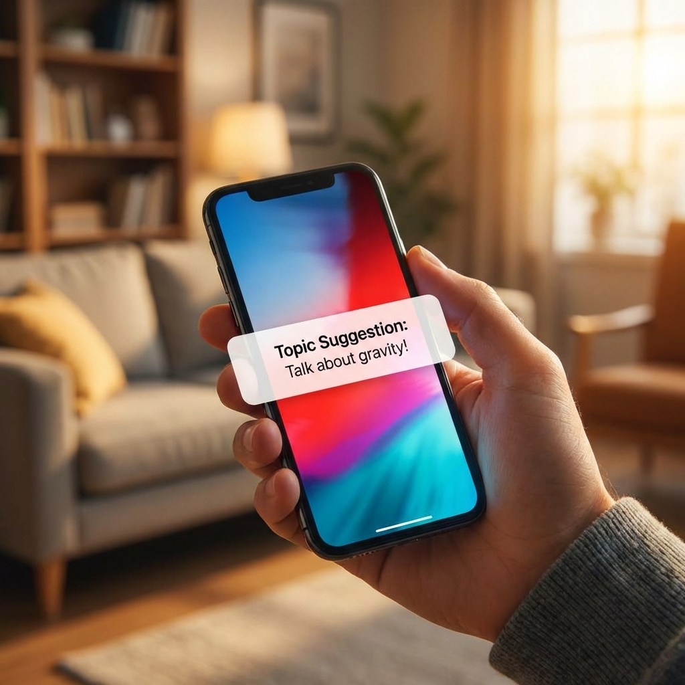

# OyaCo Lab: ハッカソン動画構成案 (Canva流し込み用)

このシナリオは、記事にある**「課題（数字のインパクト）」→「解決策（エージェント）」→「技術（Agentic）」**の流れを、審査員に最も響く形で再構成したものです。
Canvaのスライド1枚ごとに以下の構成で作ってください。

**総尺目安:** 約2分25秒 (145秒)

---

## Part 1: The Pain (課題の共有)

**BGM:** シリアス、時計の音、少し不穏な感じ

| シーン | 秒数 | 画面イメージ (Canva素材検索ワード) | テロップ (画面に大きく出す文字) | ナレーション / 字幕 |
| :--- | :--- | :--- | :--- | :--- |
| **1** | 0:00-0:07 |  忙しい親、散らかった部屋、パソコン *(Busy mom/dad, stressed)* | 親子の会話 1日、何分だと思いますか？ | 共働き世帯が増え、親子の会話時間は... |
| **2** | 0:07-0:12 |  時計の針がぐるぐる回る、砂時計 *(Clock ticking fast)* | わずか 25分 | たったの25分と言われています。 |
| **3** | 0:12-0:18 |  子供が「？」マークに囲まれている *(Curious child, question marks)* | 子供の質問 1日 300回 | 一方で、4歳の子供がする質問は1日300回。 |
| **4** | 0:18-0:24 |  数字がドンと出る *(Impact font)* | 1問あたり たった「5秒」 | 親が1つの質問に向き合える時間は、わずか5秒。これでは無理です。 |
| **5** | 0:24-0:30 |  親がスマホを見せて誤魔化す、困った顔 *(Sad parent, ignore)* | 「あとでね」 罪悪感のループ | 結局スマホを見せてやり過ごし、親は罪悪感を感じてしまう...。 |

---

## Part 2: The Solution (解決策)

**BGM:** ここで転換！明るい、ワクワクする、テクノロジー感のある曲へ

| シーン | 秒数 | 画面イメージ (Canva素材検索ワード) | テロップ (画面に大きく出す文字) | ナレーション / 字幕 |
| :--- | :--- | :--- | :--- | :--- |
| **6** | 0:30-0:35 |  **アプリのロゴ** または タイトル画面 | **OyaCo Lab** 親子の会話を 「ネタ切れ」から救う | その課題を解決するのが、「OyaCo Lab」です。 |
| **7** | 0:35-0:45 |  3人の関係図（子供・AI・親） *(Connection, Network, Bridge)* | ただのAIじゃない。 「親子をつなぐ架け橋」 | AIが子供の「好奇心の相棒」になり、そこで得た発見を親へ「会話のネタ」として届けます。 |

---

## Part 3: The Demo (デモ・機能紹介)

**BGM:** 軽快なリズム

| シーン | 秒数 | 画面イメージ | テロップ (画面に大きく出す文字) | ナレーション / 字幕 |
| :--- | :--- | :--- | :--- | :--- |
| **8** | 0:45-0:55 |  **【動画】** 子供が質問→博士が登場 | 7人のAI博士が 子供の「なぜ？」に回答 | 子供が質問すると、その分野の専門家AIが登場。今回はニュートン博士です。 |
| **9** | 0:55-1:05 |  **【動画】** 博士の考え中アニメーション | 待ち時間を 「ワクワク」に変える | 生成の待ち時間も、博士が考えている演出で子供を飽きさせません。 |
| **10** | 1:05-1:15 |  **【動画】** 親のスマホに通知が来る画面 | ここがポイント！ 親への「ネタ提供」 | そして最大の特徴。子供の興味をAIが分析し、親へ「今、こんなこと話してみて！」と通知します。 |
| **11** | 1:15-1:25 |  親子のイラスト、会話している様子 *(Happy family talking)* | AIが黒子になり 会話が弾む | 専門知識がなくても大丈夫。AIからのパスを受け取るだけで、親子の会話が弾みます。 |

---

## Part 4: The Technology (技術スタック)

**BGM:** 知的でクールな、テック系のBGM

| シーン | 秒数 | 画面イメージ (Canva素材検索ワード) | テロップ (画面に大きく出す文字) | ナレーション / 字幕 |
| :--- | :--- | :--- | :--- | :--- |
| **12** | 1:25-1:35 |  システム構成図（記事の図） またはロゴを並べる | Google Cloud × Agentic AI | 裏側では、Google Cloudと最新のAgentic AI技術が動いています。 |
| **13** | 1:35-1:45 |  Geminiのロゴ、稲妻マーク *(Speed, Lightning)* | Gemini 2.5 Flash 圧倒的な低遅延 | モデルにはGemini 2.5 Flashを採用。子供の好奇心を逃さないスピードを実現しました。 |
| **14** | 1:45-1:55 |  歯車が噛み合う動画、ロボットの思考 *(Gears, AI brain)* | ReAct Agent 自律的な思考 | 親へのアドバイスは、ReActパターンを用いたエージェントが自律的に思考して生成します。 |
| **15** | 1:55-2:05 |  Cloud Run等のロゴ | Cloud Run Parallel Generation | Cloud Runによるスケーラブルな基盤と、並列生成パイプラインによるUX最適化を行っています。 |

---

## Part 5: Conclusion (まとめ)

**BGM:** 感動的、希望を感じる曲

| シーン | 秒数 | 画面イメージ (Canva素材検索ワード) | テロップ (画面に大きく出す文字) | ナレーション / 字幕 |
| :--- | :--- | :--- | :--- | :--- |
| **16** | 2:05-2:15 |  親子が笑顔で寄り添う映像 *(Family love, Sunset)* | AIは人を孤独にしない。 人と人をつなぐ。 | 私たちは、AIこそが親子の絆を深めるツールになれると信じています。 |
| **17** | 2:15-2:25 |  ロゴ、チーム名 | 好奇心に、最高の相棒を。 OyaCo Lab | 好奇心に、最高の相棒を。OyaCo Labでした。 |

---

### Canvaでの作業ヒント

1.  **「一括作成」は使わなくてOK:**
    *   スライド枚数が17枚程度なので、テンプレート（「プレゼンテーション(16:9)」または「動画」）を選んで、1枚ずつコピペしていくのが一番早くて綺麗です。

2.  **素材検索キーワード:**
    *   表の中に英語で `(Busy mom)` などを入れています。Canvaは英語検索の方が良い素材が出やすいです。

3.  **ナレーション:**
    *   Canvaには「ナレーション付きAI（D-IDなど）」の連携アプリもありますが、一番早いのは、この表の「ナレーション」を自分で読み上げて録音し、動画に乗せることです（熱意が伝わります）。
    *   もし声を出したくなければ、字幕を大きめに入れて、BGMだけで構成するのもアリです。
