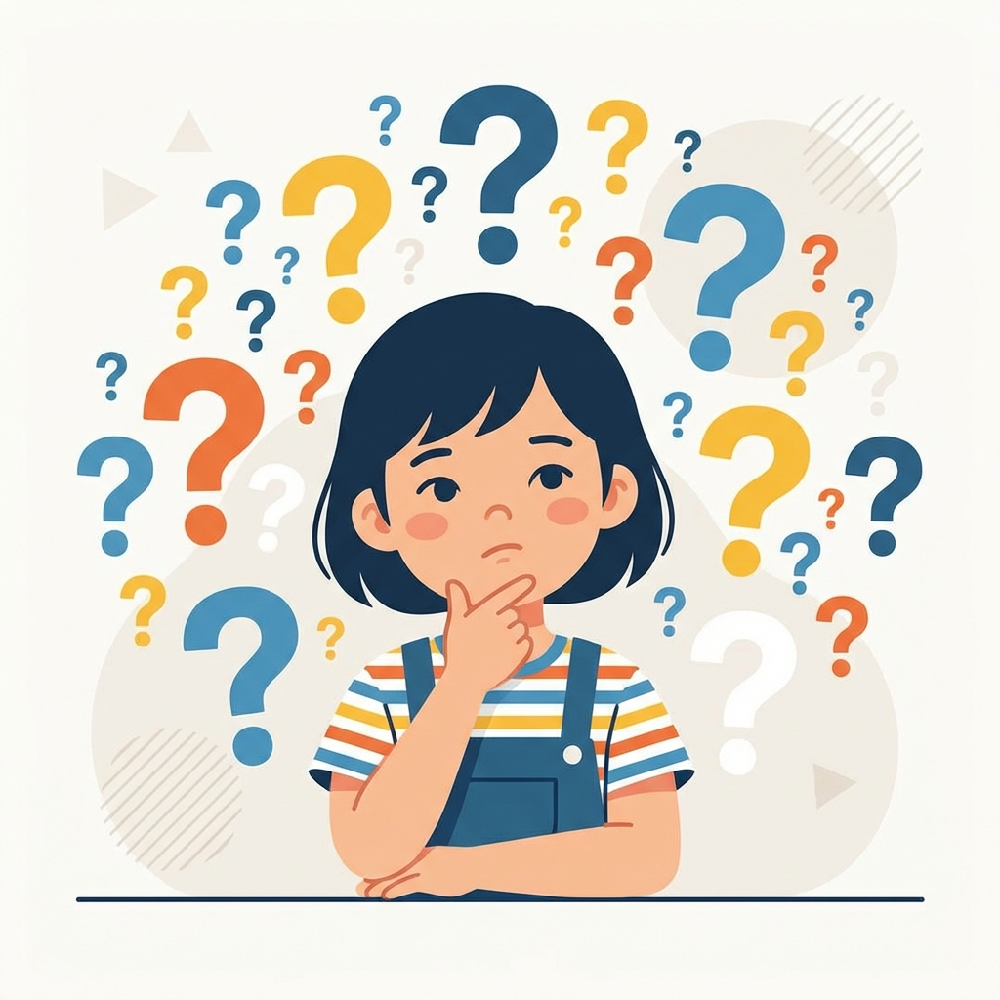
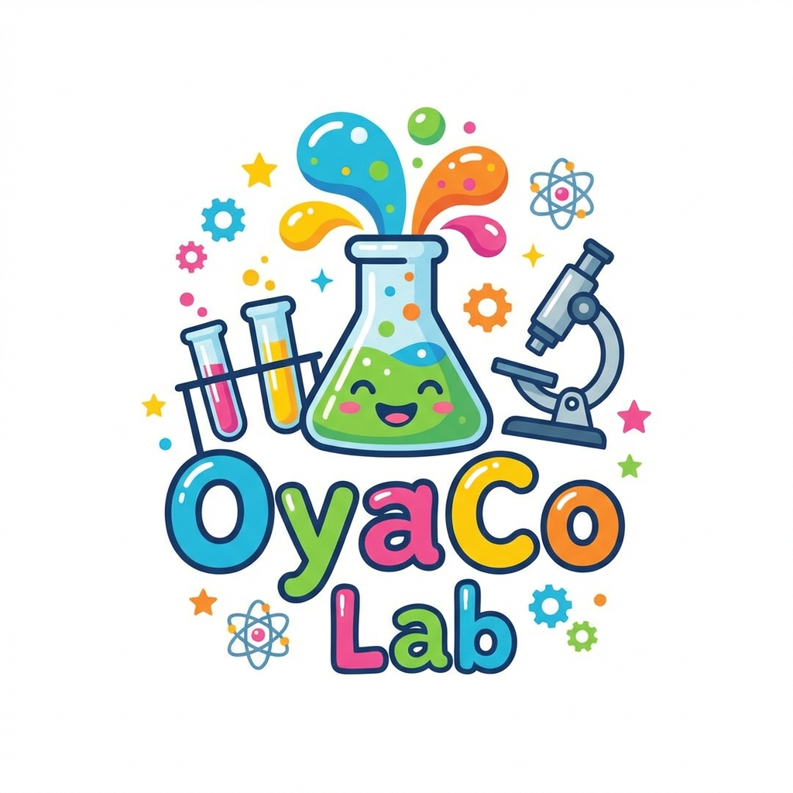
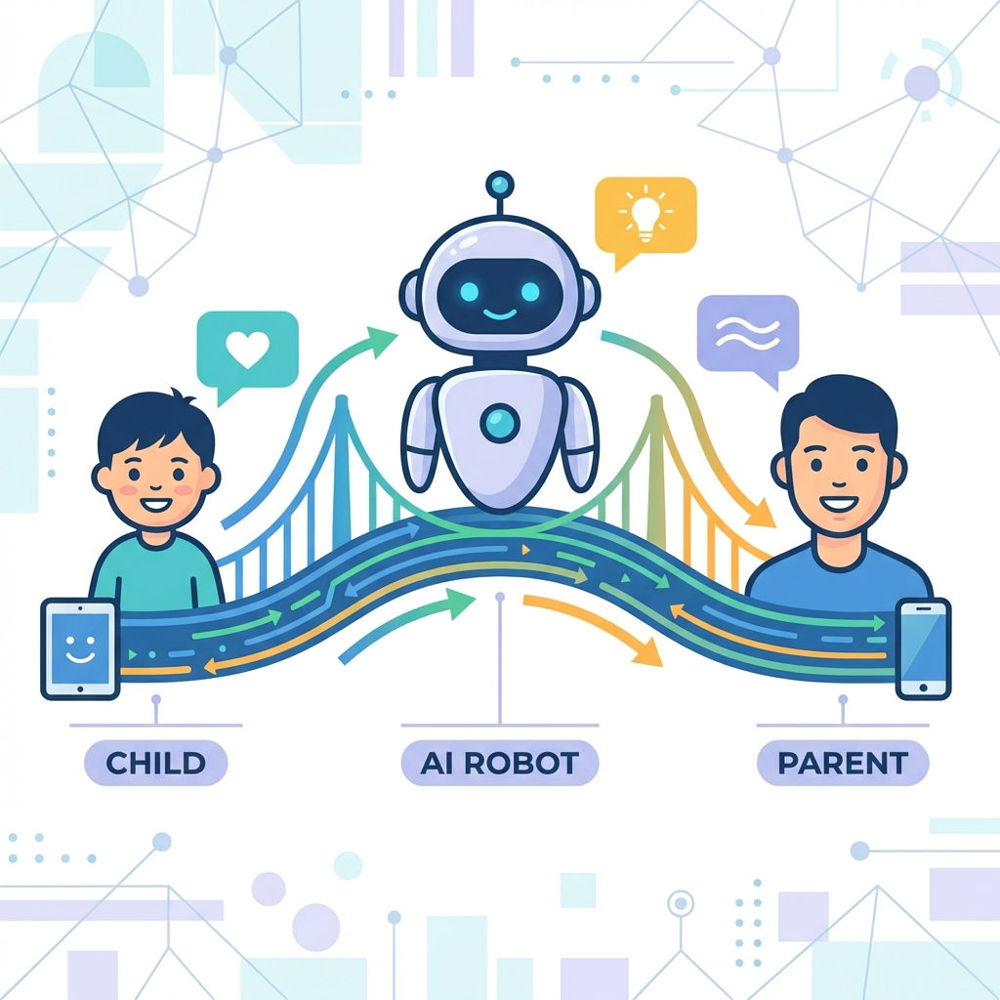
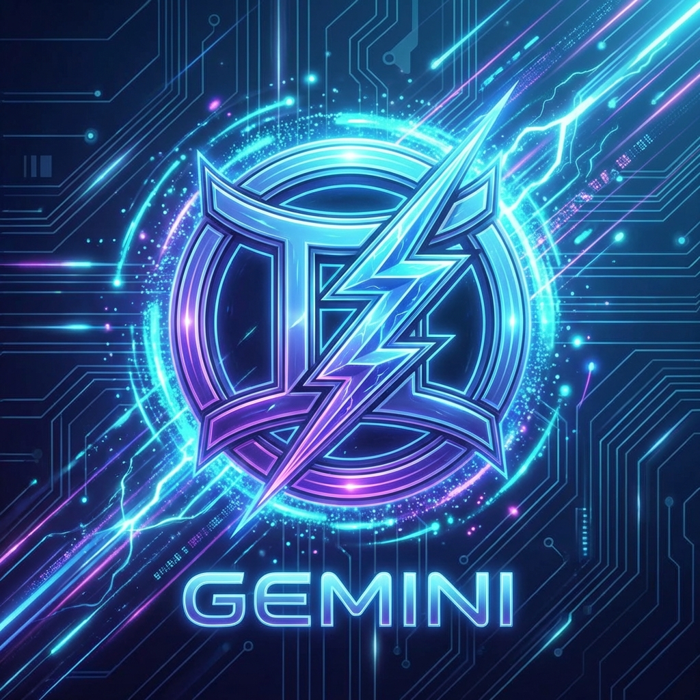
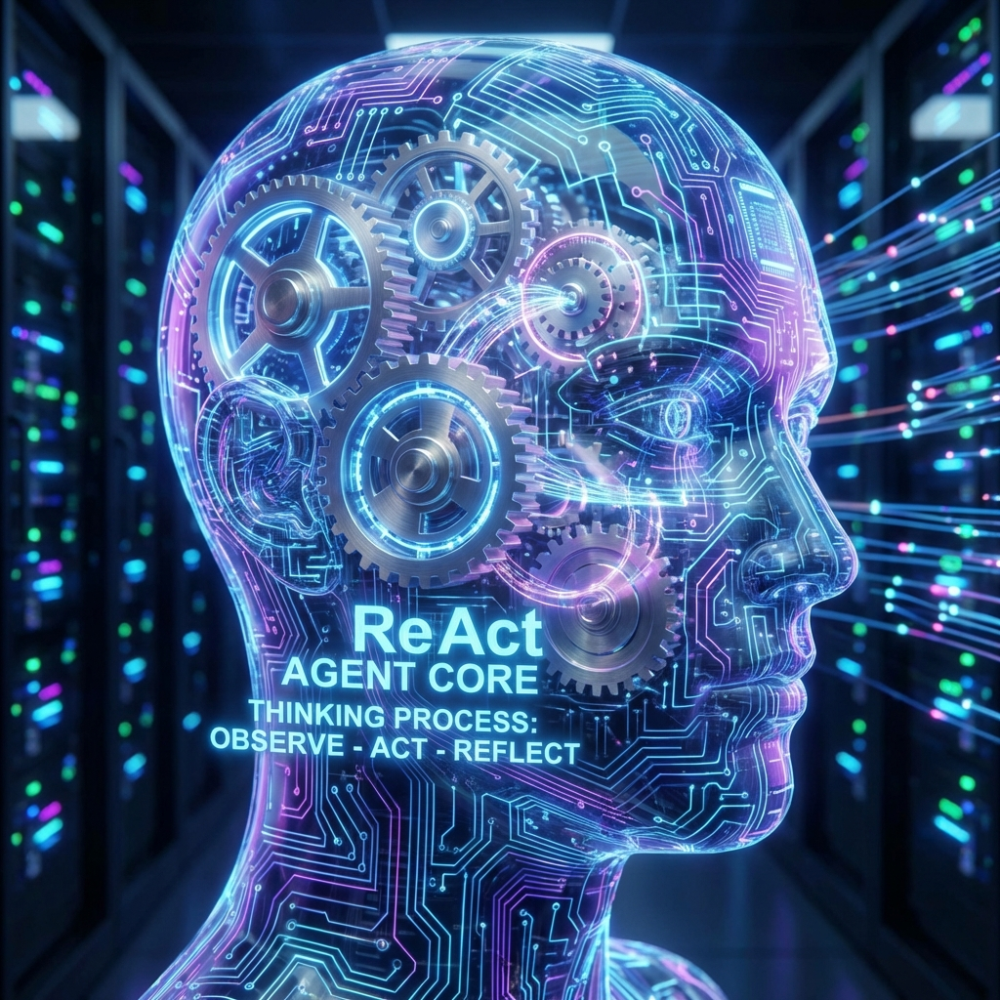
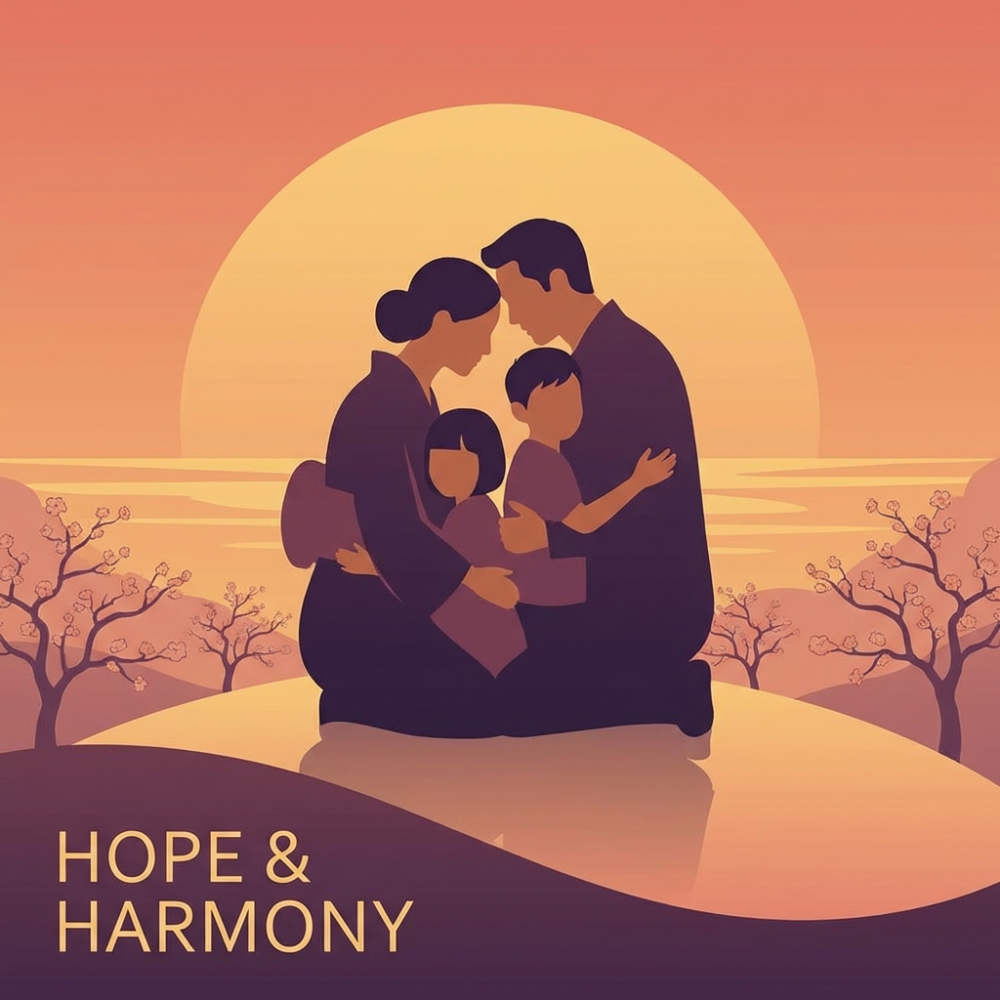
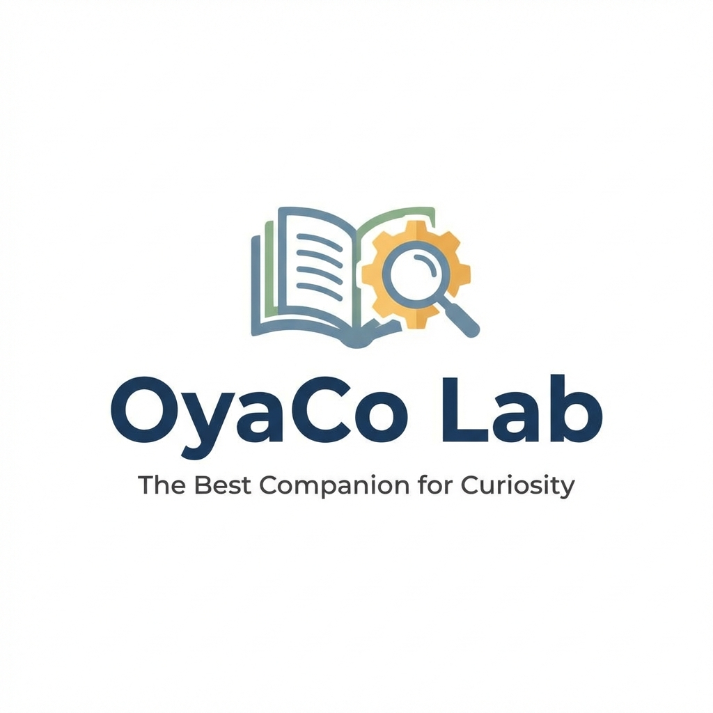

# OyaCo Lab: ハッカソン動画構成案 (Canva流し込み用) v2.1

このシナリオは、記事にある**「課題（数字のインパクト）」→「解決策（エージェント）」→「技術（Agentic）」**の流れを、審査員に最も響く形で再構成したものです。
Canvaのスライド1枚ごとに以下の構成で作ってください。

**総尺目安:** 約2分30秒 (150秒)

---

## Part 1: The Pain (課題の共有)

**BGM:** シリアス、時計の音、少し不穏な感じ

| シーン | 秒数 | 画面イメージ (Canva素材検索ワード) | テロップ (画面に大きく出す文字) | ナレーション / 字幕 |
| :--- | :--- | :--- | :--- | :--- |
| **1** | 0:00-0:07 |  忙しい親、散らかった部屋、パソコン *(Busy mom/dad, stressed)* | 親子の会話 1日、何分だと思いますか？ | 親子の会話、1日、何分だと思いますか？共働き世帯が増え、親子の会話時間は... |
| **2** | 0:07-0:12 |  時計の針がぐるぐる回る、砂時計 *(Clock ticking fast)* | わずか 25分 | たったの25分と言われています。 |
| **3** | 0:12-0:18 |  子供が「？」マークに囲まれている *(Curious child, question marks)* | 子供の質問 1日 300回 | 一方で、4歳の子供がする質問は1日300回。 |
| **4** | 0:18-0:24 |  数字がドンと出る *(Impact font)* | 1問あたり たった「5秒」 | 親が1つの質問に向き合える時間は、わずか5秒。これでは無理です。 |
| **5** | 0:24-0:30 |  親がスマホを見せて誤魔化す、困った顔 *(Sad parent, ignore)* | 「あとでね」 罪悪感のループ | 結局スマホを見せてやり過ごし、親は罪悪感を感じてしまう...。 |

---

## Part 2: The Solution (解決策)

**BGM:** ここで転換！明るい、ワクワクする、テクノロジー感のある曲へ

| シーン | 秒数 | 画面イメージ (Canva素材検索ワード) | テロップ (画面に大きく出す文字) | ナレーション / 字幕 |
| :--- | :--- | :--- | :--- | :--- |
| **6** | 0:30-0:35 |  **アプリのロゴ** または タイトル画面 | **OyaCo Lab** 親子の会話を 「ネタ切れ」から救う | その課題を解決するのが、「OyaCo Lab」です。 |
| **7** | 0:35-0:45 |  3人の関係図（子供・AI・親） *(Connection, Network, Bridge)* | AIが親子をつなぐ。 「会話の橋渡し」 | AIが子供の発見を受け止め、親に話しかけやすい“会話のきっかけ”へ変えて届けます。 |

---

## Part 3: The Demo (デモ・機能紹介)

**BGM:** 軽快なリズム

デモ部分の詳細なカット割り・ナレーションは [`plans/video_editing_plan_visual.md`](plans/video_editing_plan_visual.md:1) を参照してください。

---

## Part 4: The Technology (技術スタック・アーキテクチャ)

**BGM:** 知的でクールな、テック系のBGM

| シーン | 秒数 | 画面イメージ (Canva素材検索ワード) | テロップ (画面に大きく出す文字) | ナレーション / 字幕 |
| :--- | :--- | :--- | :--- | :--- |
| **Tech-1** | 1:25-1:30 |  ※チャットで共有いただいた「Cloud Native Architecture」の図を使用してください。  **システム全体像 (ユーザー提供図)** Next.js 16 on Cloud Runを中心としたモダンな構成。 CI/CDパイプラインとVertex AI/Firebaseとの連携。 Gemini 2.5 Flashシリーズ (Text/Image/TTS) のフル活用。 | Cloud Native Architecture Next.js 16 × Gemini 2.5 | 裏側では、Cloud Run上のNext.js 16と、最新のGemini 2.5 Flashシリーズが連携して動いています。 |
| **Tech-2** | 1:30-1:35 |  **Gemini 2.5 Flash & 低遅延** Geminiのロゴと稲妻エフェクト。 「Latency」のグラフがガクンと下がるイメージや、時計の針がゆっくりになる演出。 | Powered by Gemini 2.5 Flash 圧倒的な低遅延 | 全てのモダリティ（テキスト・画像・音声）でGemini 2.5 Flashを採用。 子供の好奇心を逃さない、圧倒的なレスポンススピードを実現しました。 |
| **Tech-3** | 1:35-1:43 |  **並列生成パイプライン** シーケンシャルな処理（Text→Image→Audio）と、パラレルな処理（Text + Image + Audio）の比較アニメーション。 タイムラインバーが短縮される様子。 | Parallel Generation 並列生成による UX最適化 | さらに、テキスト生成の裏で画像と音声を並列に生成。 「待ち時間」を極限までゼロに近づけています。 |
| **Tech-4** | 1:43-1:53 |  **ReAct Agent (Parent Advisor)** 親エージェントが「思考」している様子。 Thought（思考）→ Action（ツール実行）→ Observation（結果）のサイクルを図解。 具体的なログ（「恐竜に興味がある…」）を解析している画面。 | ReAct Agent 自律的な思考と提案 | 親へのアドバイスは、ReActパターンを用いたエージェントが担当。 会話ログを分析し、「今、何を話すべきか」を自律的に思考して提案します。 |
| **Tech-5** | 1:53-2:00 | **Tech Stack Summary** 使用技術のアイコン一覧。 Next.js, Firebase, Cloud Run, Vertex AI。 最後に「Next.js 16 Server Actions」をハイライト。 | Built with Modern Stack Next.js 16 Firebase Vertex AI | Next.js 16のServer ActionsとFirebaseを組み合わせ、 セキュアかつスケーラブルな基盤を構築しました。 |

---

## Part 5: Conclusion (まとめ)

**BGM:** 感動的、希望を感じる曲

| シーン | 秒数 | 画面イメージ (Canva素材検索ワード) | テロップ (画面に大きく出す文字) | ナレーション / 字幕 |
| :--- | :--- | :--- | :--- | :--- |
| **16** | 2:00-2:10 |  親子が笑顔で寄り添う映像 *(Family love, Sunset)* | AIは人を孤独にしない。 人と人をつなぐ。 | 私たちは、AIこそが親子の絆を深めるツールになれると信じています。 |
| **17** | 2:10-2:20 |  ロゴ、チーム名 | 好奇心に、最高の相棒を。 OyaCo Lab | 好奇心に、最高の相棒を。OyaCo Labでした。 |

---

### Canvaでの作業ヒント

1.  **「一括作成」は使わなくてOK:**
    *   スライド枚数が20枚程度なので、テンプレート（「プレゼンテーション(16:9)」または「動画」）を選んで、1枚ずつコピペしていくのが一番早くて綺麗です。

2.  **Tech-1の画像について:**
    *   ご自身でお持ちのアーキテクチャ図（チャットで共有いただいたもの）をCanvaにアップロードして貼り付けてください。

3.  **ナレーション:**
    *   Canvaには「ナレーション付きAI（D-IDなど）」の連携アプリもありますが、一番早いのは、この表の「ナレーション」を自分で読み上げて録音し、動画に乗せることです（熱意が伝わります）。
    *   もし声を出したくなければ、字幕を大きめに入れて、BGMだけで構成するのもアリです。
