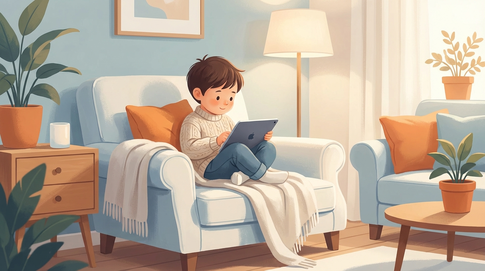
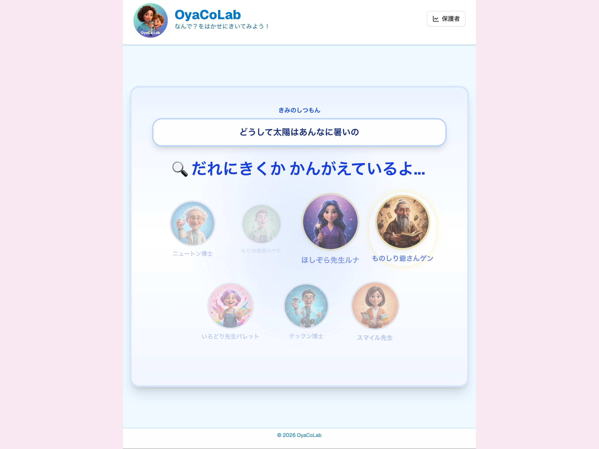
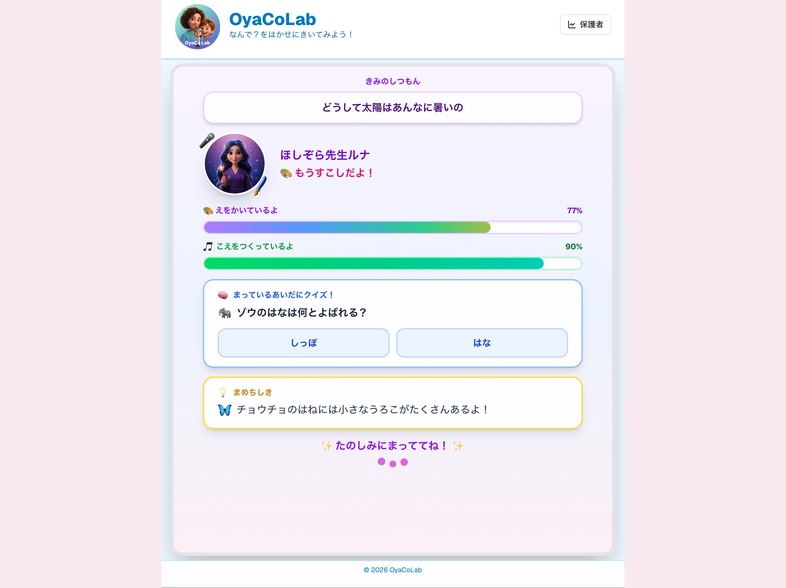
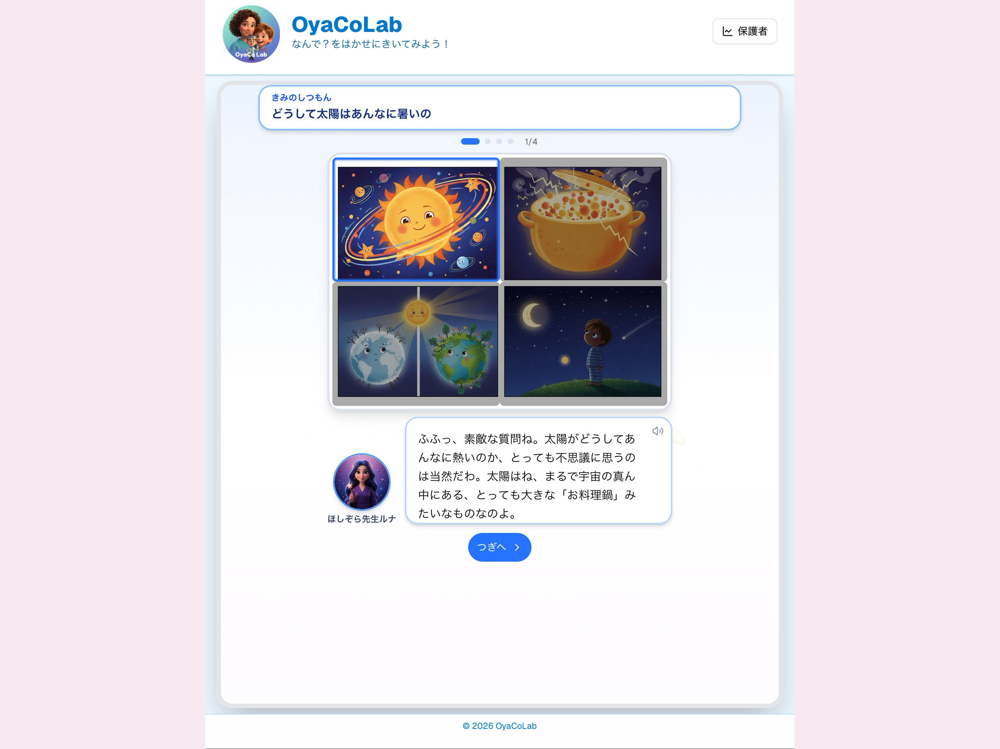

# OyaCo Lab: 統合ストーリーボード (v3)

本ドキュメントは、分割されていた構成案・編集計画・技術ストーリーボードを **1枚のストーリーボード** として統合したものです。
スライド1枚＝1シーンで運用できる形式に整理しています。

**総尺目安:** 約2分30秒 (150秒)

---

## 統合ストーリーボード

| # | 秒数 | セクション | 画面イメージ | テロップ (画面に大きく出す文字) | ナレーション / 字幕 |
| :--- | :--- | :--- | :--- | :--- | :--- |
| **1** | 0:00-0:07 | Part 1: The Pain |  忙しい親、散らかった部屋 | 親子の会話 1日、何分だと思いますか？ | 親子の会話、1日、何分だと思いますか？共働き世帯が増え、親子の会話時間は... |
| **2** | 0:07-0:12 | Part 1: The Pain |  時計の針がぐるぐる回る | わずか 25分 | たったの25分と言われています。 |
| **3** | 0:12-0:18 | Part 1: The Pain |  子供が「？」マークに囲まれている | 子供の質問 1日 300回 | 一方で、4歳の子供がする質問は1日300回。 |
| **4** | 0:18-0:24 | Part 1: The Pain |  数字がドンと出る | 1問あたり たった「5秒」 | 親が1つの質問に向き合える時間は、わずか5秒。これでは無理です。 |
| **5** | 0:24-0:30 | Part 1: The Pain |  親がスマホを見せて誤魔化す | 「あとでね」 罪悪感のループ | 結局スマホを見せてやり過ごし、親は罪悪感を感じてしまう...。 |
| **6** | 0:30-0:35 | Part 2: The Solution |  アプリのロゴ/タイトル | **OyaCo Lab** 親子の会話を 「ネタ切れ」から救う | その課題を解決するのが、「OyaCo Lab」です。 |
| **7** | 0:35-0:45 | Part 2: The Solution |  子供・AI・親の関係図 | AIが親子をつなぐ。 「会話の橋渡し」 | AIが子供の発見を受け止め、親に話しかけやすい“会話のきっかけ”へ変えて届けます。 |
| **8** | 0:45-0:50 | Part 3A: Demo (Child) |  実画面導入 | ここから実画面 | ここから実画面です。子供の“なんで？”が動き出します。 |
| **9** | 0:50-0:55 | Part 3A: Demo (Child) |  Part A タイトル | Part A: 子供の体験 | まずは学習画面。学びが自分ごとになります。 |
| **10** | 0:55-1:05 | Part 3A: Demo (Child) |  質問入力（音声） | 音声でかんたん質問 | ボタンを押して話すだけ。音声で質問できます。 |
| **11** | 1:05-1:15 | Part 3A: Demo (Child) |  博士選定 | だれにきく？ | 質問に合わせて博士を選びます。先生が決まる瞬間。 |
| **12** | 1:15-1:25 | Part 3A: Demo (Child) |  選定理由 | えらばれたりゆう | 選ばれた理由が見えるから、納得して聞けます。 |
| **13** | 1:25-1:35 | Part 3A: Demo (Child) |  待機画面 | 待ち時間も楽しい | 待ち時間もクイズや豆知識で楽しく。進捗が見えます。 |
| **14** | 1:35-1:50 | Part 3A: Demo (Child) |  博士の回答 | 4コマでわかる | 博士が楽しく解説。4コマで理解できます。 |
| **15** | 1:50-2:00 | Part 3A: Demo (Child) |  次の発見へ | もっと知りたい | “もっと知りたい”が次の発見へ。 |
| **16** | 2:00-2:05 | Part 3B: Demo (Parent) |  Part B タイトル | Part B: 保護者の体験 | 次は保護者向け画面。親の“気づき”が増えます。 |
| **17** | 2:05-2:15 | Part 3B: Demo (Parent) |  会話ログ一覧 | 子供の興味が見える化 | 子供の興味が見える化。関心の変化が一目で分かる。 |
| **18** | 2:15-2:30 | Part 3B: Demo (Parent) |  子育てアドバイザー | 相談すれば、すぐ提案 | 相談すれば、データに基づく提案がすぐ返る。 |
| **19** | 2:30-2:40 | Part 3B: Demo (Parent) |  会話のきっかけ提案 | 会話のヒントが届く | 会話のヒントがすぐ届く。話しかけるきっかけに。 |
| **20** | 2:40-2:55 | Part 4: Technology |  Orchestrator-Workers構成図 | Orchestrator-Workers Architecture Next.js + Server Actions + Gemini | Next.jsのServer Actionsをハブとし、Orchestratorが最適な専門家を選定し、回答生成からマルチモーダル出力まで一気通貫で処理します。 |
| **21** | 2:55-3:10 | Part 4: Technology |  並列パイプライン図 | Parallel Generation Pipeline Latency: 60s → 20s | 回答・画像・音声を並列処理し、1枚の画像生成で4シーンを描画。途切れない体験を実現しました。 |
| **22** | 3:10-3:25 | Part 4: Technology |  ReAct ループ図 | ReAct Pattern for Parents Logs → Analysis → Suggestion | AIが会話ログを分析し、ただの要約ではなく「今話すべきこと」を具体的に提案します。 |
| **23** | 3:25-3:30 | Part 4: Technology |  技術スタック | Built with Google Cloud Next.js 16 / Firebase / Vertex AI | 最新のGoogle Cloudスタックで構築されたOyaCo Lab。 |
| **24** | 3:30-3:40 | Part 5: Conclusion |  親子が笑顔で寄り添う | AIは人を孤独にしない。 人と人をつなぐ。 | 私たちは、AIこそが親子の絆を深めるツールになれると信じています。 |
| **25** | 3:40-3:50 | Part 5: Conclusion |  ロゴ・チーム名 | 好奇心に、最高の相棒を。 OyaCo Lab | 好奇心に、最高の相棒を。OyaCo Labでした。 |

---

## 画像アセット一覧 (1箇所に集約)

### ストーリー/デモ系

- `assets/scene_01_busy_parents.png`
- `assets/scene_02_clock_ticking.png`
- `assets/scene_03_curious_child.png`
- `assets/scene_04_5_seconds.png`
- `assets/scene_05_guilty_parent.png`
- `assets/scene_06_oyaco_logo.png`
- `assets/scene_07_connection_bridge.png`
- `assets/scene_16_family_love.png`
- `assets/scene_17_oyaco_end_logo.png`
- `assets/scene_00_navy.png`
- `assets/title_slide_part_a_child.png`
- `assets/title_slide_part_b_parent_child.png`

### 技術系

- `assets/architecture.png`
- `assets/scene_02_parallel_pipeline.png`
- `assets/scene_03_react_loop.png`
- `assets/scene_04_tech_stack.png`

### 実画面フレーム

- `assets/demo_child_01_voice_input.png`
- `assets/demo_child_02_expert_selection.png`
- `assets/demo_child_03_selection_reason.png`
- `assets/demo_child_04_waiting.png`
- `assets/demo_child_05_expert_answer.png`
- `assets/demo_child_06_next_discovery.png`
- `assets/demo_parent_01_conversation_log.png`
- `assets/demo_parent_02_advisor.png`
- `assets/demo_parent_03_conversation_starter.png`

---

## Canvaでの作業ヒント

1. **スライド形式**: 「プレゼンテーション(16:9)」または「動画」を選択。
2. **1枚ずつ貼り付け**: 枚数は約25枚のため、テンプレートからコピペ運用が最短。
3. **ナレーション**: 直接読み上げが最速。字幕のみ+BGM構成も可。
