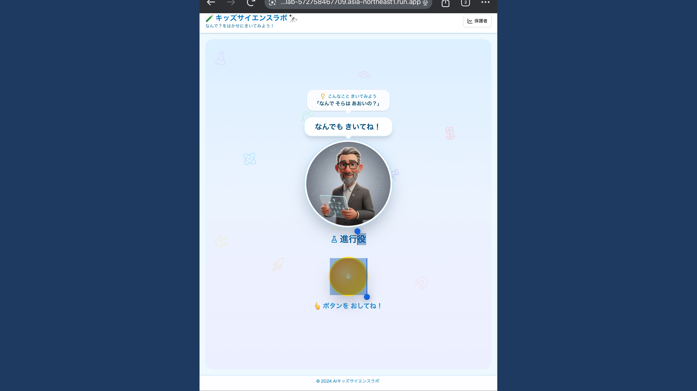
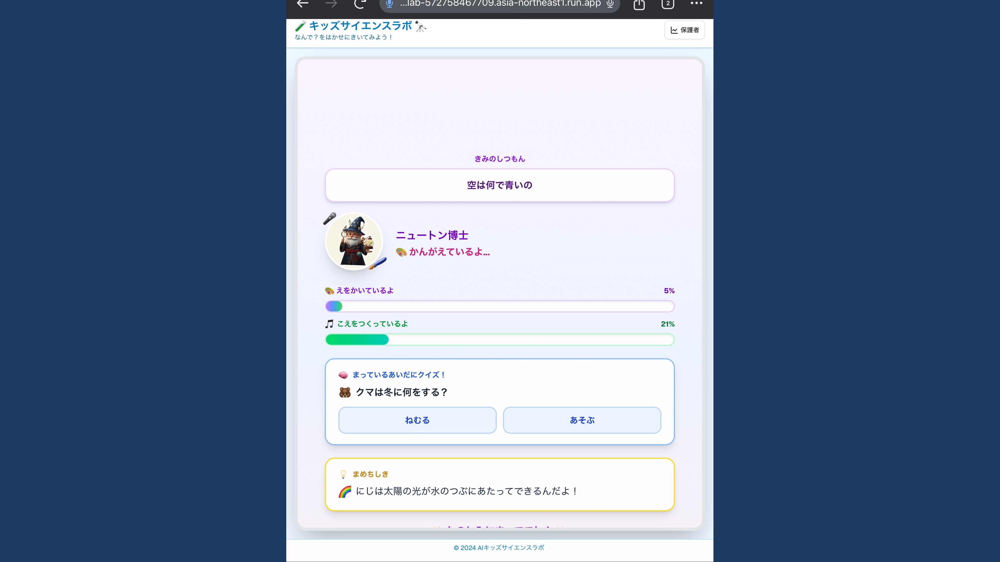
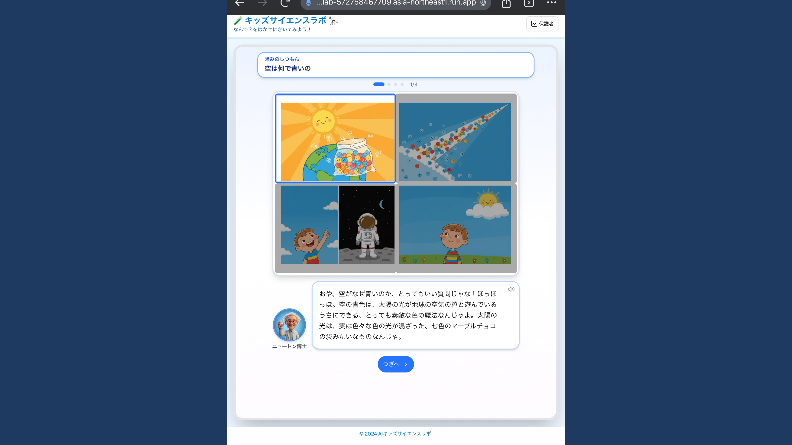
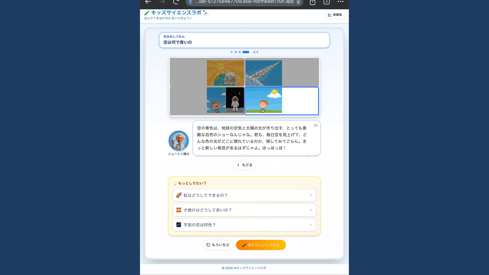
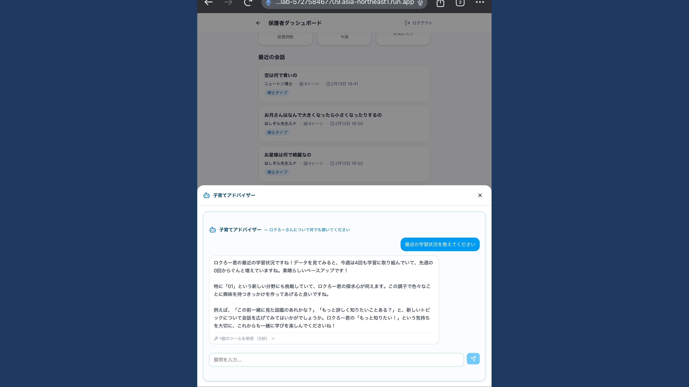

# 動画編集計画書 v3 (Video Editing Plan v3)

抽出したフレーム画像を使用して、具体的なカット割りのイメージを作成しました。

## Part A: 子供の体験 (The Child's Journey)
**コンセプト:** 「飽きさせない」「分かりやすい」「探究心が続く」

| シーン | 画像イメージ | 説明 | ナレーション案 |
| :--- | :--- | :--- | :--- |
| **A-0: 説明スライド** 実画面の紹介 |  | 以降は実際のアプリ画面での説明である旨を明示。 テキスト案: 「ここから実画面で紹介します」 | 「ここから先は、実際のアプリ画面でご紹介します。」 |
| **A-1: タイトルスライド** 子供の体験 |  | Part A開始の区切り。 テキスト案: 「Part A: 子供の体験」 短いフェードインで導入。 | 「まずは学習画面。子供の“なんで？”が動き出す。」 |
| **A-2: 質問入力** 音声で簡単に質問 |  | 「空は何で青いの？」とマイクに向かって話しかけるシーン。 大きなボタンと分かりやすいUI。 | 「思いついたら、ボタンを押して話すだけ。」 |
| **A-3: 待機画面** 飽きさせない工夫 |  | 思考中アニメーション、プログレスバー、そしてクイズ。 待ち時間も「遊び」に変える。 | 「待ち時間もクイズでワクワク。」 |
| **A-4: 博士の回答** 専門家による解説 |  | ニュートン博士が登場し、図解を使って分かりやすく説明。 キャラクターが語りかける演出。 | 「博士が、楽しくわかりやすく教えてくれる。」 |
| **A-5: 次の発見へ** 探究の連鎖 |  | 回答の最後に「もっと知りたい？」と関連質問を提示。 単発の検索で終わらせず、好奇心を広げる。 | 「“もっと知りたい”が次の発見へ。」 |

## Part B: 保護者の体験 (The Parent's Insight)
**コンセプト:** 「子供の成長が見える」「会話のきっかけが生まれる」

| シーン | 画像イメージ | 説明 | ナレーション案 |
| :--- | :--- | :--- | :--- |
| **B-0: タイトルスライド** 保護者の体験 |  | Part B開始の区切り。 テキスト案: 「Part B: 保護者の体験」 落ち着いたトーンで切り替え。 | 「次は保護者向け画面。親の“気づき”が増えていく。」 |
| **B-1: 会話のきっかけ** AIからの提案 |  | **ここが重要！** AIが「今日のお空、何色に見える？」といった具体的な会話のネタを提案。 親子のコミュニケーションをサポート。 | 「今日の会話のヒントが、すぐに届く。」 |
| **B-2: AIアドバイザー** データに基づく助言 |  | **ここが重要！** 「最近01分野に挑戦していますね」と、子供の学習データに基づいた具体的なアドバイス。 親の悩みに寄り添うパートナー。 | 「成長の記録が、親の安心につながる。」 |
