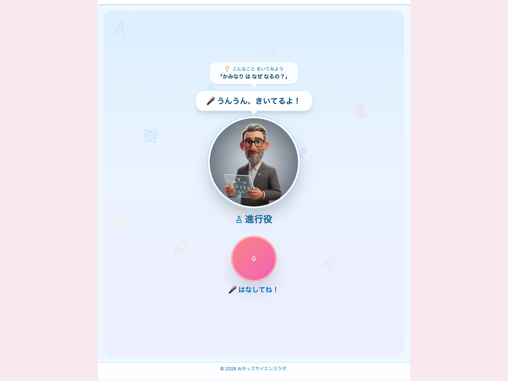
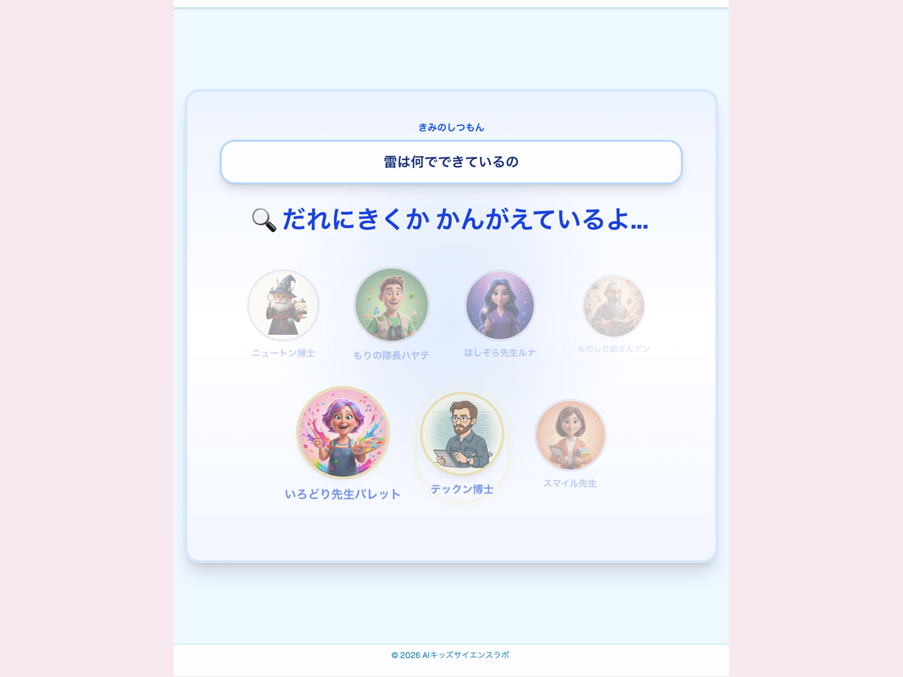
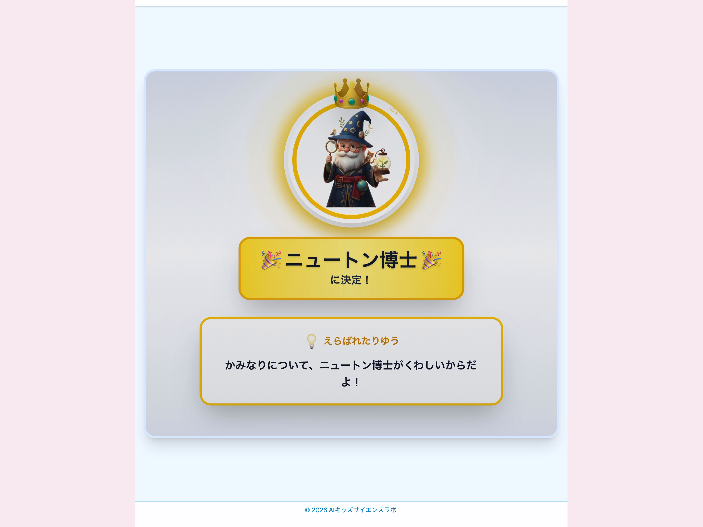
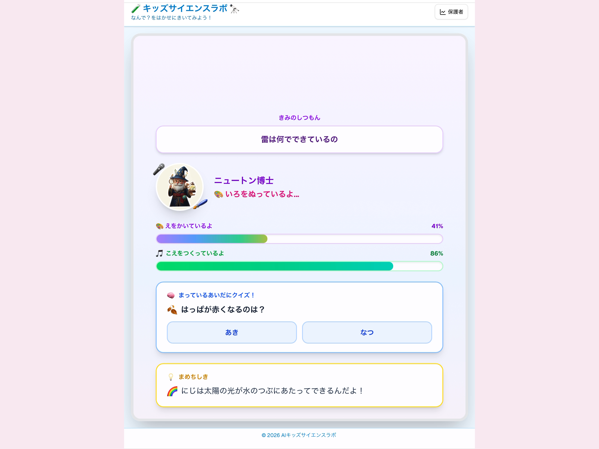
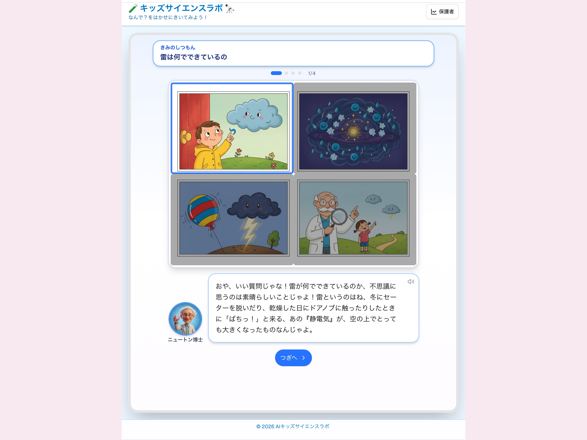
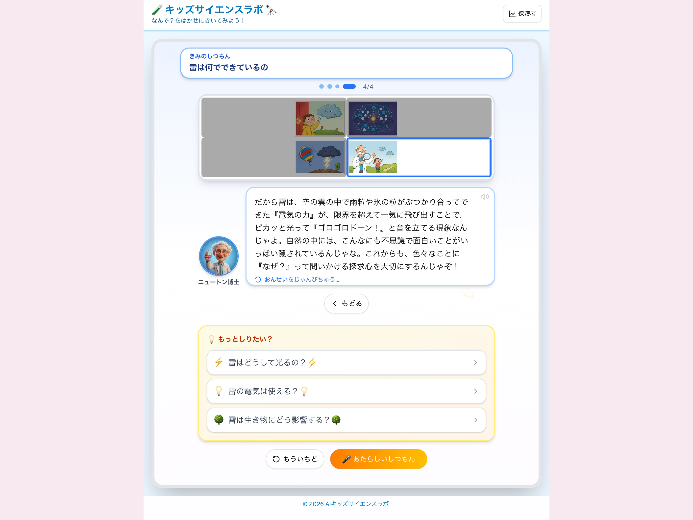
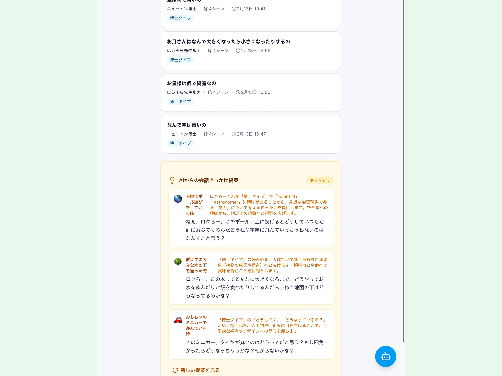
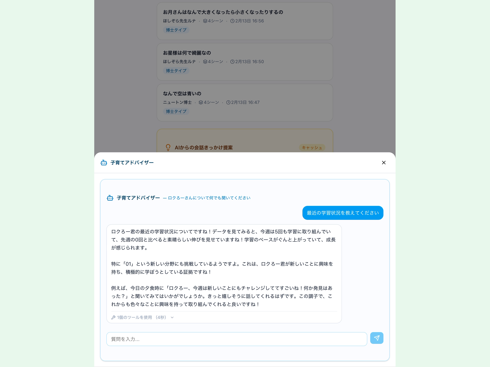

# 動画編集計画書 v3.1 (Video Editing Plan v3.1)

抽出したフレーム画像（5秒間隔）を使用して、より詳細なカット割りとタイムラインを作成しました。

## Part A: 子供の体験 (The Child's Journey)
**コンセプト:** 「飽きさせない」「分かりやすい」「探究心が続く」

| シーン | 画像イメージ | 時間目安 | 説明 | ナレーション案 |
| :--- | :--- | :--- | :--- | :--- |
| **A-0: 説明スライド** 実画面の紹介 |  | 00:00- | 以降は実際のアプリ画面での説明である旨を明示。 テキスト案: 「ここから実画面で紹介します」 | 「ここから先は、実際のアプリ画面でご紹介します。今から見てほしいのは、子供の“なんで？”が動き出す瞬間です。」 |
| **A-1: タイトルスライド** 子供の体験 |  | 00:05- | Part A開始の区切り。 テキスト案: 「Part A: 子供の体験」 | 「まずは学習画面。子供の“なんで？”が動き出し、学びが自分ごとになるところから始まります。」 |
| **A-2: 質問入力** 音声で簡単に質問 |  | 00:10- | マイクに向かって話しかけるシーン。 「うんうん、きいてるよ！」で音声入力が直感的。 | 「思いついたら、ボタンを押して話すだけ。文字が読めなくても、音声で質問できます。」 |
| **A-3: 誰に聞く？** 博士の選定 |  | 00:25- | 質問内容に応じて博士候補が表示される。 「だれにきくかかんがえているよ…」の演出。 | 「質問に合わせて、ぴったりの博士を選びます。子供にとっては“先生が選ばれる”ワクワクの瞬間。」 |
| **A-4: 博士決定** 選定理由の提示 |  | 00:30- | ニュートン博士に決定。 「えらばれたりゆう」で納得感を演出。 | 「この博士なら、答えがわかる。選ばれた理由まで見えるから、子供も納得して聞けます。」 |
| **A-5: 待機画面** 飽きさせない工夫 |  | 00:35- | 思考中アニメーション、二段階プログレス、クイズ&豆知識。 待ち時間も「遊び」に変える。 (frame_0006〜0009あたりを使用) | 「待ち時間もクイズでワクワク。進捗が見えるから、待つ時間が“遊び”に変わります。」 |
| **A-6: 博士の回答** 専門家による解説 |  | 01:00- | 4コマ解説とテキストで分かりやすく説明。 ステップ表示（1/4など）でテンポよく。 (frame_0010〜0013あたりを使用) | 「博士が、楽しくわかりやすく教えてくれる。4コマで段階的に理解できる設計です。」 |
| **A-7: 次の発見へ** 探究の連鎖 |  | 01:15- | 回答の最後に「もっとしりたい？」で関連質問を提示。 単発で終わらず好奇心を広げる。 | 「“もっと知りたい”が次の発見へ。学びが連続して、探究が自然に続いていきます。」 |

## Part B: 保護者の体験 (The Parent's Insight)
**コンセプト:** 「子供の成長が見える」「会話のきっかけが生まれる」

| シーン | 画像イメージ | 時間目安 | 説明 | ナレーション案 |
| :--- | :--- | :--- | :--- | :--- |
| **B-0: タイトルスライド** 保護者の体験 |  | 01:25- | Part B開始の区切り。 テキスト案: 「Part B: 保護者の体験」 | 「次は保護者向け画面。親の“気づき”が増えていくフェーズに切り替わります。」 |
| **B-1: 会話ログ一覧** 子供の興味が見える |  | 01:30- | 最近の会話が時系列で一覧表示。 「うちの子、何に興味がある？」がすぐ分かる。 (frame_0016〜0017あたりを使用) | 「子供の興味が、見える化される。日々の質問履歴から、関心の変化が一目で分かります。」 |
| **B-2: 子育てアドバイザー** チャットで相談 |  | 01:50- | **ここが重要！** 学習状況に基づくアドバイスを対話で取得。 不安や悩みをすぐ相談できる。 (frame_0018〜0021あたりを使用) | 「成長の記録が、親の安心につながる。相談すれば、データに基づく提案がすぐ返ってきます。」 |
| **B-3: 会話のきっかけ提案** AIからのネタ提供 |  | 02:10- | **ここが重要！** AIが具体的な問いかけをカードで提示。 親子の会話を自然にサポート。 (frame_0022〜0024あたりを使用) | 「今日の会話のヒントが、すぐに届く。忙しい日でも、話しかけるきっかけが手に入ります。」 |
